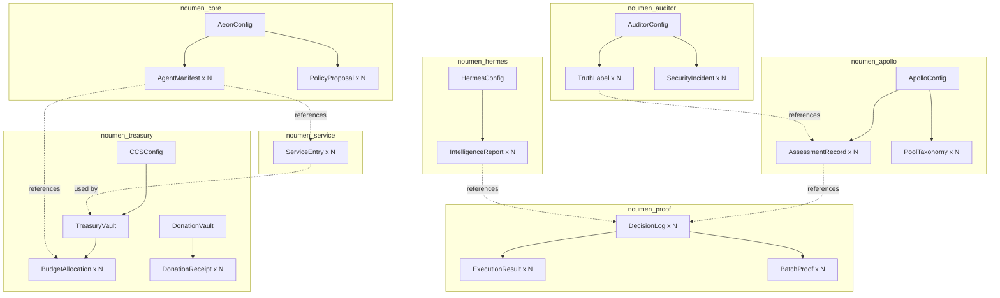
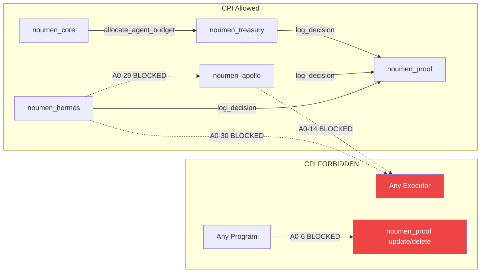
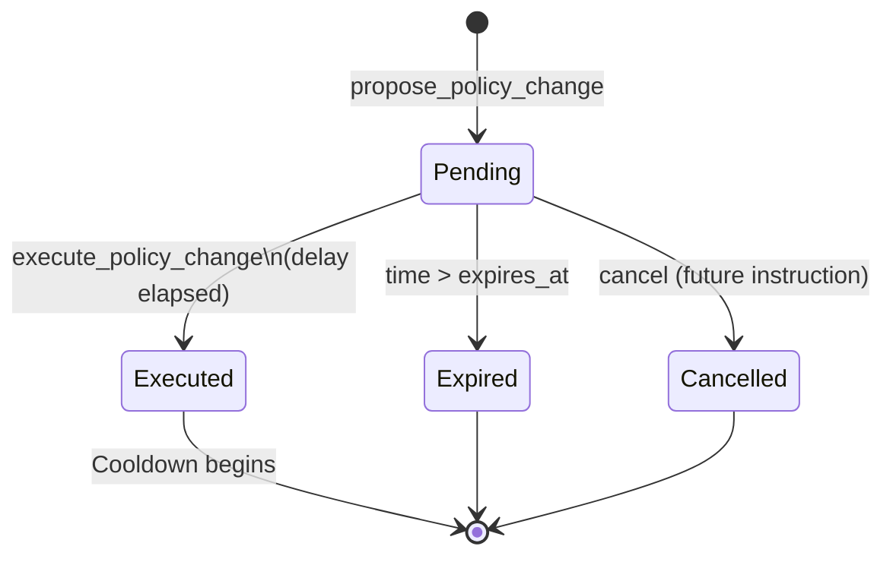
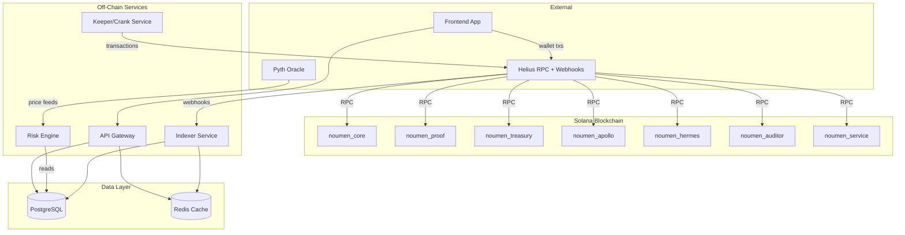
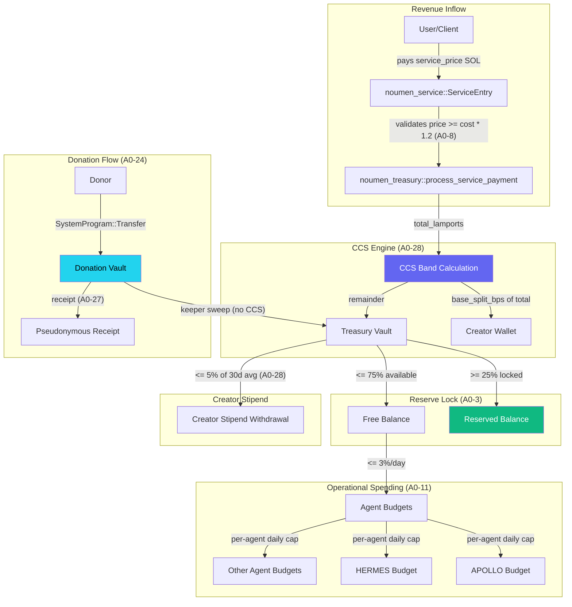
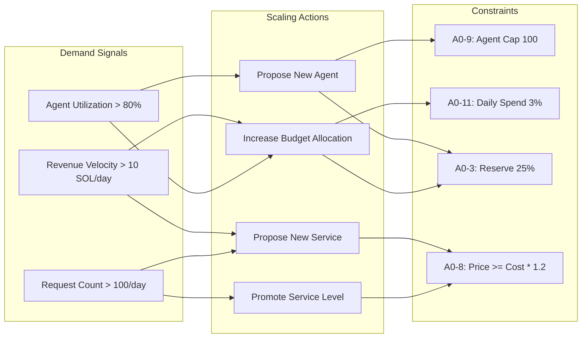
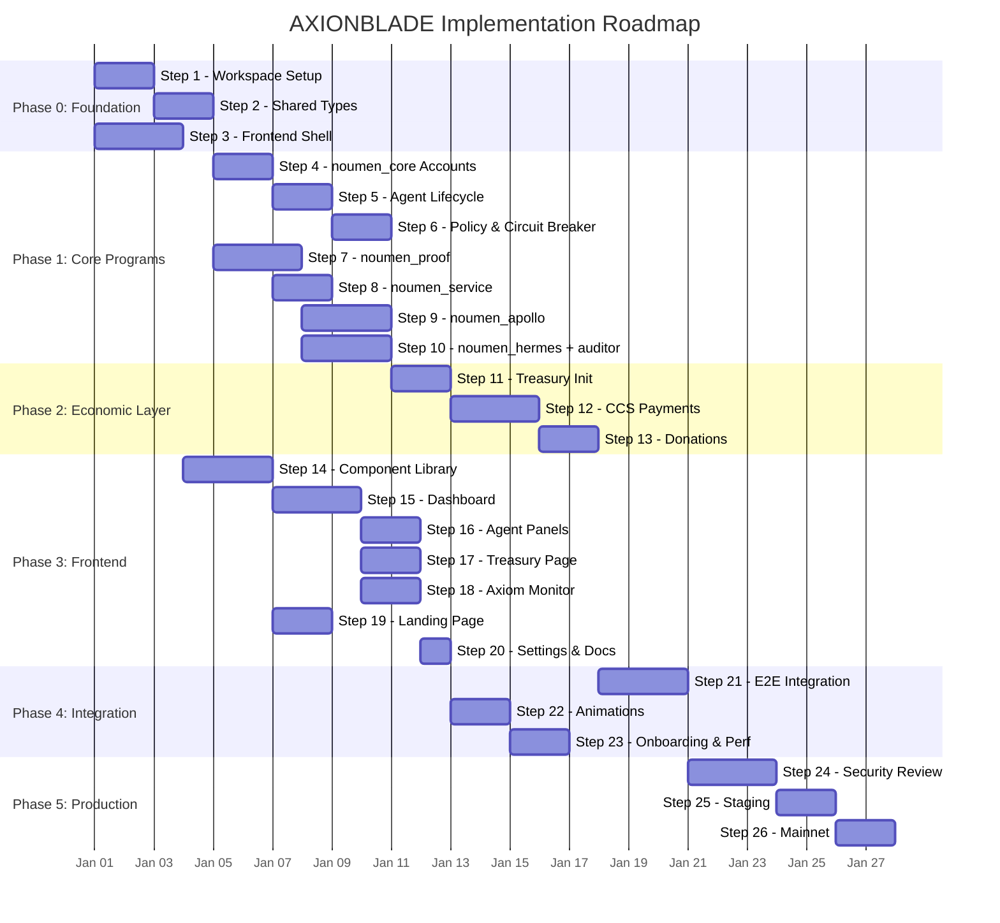
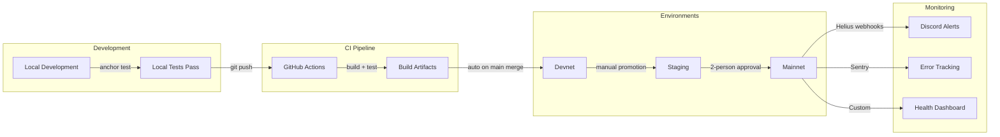

# AXIONBLADE --- Definitive Build Plan

> Version: 1.0 | Based on Architecture v3.2.3 | 29 Active Axioms | 3 Agents
> This document is the single source of truth for implementing AXIONBLADE on Solana.

---

# PART 1: ON-CHAIN ARCHITECTURE (Solana Programs)

## 1.1 Program Inventory

### Program 1: `noumen_core` (AEON Sovereign)

- **Purpose**: Central governance hub. Manages the global AEON configuration, agent registry (create/update/pause/kill), policy proposal lifecycle with delay enforcement, circuit breaker state machine, and heartbeat liveness monitoring.
- **Agent**: AEON (sovereign)
- **Axioms enforced**: A0-1 (only AEON creates agents), A0-9 (agent cap <= 100), A0-13 (anti-auto-learning flag in config)
- **Why separate**: The sovereign program must be isolated so that no other program can alter governance state. All authority flows from this program. Compromise of any other program cannot escalate to governance changes.

### Program 2: `noumen_proof` (Shared -- Proof-of-Agency)

- **Purpose**: Immutable decision logging, execution result tracking, and batch merkle proofs. Every significant action in the system creates a trail here before execution.
- **Agent**: Shared (all agents write proofs through this program)
- **Axioms enforced**: A0-5 (log_decision mandatory before execution), A0-6 (historical proofs immutable -- no delete/update instructions), A0-17 (evidence families bitmap validation >= 2 families for execution class), A0-18 (evidence family classification is static -- families encoded as enum, not configurable)
- **Why separate**: Proof immutability is a foundational guarantee. By isolating proof storage in its own program, we ensure that no program upgrade to any other module can retroactively alter decision logs. The proof program has no `update` or `delete` instructions by design.

### Program 3: `noumen_treasury` (Shared -- Economic Layer)

- **Purpose**: Holds SOL in treasury and donation vaults, processes service payments with CCS splits, manages per-agent budget allocations, handles donation sweeps with anti-masquerade validation, and issues pseudonymous donation receipts.
- **Agent**: Shared (AEON manages budgets, keeper processes sweeps, users make payments)
- **Axioms enforced**: A0-3 (reserve ratio >= 25%), A0-8 (price >= cost + 20% margin validated at payment time), A0-11 (daily spend <= 3% free balance), A0-12 (never custodial -- treasury is protocol-owned, not user-owned), A0-22 (donations confer no rights), A0-24 (donations bypass CCS), A0-25 (anti-masquerade rejection), A0-27 (pseudonymous receipts), A0-28 (CCS cap 15%, floor 4%, stipend cap 5%)
- **Why separate**: Money handling must be isolated from logic programs. A bug in APOLLO's assessment logic must never be able to drain the treasury. The treasury program validates every outflow against budget limits and reserve ratios independently.

### Program 4: `noumen_apollo` (APOLLO Risk Evaluator)

- **Purpose**: Stores APOLLO configuration, publishes risk assessment records for monitored pools, maintains pool taxonomy classifications, and tracks MLI (Mercenary Liquidity Index) data.
- **Agent**: APOLLO
- **Axioms enforced**: A0-4 (evaluation and execution never in same agent), A0-14 (APOLLO never has execution_permission -- enforced structurally: no CPI to any execution program), A0-15 (APOLLO outputs never consumed directly by executors -- enforced by PDA read-only design), A0-16 (APOLLO weight in Risk Engine <= 40% -- stored in ApolloConfig, enforced off-chain by Risk Engine with on-chain audit trail)
- **Why separate**: APOLLO must be structurally incapable of triggering execution. By having no CPI calls to execution programs and no signer authority over treasury, this is enforced at the program level, not just at the policy level.

### Program 5: `noumen_hermes` (HERMES Intelligence)

- **Purpose**: Stores HERMES configuration, publishes intelligence reports (Effective APR, Risk Decomposition Vector, Yield Trap Intelligence), pool comparisons, and protocol health snapshots for external consumption.
- **Agent**: HERMES
- **Axioms enforced**: A0-29 (HERMES never feeds Risk Engine directly -- no CPI to apollo or any risk engine interface), A0-30 (HERMES does not emit operational risk signals -- report_type enum excludes risk signal types)
- **Why separate**: HERMES outputs are terminal -- they serve external consumers only. Structural separation ensures HERMES data cannot accidentally enter the execution chain. The program has zero CPI calls to noumen_apollo or any execution-adjacent program.

### Program 6: `noumen_auditor` (Auditor)

- **Purpose**: Records truth labels (HTL and EOL) for resolved signals, registers security incidents (CONFIRMED/UNCONFIRMED), and publishes accuracy snapshots (Brier score, HTL accuracy, EOL positive rate).
- **Agent**: Auditor (structurally read-only on all other programs, write-only to its own PDAs)
- **Axioms enforced**: A0-19 (security incidents registered exclusively by Auditor), A0-20 (truth labels calculated exclusively by Auditor), A0-21 (accuracy metrics only over resolved outcomes -- enforced by requiring truth_label reference in accuracy snapshots)
- **Why separate**: The Auditor must be independent of the agents it evaluates. It has no CPI calls to any other AXIONBLADE program (except reading PDAs). No agent can influence its own truth labels or accuracy scores.

### Program 7: `noumen_service` (Shared -- Service Registry)

- **Purpose**: Maintains the service registry with definitions, lifecycle levels (L0/L1/L2), pricing with floor enforcement, and level change proposals with delay.
- **Agent**: Shared (AEON registers services, keeper manages lifecycle)
- **Axioms enforced**: A0-8 (price >= cost + 20% margin -- validated on register and price update), A0-26 (paid outputs include not_investment_advice, uncertainty_flags, decision_class -- stored as required schema flags in ServiceEntry)
- **Why separate**: Service definitions and pricing are referenced by the treasury during payment processing. Separating the registry from the treasury allows independent upgrades to service metadata without touching money-handling code.

---

## 1.2 Account Model and PDA Design

### Conventions

- All sizes include 8-byte Anchor discriminator
- All accounts include a `_reserved` field sized at 30% of the data fields for future expansion
- All u64 monetary values are in lamports (1 SOL = 1,000,000,000 lamports)
- Timestamps are i64 Unix timestamps
- Hashes are `[u8; 32]` (SHA-256)
- Public keys are `Pubkey` (32 bytes)
- Strings use fixed-size byte arrays to avoid dynamic allocation

### noumen_core Accounts

#### AeonConfig

```rust
// Seeds: ["aeon_config"]
// Size: 8 + 32 + 32 + 32 + 32 + 32 + 2 + 1 + 1 + 4 + 8 + 8 + 8 + 8 + 1 + 128 = 327 bytes
// Rent: ~0.003 SOL
#[account]
pub struct AeonConfig {
    pub super_authority: Pubkey,       // Upgrade authority, can transfer itself
    pub aeon_authority: Pubkey,        // Day-to-day AEON operations (agent mgmt, policy)
    pub keeper_authority: Pubkey,      // Crank/automation (sweeps, heartbeats)
    pub treasury_program: Pubkey,      // Verified treasury program ID for CPI
    pub proof_program: Pubkey,         // Verified proof program ID for CPI
    pub active_agent_count: u16,       // Current count of non-killed agents
    pub circuit_breaker_mode: u8,      // 0=Normal, 1=Cautious, 2=Restricted, 3=Halted
    pub is_initialized: bool,
    pub operational_agent_cap: u32,    // Layer 1 param, starts at 15
    pub last_heartbeat: i64,           // Unix timestamp of last heartbeat
    pub heartbeat_interval: i64,       // Required interval in seconds (e.g., 3600)
    pub created_at: i64,
    pub updated_at: i64,
    pub bump: u8,
    pub _reserved: [u8; 128],
}
```

#### AgentManifest

```rust
// Seeds: ["agent", agent_id.to_le_bytes()]
// agent_id is a u16 (0-99 for max 100 agents)
// Size: 8 + 2 + 32 + 1 + 1 + 1 + 2 + 8 + 8 + 8 + 8 + 8 + 32 + 8 + 8 + 8 + 8 + 1 + 64 = 216 bytes
// Rent: ~0.002 SOL
#[account]
pub struct AgentManifest {
    pub agent_id: u16,                 // Unique ID (0..MAX_AGENTS)
    pub authority: Pubkey,             // Agent-specific signer
    pub agent_type: u8,                // 0=Collector, 1=Evaluator, 2=Executor, 3=Auditor
    pub status: u8,                    // 0=Pending, 1=Active, 2=Paused, 3=Killed
    pub execution_permission: u8,      // 0=Never, 1=Limited, 2=Full
    pub level: u16,                    // Service level: 0, 1, 2
    pub budget_lamports: u64,          // Max total budget allocated
    pub budget_spent_lamports: u64,    // Cumulative spent
    pub budget_daily_cap_lamports: u64,// Max spend per day
    pub birth_bond_lamports: u64,      // Locked in treasury on creation
    pub ttl: i64,                      // Unix timestamp when review is due
    pub creation_proof: [u8; 32],      // Hash of creation justification
    pub created_at: i64,
    pub updated_at: i64,
    pub last_active: i64,              // Last decision/execution timestamp
    pub daily_spend_reset_at: i64,     // Start of current daily spend window
    pub bump: u8,
    pub _reserved: [u8; 64],
}
```

#### PolicyProposal

```rust
// Seeds: ["proposal", proposal_id.to_le_bytes()]
// proposal_id is a u32
// Size: 8 + 4 + 32 + 1 + 1 + 32 + 8 + 8 + 8 + 8 + 8 + 1 + 64 = 183 bytes
// Rent: ~0.002 SOL
#[account]
pub struct PolicyProposal {
    pub proposal_id: u32,
    pub proposer: Pubkey,              // Who proposed (must be aeon_authority)
    pub policy_layer: u8,              // 1=Constitutional, 2=Operational
    pub status: u8,                    // 0=Pending, 1=Executed, 2=Expired, 3=Cancelled
    pub change_hash: [u8; 32],         // SHA-256 of proposed change params
    pub delay_until: i64,              // Earliest execution time (clock sysvar checked)
    pub cooldown_until: i64,           // No new proposals for same param until this time
    pub proposed_at: i64,
    pub executed_at: i64,              // 0 if not yet executed
    pub expires_at: i64,               // Auto-expire if not executed by this time
    pub bump: u8,
    pub _reserved: [u8; 64],
}
```

### noumen_proof Accounts

#### DecisionLog

```rust
// Seeds: ["decision", agent_id.to_le_bytes(), decision_nonce.to_le_bytes()]
// decision_nonce is a u64 per agent (monotonic counter)
// Size: 8 + 2 + 8 + 32 + 32 + 32 + 1 + 1 + 8 + 1 + 1 + 32 = 158 bytes (+ reserved)
// Total: 158 + 48 = 206 bytes
// Rent: ~0.002 SOL
#[account]
pub struct DecisionLog {
    pub agent_id: u16,
    pub nonce: u64,                    // Monotonically increasing per agent
    pub input_hash: [u8; 32],          // SHA-256 of canonical input
    pub decision_hash: [u8; 32],       // SHA-256 of decision output
    pub justification_hash: [u8; 32],  // SHA-256 of justification/reasoning
    pub evidence_families_bitmap: u8,  // Bits 0-4 = families A-E present
    pub decision_class: u8,            // 0=Info, 1=LimitedReliability, 2=RiskWarning, 3=DangerSignal
    pub timestamp: i64,
    pub is_execution_class: bool,      // If true, requires >= 2 evidence families
    pub bump: u8,
    pub execution_confirmed: bool,     // Set to true by confirm_execution
    pub _reserved: [u8; 48],
}
```

#### ExecutionResult

```rust
// Seeds: ["execution", decision_log_key.as_ref()]
// decision_log_key is the Pubkey of the DecisionLog account
// Size: 8 + 32 + 32 + 1 + 8 + 32 + 1 + 32 = 146 bytes (+ reserved)
// Total: 146 + 44 = 190 bytes
// Rent: ~0.002 SOL
#[account]
pub struct ExecutionResult {
    pub decision_log: Pubkey,          // Reference back to DecisionLog
    pub result_hash: [u8; 32],         // SHA-256 of execution result
    pub status: u8,                    // 0=Success, 1=Failed, 2=Partial, 3=Reverted
    pub executed_at: i64,
    pub executor: Pubkey,              // Who executed
    pub bump: u8,
    pub _reserved: [u8; 44],
}
```

#### BatchProof

```rust
// Seeds: ["batch", agent_id.to_le_bytes(), batch_nonce.to_le_bytes()]
// Size: 8 + 2 + 8 + 32 + 4 + 8 + 8 + 8 + 1 + 32 = 111 bytes (+ reserved)
// Total: 111 + 34 = 145 bytes
// Rent: ~0.002 SOL
#[account]
pub struct BatchProof {
    pub agent_id: u16,
    pub batch_nonce: u64,
    pub merkle_root: [u8; 32],         // Root of merkle tree of decision hashes
    pub leaf_count: u32,               // Number of decisions in batch
    pub start_timestamp: i64,          // Earliest decision in batch
    pub end_timestamp: i64,            // Latest decision in batch
    pub submitted_at: i64,
    pub bump: u8,
    pub _reserved: [u8; 34],
}
```

### noumen_treasury Accounts

#### TreasuryVault

```rust
// Seeds: ["treasury_vault"]
// This PDA is also the authority for the treasury SOL account
// Size: 8 + 8 + 8 + 8 + 8 + 8 + 8 + 8 + 8 + 8 + 1 + 64 = 147 bytes
// Rent: ~0.002 SOL
#[account]
pub struct TreasuryVault {
    pub total_balance_lamports: u64,       // Total SOL held (synced with actual balance)
    pub reserved_lamports: u64,            // Amount that cannot be spent (>= 25% of total)
    pub free_balance_lamports: u64,        // total - reserved
    pub total_revenue_lamports: u64,       // Lifetime revenue
    pub total_spent_lamports: u64,         // Lifetime expenditure
    pub daily_spend_lamports: u64,         // Spend in current day window
    pub daily_spend_reset_at: i64,         // Start of current daily window
    pub total_donations_received: u64,     // Lifetime donations swept in
    pub updated_at: i64,
    pub bump: u8,
    pub _reserved: [u8; 64],
}
```

#### DonationVault

```rust
// Seeds: ["donation_vault"]
// Size: 8 + 8 + 8 + 4 + 8 + 1 + 32 = 69 bytes (+ reserved)
// Total: 69 + 21 = 90 bytes
// Rent: ~0.001 SOL
#[account]
pub struct DonationVault {
    pub total_received_lamports: u64,  // Lifetime total received
    pub pending_sweep_lamports: u64,   // Not yet swept to treasury
    pub sweep_count: u32,              // Number of sweeps performed
    pub last_sweep_at: i64,            // Last sweep timestamp
    pub bump: u8,
    pub _reserved: [u8; 21],
}
```

#### CCSConfig

```rust
// Seeds: ["ccs_config"]
// Size: 8 + (4 bands * 16 bytes) + 2 + 2 + 2 + 8 + 8 + 8 + 8 + 1 + 48 = 161 bytes
// Rent: ~0.002 SOL
#[account]
pub struct CCSConfig {
    // CCS Bands: 4 bands, each with threshold + base_split_bps + max_stipend_bps + max_total_bps
    pub band_0_threshold_lamports: u64,    // 0 (always)
    pub band_0_base_split_bps: u16,        // 1200 (12%)
    pub band_0_max_stipend_bps: u16,       // 300 (3%)
    pub band_1_threshold_lamports: u64,    // 1 SOL in lamports
    pub band_1_base_split_bps: u16,        // 1000 (10%)
    pub band_1_max_stipend_bps: u16,       // 500 (5%)
    pub band_2_threshold_lamports: u64,    // 10 SOL in lamports
    pub band_2_base_split_bps: u16,        // 700 (7%)
    pub band_2_max_stipend_bps: u16,       // 500 (5%)
    pub band_3_threshold_lamports: u64,    // 50 SOL in lamports
    pub band_3_base_split_bps: u16,        // 400 (4%)
    pub band_3_max_stipend_bps: u16,       // 500 (5%)
    // Immutable caps (Layer 0 -- A0-28)
    pub cap_total_bps: u16,                // 1500 (15%)
    pub floor_base_split_bps: u16,         // 400 (4%)
    pub cap_stipend_bps: u16,              // 500 (5%)
    // Rolling averages
    pub avg_7d_revenue_lamports: u64,      // Updated by keeper
    pub avg_30d_revenue_lamports: u64,     // Updated by keeper
    pub creator_wallet: Pubkey,            // Where creator split goes
    pub total_creator_paid_lamports: u64,  // Lifetime creator payments
    pub bump: u8,
    pub _reserved: [u8; 48],
}
```

#### BudgetAllocation

```rust
// Seeds: ["budget", agent_id.to_le_bytes()]
// Size: 8 + 2 + 8 + 8 + 8 + 8 + 8 + 8 + 1 + 32 = 91 bytes
// Rent: ~0.001 SOL
#[account]
pub struct BudgetAllocation {
    pub agent_id: u16,
    pub allocated_lamports: u64,       // Total budget for this agent
    pub spent_lamports: u64,           // Cumulative spent
    pub daily_cap_lamports: u64,       // Max daily spend
    pub daily_spent_lamports: u64,     // Spent in current day
    pub daily_reset_at: i64,           // Start of current day window
    pub updated_at: i64,
    pub bump: u8,
    pub _reserved: [u8; 32],
}
```

#### DonationReceipt

```rust
// Seeds: ["donation_receipt", receipt_nonce.to_le_bytes()]
// receipt_nonce is a u64
// Size: 8 + 8 + 8 + 8 + 32 + 1 + 1 + 1 + 4 + 1 + 32 + 1 + 32 = 137 bytes (+ reserved)
// Total: 137 + 42 = 179 bytes
// Rent: ~0.002 SOL
#[account]
pub struct DonationReceipt {
    pub receipt_nonce: u64,
    pub amount_lamports: u64,
    pub timestamp: i64,
    pub source_wallet_hash: [u8; 32],      // SHA-256 of donor wallet (A0-27)
    pub disclosure_mode: u8,               // 0=Pseudonymous, 1=Disclosed
    pub receipt_status: u8,                // 0=ValidDonation, 1=UnrecognizedFormat
    pub counts_as_donation: bool,
    pub correlated_service_payments: u32,  // Count of correlated payments in 24h window
    pub correlated_flag: bool,             // True if correlation detected
    pub receipt_hash: [u8; 32],            // SHA-256 of entire receipt
    pub bump: u8,
    pub _reserved: [u8; 42],
}
```

### noumen_apollo Accounts

#### ApolloConfig

```rust
// Seeds: ["apollo_config"]
// Size: 8 + 2 + 32 + 2 + 2 + 1 + 8 + 8 + 8 + 8 + 1 + 48 = 138 bytes
// Rent: ~0.002 SOL
#[account]
pub struct ApolloConfig {
    pub agent_id: u16,                 // APOLLO's agent_id in the registry
    pub authority: Pubkey,             // APOLLO agent authority
    pub max_weight_bps: u16,           // Max weight in Risk Engine (4000 = 40%, A0-16)
    pub max_mli_pools: u16,            // Max pools tracked for MLI (Layer 1, default 50)
    pub status: u8,                    // 0=Inactive, 1=Active, 2=Paused
    pub total_assessments: u64,        // Lifetime count
    pub mli_tvl_minimum_lamports: u64, // Min TVL for MLI tracking (Layer 1)
    pub created_at: i64,
    pub updated_at: i64,
    pub bump: u8,
    pub _reserved: [u8; 48],
}
```

#### AssessmentRecord

```rust
// Seeds: ["assessment", pool_id_hash[0..16], timestamp.to_le_bytes()]
// pool_id_hash is first 16 bytes of SHA-256 of pool address
// Size: 8 + 32 + 8 + 1 + 1 + 1 + 2 + 2 + 2 + 2 + 2 + 2 + 8 + 32 + 1 + 48 = 152 bytes
// Rent: ~0.002 SOL
#[account]
pub struct AssessmentRecord {
    pub pool_address: Pubkey,
    pub timestamp: i64,
    pub risk_level: u8,                // 0=Low, 1=Medium, 2=High, 3=Critical
    pub confidence_score: u8,          // 0-100
    pub evidence_families_bitmap: u8,  // Which families contributed
    pub composite_score: u16,          // 0-10000 (basis points)
    pub mli_score: u16,                // Mercenary Liquidity Index 0-10000
    pub effective_apr_bps: u16,        // Net effective APR in basis points
    pub headline_apr_bps: u16,         // Headline APR (A0-23: always reported together)
    pub il_projected_bps: u16,         // Projected IL in basis points
    pub sustainability_score: u16,     // 0-10000
    pub expiry: i64,                   // When this assessment expires
    pub decision_log: Pubkey,          // Reference to proof in noumen_proof
    pub bump: u8,
    pub _reserved: [u8; 48],
}
```

#### PoolTaxonomy

```rust
// Seeds: ["taxonomy", pool_id_hash[0..16]]
// Size: 8 + 32 + 1 + 1 + 1 + 1 + 1 + 8 + 8 + 8 + 1 + 32 = 102 bytes
// Rent: ~0.001 SOL
#[account]
pub struct PoolTaxonomy {
    pub pool_address: Pubkey,
    pub pool_type: u8,                 // 0=CLAMM, 1=ConstProduct, 2=Stable, 3=Weighted, etc.
    pub protocol: u8,                  // 0=Orca, 1=Raydium, 2=Meteora, etc.
    pub risk_profile: u8,              // 0=Conservative, 1=Moderate, 2=Aggressive, 3=Speculative
    pub il_sensitivity: u8,            // 0=Low, 1=Medium, 2=High, 3=Extreme
    pub pair_class: u8,                // 0=StableStable, 1=MajorMajor, 2=MajorMinor, 3=MinorMinor
    pub tvl_lamports: u64,             // Last observed TVL
    pub last_updated: i64,
    pub created_at: i64,
    pub bump: u8,
    pub _reserved: [u8; 32],
}
```

### noumen_hermes Accounts

#### HermesConfig

```rust
// Seeds: ["hermes_config"]
// Size: 8 + 2 + 32 + 1 + 8 + 8 + 8 + 1 + 48 = 116 bytes
// Rent: ~0.001 SOL
#[account]
pub struct HermesConfig {
    pub agent_id: u16,
    pub authority: Pubkey,
    pub status: u8,                    // 0=Inactive, 1=Active, 2=Paused
    pub total_reports: u64,
    pub created_at: i64,
    pub updated_at: i64,
    pub bump: u8,
    pub _reserved: [u8; 48],
}
```

#### IntelligenceReport

```rust
// Seeds: ["report", report_type.to_le_bytes(), report_nonce.to_le_bytes()]
// Size: 8 + 1 + 8 + 32 + 32 + 1 + 8 + 8 + 32 + 1 + 48 = 179 bytes
// Rent: ~0.002 SOL
#[account]
pub struct IntelligenceReport {
    pub report_type: u8,               // 0=EffectiveAPR, 1=RiskDecomposition, 2=YieldTrapIntel,
                                       // 3=PoolComparison, 4=ProtocolSnapshot
    pub report_nonce: u64,
    pub content_hash: [u8; 32],        // SHA-256 of full report (stored off-chain)
    pub subject_hash: [u8; 32],        // SHA-256 of subject (pool/protocol address)
    pub confidence_score: u8,          // 0-100
    pub timestamp: i64,
    pub expiry: i64,
    pub decision_log: Pubkey,          // Reference to proof in noumen_proof
    pub bump: u8,
    pub _reserved: [u8; 48],
}
```

### noumen_auditor Accounts

#### AuditorConfig

```rust
// Seeds: ["auditor_config"]
// Size: 8 + 32 + 8 + 8 + 8 + 8 + 1 + 48 = 121 bytes
// Rent: ~0.001 SOL
#[account]
pub struct AuditorConfig {
    pub authority: Pubkey,             // Auditor signer
    pub total_truth_labels: u64,
    pub total_incidents: u64,
    pub created_at: i64,
    pub updated_at: i64,
    pub bump: u8,
    pub _reserved: [u8; 48],
}
```

#### TruthLabel

```rust
// Seeds: ["truth_label", signal_id[0..32]]
// signal_id is the SHA-256 hash of the original signal/assessment
// Size: 8 + 32 + 1 + 1 + 1 + 1 + 8 + 8 + 8 + 32 + 1 + 32 = 133 bytes
// Rent: ~0.002 SOL
#[account]
pub struct TruthLabel {
    pub signal_id: [u8; 32],           // Hash of the original assessment/signal
    pub htl_result: u8,                // 0=Correct, 1=Incorrect, 2=Inconclusive
    pub eol_result: u8,                // 0=Positive, 1=Negative, 2=Inconclusive
    pub signal_type: u8,               // Matches risk signal type enum
    pub is_resolved: bool,             // True when window has closed
    pub window_start: i64,             // When measurement window opened
    pub window_end: i64,               // When measurement window closed
    pub resolved_at: i64,              // When label was finalized
    pub evidence_hash: [u8; 32],       // SHA-256 of evidence used for labeling
    pub bump: u8,
    pub _reserved: [u8; 32],
}
```

#### SecurityIncident

```rust
// Seeds: ["incident", incident_nonce.to_le_bytes()]
// Size: 8 + 8 + 32 + 1 + 1 + 8 + 8 + 32 + 32 + 1 + 48 = 179 bytes
// Rent: ~0.002 SOL
#[account]
pub struct SecurityIncident {
    pub incident_nonce: u64,
    pub affected_pool: Pubkey,         // Pool/protocol affected
    pub incident_type: u8,             // 0=Exploit, 1=RugPull, 2=LiquidityDrain,
                                       // 3=OracleManipulation, 4=IncentiveCollapse
    pub status: u8,                    // 0=Unconfirmed, 1=Confirmed, 2=Dismissed
    pub detected_at: i64,
    pub resolved_at: i64,              // When confirmed or dismissed
    pub detection_evidence_hash: [u8; 32], // Evidence at detection time
    pub resolution_evidence_hash: [u8; 32],// Evidence at resolution time
    pub bump: u8,
    pub _reserved: [u8; 48],
}
```

### noumen_service Accounts

#### ServiceEntry

```rust
// Seeds: ["service", service_id.to_le_bytes()]
// service_id is a u16
// Size: 8 + 2 + 2 + 1 + 1 + 8 + 8 + 8 + 2 + 8 + 8 + 8 + 8 + 1 + 1 + 1 + 48 = 123 bytes
// Rent: ~0.001 SOL
#[account]
pub struct ServiceEntry {
    pub service_id: u16,
    pub owning_agent_id: u16,          // Which agent provides this service
    pub service_tier: u8,              // 0=Entry, 1=Premium, 2=B2B
    pub level: u8,                     // 0=Declared, 1=Simulated, 2=Active
    pub price_lamports: u64,           // Current price per use
    pub cost_lamports: u64,            // Estimated cost per use (for A0-8 validation)
    pub min_price_lamports: u64,       // Floor: cost * 1.2 (A0-8)
    pub request_count_7d: u16,         // Rolling 7-day request count
    pub revenue_7d_lamports: u64,      // Rolling 7-day revenue
    pub subsidy_start: i64,            // When subsidy period began (0 if none)
    pub created_at: i64,
    pub updated_at: i64,
    pub requires_not_advice_flag: bool,// A0-26 compliance
    pub requires_uncertainty_flags: bool,
    pub bump: u8,
    pub _reserved: [u8; 48],
}
```

### Account Relationship Diagram



---

## 1.3 Instruction Set

### noumen_core Instructions (10)

#### 1. `initialize_aeon`
- **Signers**: `super_authority`
- **Accounts**: `aeon_config (init, mut)`, `super_authority (signer, mut)`, `system_program`
- **Args**: `InitializeAeonArgs { keeper_authority: Pubkey, aeon_authority: Pubkey, treasury_program: Pubkey, proof_program: Pubkey, heartbeat_interval: i64, operational_agent_cap: u32 }`
- **Validations**: Only callable once (check is_initialized == false). operational_agent_cap <= 100 (A0-9).
- **Error codes**: `AlreadyInitialized`, `AgentCapExceedsHardLimit`

#### 2. `update_system_actors`
- **Signers**: `super_authority`
- **Accounts**: `aeon_config (mut)`, `super_authority (signer)`
- **Args**: `UpdateSystemActorsArgs { new_aeon_authority: Option<Pubkey>, new_keeper_authority: Option<Pubkey>, new_super_authority: Option<Pubkey> }`
- **Validations**: Only super_authority can call. If transferring super_authority, this is irreversible.
- **Error codes**: `Unauthorized`

#### 3. `create_agent`
- **Signers**: `aeon_authority`
- **Accounts**: `aeon_config (mut)`, `agent_manifest (init, mut)`, `aeon_authority (signer, mut)`, `system_program`
- **Args**: `CreateAgentArgs { agent_id: u16, authority: Pubkey, agent_type: u8, execution_permission: u8, budget_lamports: u64, budget_daily_cap_lamports: u64, ttl: i64, creation_proof: [u8; 32] }`
- **Validations**: active_agent_count < operational_agent_cap AND < 100 (A0-9). Only aeon_authority (A0-1). If agent_type == Evaluator, execution_permission must be NEVER (A0-14). TTL must be > current time. budget_lamports <= 15% of treasury free balance.
- **CPIs**: Calls `noumen_treasury::allocate_agent_budget` to set initial budget.
- **Error codes**: `AgentCapReached`, `Unauthorized`, `EvaluatorCannotExecute`, `InvalidTTL`, `BudgetExceedsLimit`

#### 4. `update_agent`
- **Signers**: `aeon_authority`
- **Accounts**: `aeon_config`, `agent_manifest (mut)`, `aeon_authority (signer)`
- **Args**: `UpdateAgentArgs { new_authority: Option<Pubkey>, new_budget_daily_cap: Option<u64>, new_ttl: Option<i64> }`
- **Validations**: Agent status must be Active or Paused. Cannot change execution_permission on evaluators (A0-14).
- **Error codes**: `Unauthorized`, `AgentKilled`, `EvaluatorCannotExecute`

#### 5. `pause_agent`
- **Signers**: `aeon_authority`
- **Accounts**: `aeon_config`, `agent_manifest (mut)`, `aeon_authority (signer)`
- **Args**: `PauseAgentArgs { agent_id: u16 }`
- **Validations**: Agent status must be Active. Sets status to Paused. Reversible.
- **Error codes**: `Unauthorized`, `AgentNotActive`

#### 6. `kill_agent`
- **Signers**: `aeon_authority`
- **Accounts**: `aeon_config (mut)`, `agent_manifest (mut)`, `aeon_authority (signer)`
- **Args**: `KillAgentArgs { agent_id: u16, kill_proof: [u8; 32] }`
- **Validations**: Agent status must be Active or Paused. Sets status to Killed (irreversible). Decrements active_agent_count. Birth bond return handled off-chain via keeper.
- **Error codes**: `Unauthorized`, `AgentAlreadyKilled`

#### 7. `propose_policy_change`
- **Signers**: `aeon_authority`
- **Accounts**: `aeon_config`, `policy_proposal (init, mut)`, `aeon_authority (signer, mut)`, `system_program`
- **Args**: `ProposePolicyChangeArgs { proposal_id: u32, policy_layer: u8, change_hash: [u8; 32], delay_seconds: i64 }`
- **Validations**: Layer 1 delay >= 259200 (72h) to 2592000 (30d). Layer 2 delay >= 86400 (24h). Check no active proposal for same parameter within cooldown. Clock sysvar for timestamp.
- **Error codes**: `Unauthorized`, `InvalidDelay`, `CooldownActive`

#### 8. `execute_policy_change`
- **Signers**: `aeon_authority`
- **Accounts**: `aeon_config (mut)`, `policy_proposal (mut)`, `aeon_authority (signer)`
- **Args**: `ExecutePolicyChangeArgs { proposal_id: u32 }`
- **Validations**: Proposal status == Pending. Current time >= delay_until (clock sysvar). Current time < expires_at. Sets status to Executed.
- **Error codes**: `ProposalNotPending`, `DelayNotElapsed`, `ProposalExpired`

#### 9. `trigger_circuit_breaker`
- **Signers**: `aeon_authority` OR `keeper_authority`
- **Accounts**: `aeon_config (mut)`, `authority (signer)`
- **Args**: `TriggerCircuitBreakerArgs { new_mode: u8, trigger_reason_hash: [u8; 32] }`
- **Validations**: new_mode must be higher than or equal to current mode (can escalate or maintain, not de-escalate directly without a separate cool-down mechanism). Signer must be aeon_authority or keeper_authority.
- **Error codes**: `Unauthorized`, `InvalidModeTransition`

#### 10. `record_heartbeat`
- **Signers**: `keeper_authority`
- **Accounts**: `aeon_config (mut)`, `keeper_authority (signer)`
- **Args**: None
- **Validations**: Signer is keeper_authority. Updates last_heartbeat to current timestamp.
- **Error codes**: `Unauthorized`

### noumen_proof Instructions (4)

#### 1. `log_decision`
- **Signers**: `agent_authority` (the agent logging the decision)
- **Accounts**: `decision_log (init, mut)`, `agent_manifest` (to verify agent is active), `agent_authority (signer, mut)`, `system_program`
- **Args**: `LogDecisionArgs { agent_id: u16, nonce: u64, input_hash: [u8; 32], decision_hash: [u8; 32], justification_hash: [u8; 32], evidence_families_bitmap: u8, decision_class: u8, is_execution_class: bool }`
- **Validations**: Agent status must be Active. Nonce must be previous_nonce + 1 (monotonic). If is_execution_class == true, evidence_families_bitmap must have >= 2 bits set (A0-17). Evidence families bitmap must only use bits 0-4 (families A-E) (A0-18). decision_class must be valid enum value. A0-5 enforced: this instruction MUST be called before any execution.
- **Error codes**: `AgentNotActive`, `InvalidNonce`, `InsufficientEvidenceFamilies`, `InvalidEvidenceBitmap`, `InvalidDecisionClass`

#### 2. `confirm_execution`
- **Signers**: `executor_authority` (the agent that executed)
- **Accounts**: `decision_log (mut)`, `execution_result (init, mut)`, `executor_authority (signer, mut)`, `system_program`
- **Args**: `ConfirmExecutionArgs { result_hash: [u8; 32], status: u8 }`
- **Validations**: DecisionLog must exist and not already have execution_confirmed == true. A0-6 enforced: cannot modify existing DecisionLog fields. Sets decision_log.execution_confirmed = true.
- **Error codes**: `DecisionNotFound`, `ExecutionAlreadyConfirmed`, `InvalidStatus`

#### 3. `submit_batch_proof`
- **Signers**: `agent_authority`
- **Accounts**: `batch_proof (init, mut)`, `agent_manifest`, `agent_authority (signer, mut)`, `system_program`
- **Args**: `SubmitBatchProofArgs { agent_id: u16, batch_nonce: u64, merkle_root: [u8; 32], leaf_count: u32, start_timestamp: i64, end_timestamp: i64 }`
- **Validations**: Agent must be active. batch_nonce monotonic. leaf_count > 0. start_timestamp < end_timestamp.
- **Error codes**: `AgentNotActive`, `InvalidBatchNonce`, `InvalidTimestampRange`

#### 4. `close_expired_batch`
- **Signers**: `keeper_authority` (permissionless cleanup)
- **Accounts**: `batch_proof (mut)`, `keeper_authority (signer)`
- **Args**: `CloseExpiredBatchArgs { min_age_seconds: i64 }`
- **Validations**: Batch must be older than min_age_seconds. Reclaims rent. NOTE: This does NOT delete the batch data -- it only closes the account after the data has been indexed off-chain. The batch proof has already been committed to the merkle root. A0-6 is not violated because the merkle root provides permanent verifiability.
- **Error codes**: `BatchNotExpired`

### noumen_treasury Instructions (7)

#### 1. `initialize_treasury`
- **Signers**: `super_authority`
- **Accounts**: `treasury_vault (init, mut)`, `donation_vault (init, mut)`, `ccs_config (init, mut)`, `super_authority (signer, mut)`, `system_program`
- **Args**: `InitializeTreasuryArgs { creator_wallet: Pubkey }`
- **Validations**: Only callable once. Sets all CCS bands to genesis values. Sets cap/floor/stipend to A0-28 values.
- **Error codes**: `AlreadyInitialized`

#### 2. `process_service_payment`
- **Signers**: `payer` (user paying for service)
- **Accounts**: `treasury_vault (mut)`, `ccs_config`, `service_entry` (from noumen_service, immut), `payer (signer, mut)`, `creator_wallet (mut)`, `system_program`
- **Args**: `ProcessServicePaymentArgs { service_id: u16 }`
- **Validations**: service_entry.level must be 2 (Active). payment amount == service_entry.price_lamports. Price >= min_price (A0-8). Calculate CCS band from avg_7d_revenue. Split: creator gets base_split_bps, treasury gets remainder. Rounding always favors treasury. A0-24 enforced: this is a service payment, not a donation.
- **CPIs**: Calls `noumen_proof::log_decision` to record the payment decision for audit trail.
- **Error codes**: `ServiceNotActive`, `InsufficientPayment`, `PriceBelowFloor`

#### 3. `update_ccs_bands`
- **Signers**: `aeon_authority`
- **Accounts**: `ccs_config (mut)`, `aeon_config`, `policy_proposal`, `aeon_authority (signer)`
- **Args**: `UpdateCCSBandsArgs { proposal_id: u32, new_band_splits: [u16; 4] }`
- **Validations**: Requires executed PolicyProposal (Layer 1, 30d delay). No band split can be below floor_base_split_bps (400 = 4%) or above cap_total_bps (1500 = 15%). A0-28 cap/floor/stipend values are NEVER modifiable by this instruction.
- **Error codes**: `ProposalNotExecuted`, `BandBelowFloor`, `BandAboveCap`

#### 4. `allocate_agent_budget`
- **Signers**: `aeon_authority`
- **Accounts**: `budget_allocation (init or mut)`, `treasury_vault`, `aeon_config`, `aeon_authority (signer, mut)`, `system_program`
- **Args**: `AllocateAgentBudgetArgs { agent_id: u16, allocated_lamports: u64, daily_cap_lamports: u64 }`
- **Validations**: allocated_lamports <= 15% of treasury free_balance. Sum of all evaluator budgets (APOLLO + HERMES) <= 25% of free_balance. A0-11: daily_cap must be <= 3% of free_balance.
- **Error codes**: `BudgetExceedsAgentCap`, `EvaluatorBudgetExceedsCombinedCap`, `DailyCapExceedsLimit`

#### 5. `sweep_donations`
- **Signers**: `keeper_authority`
- **Accounts**: `donation_vault (mut)`, `treasury_vault (mut)`, `aeon_config`, `keeper_authority (signer)`
- **Args**: None
- **Validations**: A0-24: donations go directly to treasury without CCS split. Updates both vault balances. Increments sweep_count.
- **Error codes**: `Unauthorized`, `NothingToSweep`

#### 6. `record_donation_receipt`
- **Signers**: `keeper_authority`
- **Accounts**: `donation_receipt (init, mut)`, `donation_vault`, `aeon_config`, `keeper_authority (signer, mut)`, `system_program`
- **Args**: `RecordDonationReceiptArgs { receipt_nonce: u64, amount_lamports: u64, source_wallet_hash: [u8; 32], disclosure_mode: u8, receipt_status: u8, correlated_service_payments: u32, correlated_flag: bool }`
- **Validations**: A0-25: if correlated_flag == true AND correlated_service_payments > 0, this is flagged but still recorded (keeper logs it, frontend displays warning). A0-27: disclosure_mode defaults to 0 (Pseudonymous). Receipt hash computed on-chain from all fields.
- **Error codes**: `Unauthorized`, `InvalidReceiptNonce`

#### 7. `withdraw_creator_split`
- **Signers**: `creator_wallet` (the creator themselves)
- **Accounts**: `treasury_vault (mut)`, `ccs_config`, `creator_wallet (signer, mut)`, `system_program`
- **Args**: `WithdrawCreatorSplitArgs { amount_lamports: u64 }`
- **Validations**: Amount must be <= accumulated creator balance (tracked in CCSConfig or separate accumulator). Cannot withdraw if it would push reserve ratio below 25% (A0-3). Stipend portion capped at 5% of avg_30d_revenue (A0-28).
- **Error codes**: `InsufficientCreatorBalance`, `WouldBreachReserveRatio`, `StipendCapExceeded`

### noumen_apollo Instructions (4)

#### 1. `initialize_apollo`
- **Signers**: `aeon_authority`
- **Accounts**: `apollo_config (init, mut)`, `aeon_config`, `agent_manifest`, `aeon_authority (signer, mut)`, `system_program`
- **Args**: `InitializeApolloArgs { agent_id: u16, authority: Pubkey, max_mli_pools: u16, mli_tvl_minimum_lamports: u64 }`
- **Validations**: Agent must exist and be type Evaluator. execution_permission must be NEVER (A0-14). max_weight_bps hardcoded to 4000 (A0-16).
- **Error codes**: `AgentNotFound`, `NotEvaluator`, `EvaluatorHasExecutionPermission`

#### 2. `publish_assessment`
- **Signers**: `apollo_authority`
- **Accounts**: `assessment_record (init, mut)`, `apollo_config`, `apollo_authority (signer, mut)`, `system_program`
- **Args**: `PublishAssessmentArgs { pool_address: Pubkey, risk_level: u8, confidence_score: u8, evidence_families_bitmap: u8, composite_score: u16, mli_score: u16, effective_apr_bps: u16, headline_apr_bps: u16, il_projected_bps: u16, sustainability_score: u16, expiry: i64, timestamp: i64 }`
- **Validations**: A0-23: headline_apr_bps AND effective_apr_bps must both be > 0 (always reported together). confidence_score <= 100. A0-14/A0-15 enforced structurally (no CPI to execution programs). Increments total_assessments.
- **CPIs**: Calls `noumen_proof::log_decision` to create proof trail.
- **Error codes**: `Unauthorized`, `InvalidConfidenceScore`, `MissingAPRPair`

#### 3. `update_taxonomy`
- **Signers**: `apollo_authority`
- **Accounts**: `pool_taxonomy (init or mut)`, `apollo_config`, `apollo_authority (signer, mut)`, `system_program`
- **Args**: `UpdateTaxonomyArgs { pool_address: Pubkey, pool_type: u8, protocol: u8, risk_profile: u8, il_sensitivity: u8, pair_class: u8, tvl_lamports: u64 }`
- **Validations**: Only APOLLO authority. All enum values must be valid.
- **Error codes**: `Unauthorized`, `InvalidEnumValue`

#### 4. `update_mli_record`
- **Signers**: `apollo_authority`
- **Accounts**: `pool_taxonomy (mut)`, `apollo_config`, `apollo_authority (signer)`
- **Args**: `UpdateMLIArgs { pool_address: Pubkey, tvl_lamports: u64 }`
- **Validations**: Pool must exist in taxonomy. TVL must be >= mli_tvl_minimum (Layer 1 param). Pool count must be <= max_mli_pools.
- **Error codes**: `Unauthorized`, `PoolNotFound`, `TVLBelowMinimum`, `MLIPoolCapReached`

### noumen_hermes Instructions (3)

#### 1. `initialize_hermes`
- **Signers**: `aeon_authority`
- **Accounts**: `hermes_config (init, mut)`, `aeon_config`, `agent_manifest`, `aeon_authority (signer, mut)`, `system_program`
- **Args**: `InitializeHermesArgs { agent_id: u16, authority: Pubkey }`
- **Validations**: Agent must exist, type Evaluator, execution_permission NEVER. A0-29/A0-30 enforced structurally (no CPI to apollo or risk engine).
- **Error codes**: `AgentNotFound`, `NotEvaluator`

#### 2. `publish_report`
- **Signers**: `hermes_authority`
- **Accounts**: `intelligence_report (init, mut)`, `hermes_config (mut)`, `hermes_authority (signer, mut)`, `system_program`
- **Args**: `PublishReportArgs { report_type: u8, report_nonce: u64, content_hash: [u8; 32], subject_hash: [u8; 32], confidence_score: u8, expiry: i64 }`
- **Validations**: report_type must be valid (0-4). A0-30: report_type cannot be risk signal types (those are APOLLO-exclusive). Increments total_reports.
- **CPIs**: Calls `noumen_proof::log_decision` for proof trail.
- **Error codes**: `Unauthorized`, `InvalidReportType`, `RiskSignalProhibited`

#### 3. `publish_pool_comparison`
- **Signers**: `hermes_authority`
- **Accounts**: `intelligence_report (init, mut)`, `hermes_config (mut)`, `hermes_authority (signer, mut)`, `system_program`
- **Args**: `PublishPoolComparisonArgs { report_nonce: u64, content_hash: [u8; 32], pool_count: u8, pair_class: u8, subject_hash: [u8; 32], confidence_score: u8, expiry: i64 }`
- **Validations**: pool_count must be 2-5 (Layer 1 param: max 5). report_type is automatically set to PoolComparison (3). All pools must be same pair_class.
- **CPIs**: Calls `noumen_proof::log_decision`.
- **Error codes**: `Unauthorized`, `InvalidPoolCount`, `PairClassMismatch`

### noumen_auditor Instructions (4)

#### 1. `initialize_auditor`
- **Signers**: `super_authority`
- **Accounts**: `auditor_config (init, mut)`, `super_authority (signer, mut)`, `system_program`
- **Args**: `InitializeAuditorArgs { authority: Pubkey }`
- **Validations**: Only callable once.
- **Error codes**: `AlreadyInitialized`

#### 2. `record_truth_label`
- **Signers**: `auditor_authority`
- **Accounts**: `truth_label (init, mut)`, `auditor_config (mut)`, `auditor_authority (signer, mut)`, `system_program`
- **Args**: `RecordTruthLabelArgs { signal_id: [u8; 32], htl_result: u8, eol_result: u8, signal_type: u8, window_start: i64, window_end: i64, evidence_hash: [u8; 32] }`
- **Validations**: A0-20: only auditor_authority can call. window_end must be <= current time (resolved outcomes only, A0-21). htl_result and eol_result must be valid enum values. Increments total_truth_labels.
- **Error codes**: `Unauthorized`, `WindowNotResolved`, `InvalidLabelValue`

#### 3. `register_security_incident`
- **Signers**: `auditor_authority`
- **Accounts**: `security_incident (init, mut)`, `auditor_config (mut)`, `auditor_authority (signer, mut)`, `system_program`
- **Args**: `RegisterSecurityIncidentArgs { incident_nonce: u64, affected_pool: Pubkey, incident_type: u8, detection_evidence_hash: [u8; 32] }`
- **Validations**: A0-19: only auditor_authority. Status starts as Unconfirmed. Increments total_incidents.
- **Error codes**: `Unauthorized`, `InvalidIncidentType`

#### 4. `publish_accuracy_snapshot`
- **Signers**: `auditor_authority`
- **Accounts**: `auditor_config`, `auditor_authority (signer)`
- **Args**: `PublishAccuracySnapshotArgs { htl_accuracy_bps: u16, eol_positive_rate_bps: u16, brier_score_bps: u16, sample_size: u32, window_start: i64, window_end: i64, snapshot_hash: [u8; 32] }`
- **Validations**: A0-21: all metrics must be over resolved outcomes only (sample_size must match count of resolved truth labels in window). This is an Anchor event emission (not a PDA), keeping costs low.
- **Error codes**: `Unauthorized`, `InvalidSampleSize`

### noumen_service Instructions (4)

#### 1. `register_service`
- **Signers**: `aeon_authority`
- **Accounts**: `service_entry (init, mut)`, `aeon_config`, `agent_manifest`, `aeon_authority (signer, mut)`, `system_program`
- **Args**: `RegisterServiceArgs { service_id: u16, owning_agent_id: u16, service_tier: u8, price_lamports: u64, cost_lamports: u64 }`
- **Validations**: Agent must exist and be active. price_lamports >= cost_lamports * 12000 / 10000 (A0-8: cost + 20% margin). Level starts at 0 (Declared). A0-26: sets requires_not_advice_flag and requires_uncertainty_flags based on service_tier.
- **Error codes**: `Unauthorized`, `AgentNotFound`, `PriceBelowMinimum`

#### 2. `propose_level_change`
- **Signers**: `aeon_authority`
- **Accounts**: `service_entry`, `policy_proposal (init, mut)`, `aeon_config`, `aeon_authority (signer, mut)`, `system_program`
- **Args**: `ProposeLevelChangeArgs { service_id: u16, proposal_id: u32, new_level: u8, change_hash: [u8; 32] }`
- **Validations**: Level changes are Layer 2 (24h delay). new_level must be current_level + 1 (no skipping). L0 to L1: service must be >= 14 days old. L1 to L2: service must be L1 >= 30 days, treasury covers 7d operation cost.
- **Error codes**: `InvalidLevelTransition`, `ServiceTooNew`, `InsufficientTreasuryForPromotion`

#### 3. `execute_level_change`
- **Signers**: `aeon_authority`
- **Accounts**: `service_entry (mut)`, `policy_proposal (mut)`, `aeon_config`, `aeon_authority (signer)`
- **Args**: `ExecuteLevelChangeArgs { service_id: u16, proposal_id: u32 }`
- **Validations**: Proposal must be pending and delay elapsed. Updates service level.
- **Error codes**: `ProposalNotPending`, `DelayNotElapsed`

#### 4. `update_service_pricing`
- **Signers**: `aeon_authority`
- **Accounts**: `service_entry (mut)`, `aeon_config`, `aeon_authority (signer)`
- **Args**: `UpdateServicePricingArgs { service_id: u16, new_price_lamports: u64, new_cost_lamports: u64 }`
- **Validations**: new_price >= new_cost * 12000 / 10000 (A0-8). Layer 2 operation (24h delay handled via PolicyProposal if price change > 50%).
- **Error codes**: `PriceBelowMinimum`

---

## 1.4 Cross-Program Invocations (CPI)

### CPI Map

| Source Program | Target Program | Instruction | Purpose |
|---|---|---|---|
| noumen_core | noumen_treasury | allocate_agent_budget | Set initial budget when creating agent |
| noumen_treasury | noumen_proof | log_decision | Record payment decision for audit trail |
| noumen_apollo | noumen_proof | log_decision | Record assessment for proof trail |
| noumen_hermes | noumen_proof | log_decision | Record report for proof trail |

### Forbidden CPIs (Axiom-Enforced)

| Source | Target | Forbidden By | Reason |
|---|---|---|---|
| noumen_hermes | noumen_apollo | A0-29 | HERMES never feeds Risk Engine |
| noumen_apollo | any executor | A0-14 | APOLLO never executes |
| noumen_hermes | any executor | A0-29, A0-30 | HERMES outputs are terminal |
| any program | noumen_proof (update/delete) | A0-6 | Historical proofs immutable |
| noumen_apollo | noumen_treasury (withdraw) | A0-14 | APOLLO cannot move funds |

### CPI Diagram



---

# PART 2: SECURITY AND COMPLIANCE

## 2.1 Threat Model

| # | Attack Vector | Severity | Description | Mitigation | Axiom Reference |
|---|---|---|---|---|---|
| T1 | PDA collision/confusion | HIGH | Attacker crafts seeds that collide with legitimate PDAs or passes a PDA from the wrong program | All PDA derivations use unique prefixes per account type. Anchor's `#[account]` discriminator (8-byte hash) prevents cross-type confusion. All CPI calls verify program_id of passed accounts. | -- |
| T2 | Unauthorized CPI | CRITICAL | Malicious program invokes AXIONBLADE instructions pretending to be an authorized caller | All instructions require explicit signer checks. CPI targets are verified against program IDs stored in AeonConfig (treasury_program, proof_program). Anchor's `Program<>` type validates program ownership. | A0-7 |
| T3 | Arithmetic overflow in CCS | HIGH | Overflow in CCS split calculation causes creator to receive more than cap or treasury to receive less than expected | All math uses `checked_mul`, `checked_div`, `checked_sub`, `checked_add`. Rounding always favors treasury (truncation, not rounding up). Final assertion: creator_amount + treasury_amount == revenue. | A0-28 |
| T4 | Fake account injection | HIGH | Attacker passes a manually-created account that looks like a legitimate PDA but was created outside the program | Anchor's `Account<>` type verifies discriminator and owner. PDA accounts verified via `seeds` and `bump` constraints in Anchor. Never trust accounts without ownership + discriminator checks. | -- |
| T5 | Authority key compromise | CRITICAL | Attacker gains control of super_authority, aeon_authority, or keeper_authority private key | super_authority should be a multi-sig (Squads). aeon_authority and keeper_authority are separate keys with different scopes. Key rotation via `update_system_actors`. Meta-circuit-breaker detects anomalous decision patterns. Heartbeat dead-man's-switch detects silent takeover. | -- |
| T6 | Data poisoning via APOLLO | HIGH | Corrupted or manipulated data fed to APOLLO produces systematically biased risk assessments | APOLLO weight capped at 40% in Risk Engine (A0-16). Truth labels from independent Auditor detect accuracy degradation. Auto-pause if accuracy drops below 70%. Multiple evidence families required (A0-17). | A0-16, A0-17 |
| T7 | Privilege escalation APOLLO to Executor | CRITICAL | APOLLO attempts to trigger execution directly, bypassing the Risk Engine firewall | APOLLO's execution_permission is hardcoded to NEVER (A0-14). APOLLO program has zero CPI calls to any execution or treasury withdrawal instruction. Structural impossibility at the program level. Auditor monitors for any correlation between APOLLO outputs and executor actions without Risk Engine intermediation. | A0-14, A0-15 |
| T8 | Circuit breaker exploitation | MEDIUM | Attacker deliberately triggers failures to activate circuit breaker, causing denial of service | Circuit breaker uses sliding window failure rate, not absolute count. Distinction between internal failures and external input failures. Escalation requires sustained anomaly, not single events. De-escalation is gradual (Halted to Restricted to Cautious to Normal). | -- |
| T9 | Treasury drain via micro-decisions | HIGH | Many small spending decisions that individually pass limits but collectively drain the treasury | Daily spend cap of 3% of free balance (A0-11) enforced on-chain with daily_spend_lamports counter. Reserve ratio of 25% is a hard floor (A0-3). Budget allocations per agent with separate daily caps. | A0-3, A0-11 |
| T10 | Stale data execution | MEDIUM | Execution based on outdated risk assessments that no longer reflect current conditions | All AssessmentRecords have an expiry timestamp. Risk Engine (off-chain) rejects expired assessments. Heartbeat mechanism ensures liveness. DecisionLog timestamp compared against data freshness. | A0-5 |
| T11 | Oracle manipulation | HIGH | Attacker manipulates price feeds (Pyth) to make the Risk Engine produce incorrect assessments | Multiple evidence families required (A0-17) -- price manipulation alone is only 1 family (A). Pyth confidence intervals checked. Divergence detection between sources. If sources diverge above threshold, system enters ALERT-ONLY mode. | A0-17, A0-18 |
| T12 | Agent impersonation | HIGH | Malicious entity creates a fake agent that mimics a legitimate AXIONBLADE agent | All agents registered in AgentManifest with unique agent_id and authority keypair. PDA seeds include agent_id, preventing collision. External agents are read-only on AXIONBLADE PDAs (A0-7). Agent creation restricted to AEON (A0-1). | A0-1, A0-7 |
| T13 | Donation masquerade attacks | MEDIUM | Attacker disguises a payment as a donation (or vice versa) to avoid CCS split or gain unwarranted influence | Anti-masquerade rule (A0-25): donation PDA accepts only SystemProgram::Transfer. Any memo referencing a service causes rejection. Correlation detection within 24h window flags suspicious patterns. Donations never confer rights (A0-22). | A0-22, A0-24, A0-25 |
| T14 | Rent drain attacks | LOW | Attacker creates many PDAs to consume rent from the system | PDA creation requires authorized signers (aeon_authority, agent authorities). No permissionless PDA creation. close_expired_batch reclaims rent. Account sizes are bounded by fixed structs. | -- |
| T15 | Sandwich attacks on service payments | MEDIUM | MEV bot sandwiches a service payment transaction to extract value | Service payments are fixed-price SOL transfers (not DEX swaps), so traditional sandwich attacks do not apply. However, priority fee manipulation could delay transactions. Mitigation: payments use exact lamport amounts with no slippage. | -- |

## 2.2 Access Control Matrix

Legend: Y = Allowed, N = Denied, C(condition) = Conditional

| Instruction | super_authority | aeon_authority | apollo_authority | hermes_authority | auditor_authority | keeper_authority | user/permissionless |
|---|---|---|---|---|---|---|---|
| initialize_aeon | Y | N | N | N | N | N | N |
| update_system_actors | Y | N | N | N | N | N | N |
| create_agent | N | Y | N | N | N | N | N |
| update_agent | N | Y | N | N | N | N | N |
| pause_agent | N | Y | N | N | N | N | N |
| kill_agent | N | Y | N | N | N | N | N |
| propose_policy_change | N | Y | N | N | N | N | N |
| execute_policy_change | N | Y | N | N | N | N | N |
| trigger_circuit_breaker | N | Y | N | N | N | Y | N |
| record_heartbeat | N | N | N | N | N | Y | N |
| log_decision | N | N | C(own agent) | C(own agent) | N | N | N |
| confirm_execution | N | N | N | N | N | N | C(executor only) |
| submit_batch_proof | N | N | C(own agent) | C(own agent) | N | N | N |
| close_expired_batch | N | N | N | N | N | Y | N |
| initialize_treasury | Y | N | N | N | N | N | N |
| process_service_payment | N | N | N | N | N | N | Y (payer) |
| update_ccs_bands | N | C(w/ proposal) | N | N | N | N | N |
| allocate_agent_budget | N | Y | N | N | N | N | N |
| sweep_donations | N | N | N | N | N | Y | N |
| record_donation_receipt | N | N | N | N | N | Y | N |
| withdraw_creator_split | N | N | N | N | N | N | C(creator only) |
| initialize_apollo | N | Y | N | N | N | N | N |
| publish_assessment | N | N | Y | N | N | N | N |
| update_taxonomy | N | N | Y | N | N | N | N |
| update_mli_record | N | N | Y | N | N | N | N |
| initialize_hermes | N | Y | N | N | N | N | N |
| publish_report | N | N | N | Y | N | N | N |
| publish_pool_comparison | N | N | N | Y | N | N | N |
| initialize_auditor | Y | N | N | N | N | N | N |
| record_truth_label | N | N | N | N | Y | N | N |
| register_security_incident | N | N | N | N | Y | N | N |
| publish_accuracy_snapshot | N | N | N | N | Y | N | N |
| register_service | N | Y | N | N | N | N | N |
| propose_level_change | N | Y | N | N | N | N | N |
| execute_level_change | N | Y | N | N | N | N | N |
| update_service_pricing | N | Y | N | N | N | N | N |

## 2.3 Axiom Enforcement Map

| Axiom | Enforcement Method | On-chain / Off-chain | Error Code |
|---|---|---|---|
| A0-1 | create_agent requires aeon_authority signer check | On-chain | `Unauthorized` |
| A0-3 | withdraw_creator_split checks reserve ratio >= 2500 bps | On-chain | `WouldBreachReserveRatio` |
| A0-4 | AgentManifest.agent_type + execution_permission validated: evaluators get NEVER | On-chain | `EvaluatorCannotExecute` |
| A0-5 | confirm_execution requires existing DecisionLog PDA (init check fails without it) | On-chain | `DecisionNotFound` |
| A0-6 | noumen_proof has no update/delete instructions. Account fields set once at init. | On-chain (structural) | N/A (no instruction exists) |
| A0-7 | External programs cannot write to AXIONBLADE PDAs (Anchor owner check). Read access is public on Solana. | On-chain (structural) | N/A |
| A0-8 | register_service and update_service_pricing check price >= cost * 12000 / 10000 | On-chain | `PriceBelowMinimum` |
| A0-9 | create_agent checks active_agent_count < 100 (hard cap) and < operational_agent_cap | On-chain | `AgentCapReached` |
| A0-10 | No backtest storage accounts exist in any program. Backtests run in external agent memory. | On-chain (structural) | N/A |
| A0-11 | allocate_agent_budget checks daily_cap <= 3% of free_balance. TreasuryVault tracks daily_spend. | On-chain | `DailyCapExceedsLimit` |
| A0-12 | No vault accounts hold user funds. TreasuryVault holds protocol funds only. No deposit instructions for user assets. | On-chain (structural) | N/A |
| A0-13 | AeonConfig flag. Model updates require PolicyProposal with shadow mode. No auto-update instruction. | On-chain + Off-chain | `AutoLearningProhibited` |
| A0-14 | initialize_apollo hardcodes execution_permission=NEVER. APOLLO program has no CPI to execution. | On-chain (structural) | `EvaluatorHasExecutionPermission` |
| A0-15 | APOLLO writes to assessment_pda. Risk Engine reads it (off-chain). Executors read Risk Engine output, not APOLLO PDA directly. Auditor monitors correlation. | Off-chain (architectural) | N/A |
| A0-16 | ApolloConfig.max_weight_bps = 4000. Risk Engine (off-chain) enforces ceiling. On-chain audit trail. | On-chain (config) + Off-chain (enforcement) | `WeightExceedsMaximum` |
| A0-17 | log_decision validates evidence_families_bitmap has >= 2 bits set when is_execution_class=true | On-chain | `InsufficientEvidenceFamilies` |
| A0-18 | Evidence families are a fixed enum (5 families, bits 0-4). No instruction to modify family definitions. Reclassification requires Layer 1 proposal (72h delay). | On-chain (structural) | `InvalidEvidenceBitmap` |
| A0-19 | register_security_incident requires auditor_authority signer. No other program has this instruction. | On-chain | `Unauthorized` |
| A0-20 | record_truth_label requires auditor_authority signer. No other program can create TruthLabel PDAs. | On-chain | `Unauthorized` |
| A0-21 | record_truth_label checks window_end <= current_time. publish_accuracy_snapshot requires resolved labels. | On-chain | `WindowNotResolved` |
| A0-22 | Donations processed through separate DonationVault. No link between donor identity and service access/priority. | On-chain (structural) | N/A |
| A0-23 | publish_assessment requires both headline_apr_bps > 0 AND effective_apr_bps > 0 | On-chain | `MissingAPRPair` |
| A0-24 | sweep_donations transfers to treasury without calling CCS split logic. Separate code path from process_service_payment. | On-chain (structural) | N/A |
| A0-25 | record_donation_receipt flags correlated donations. Keeper rejects donations with service memos (off-chain filter before receipt creation). DonationVault only accepts SystemProgram::Transfer. | On-chain + Off-chain | `ConditionalDonationRejected` |
| A0-26 | ServiceEntry has requires_not_advice_flag and requires_uncertainty_flags. Off-chain service layer includes these in canonical hash of paid outputs. | On-chain (config) + Off-chain (enforcement) | N/A |
| A0-27 | DonationReceipt stores source_wallet_hash (SHA-256), not raw wallet address. disclosure_mode defaults to PSEUDONYMOUS. | On-chain | N/A |
| A0-28 | CCSConfig stores immutable cap_total_bps=1500, floor_base_split_bps=400, cap_stipend_bps=500. update_ccs_bands cannot modify these fields. Only band percentages within bounds are adjustable via Layer 1 proposal. | On-chain | `BandBelowFloor`, `BandAboveCap` |
| A0-29 | noumen_hermes has zero CPI calls to noumen_apollo. Report types exclude risk signals. Off-chain Risk Engine ignores HERMES PDAs. | On-chain (structural) + Off-chain | `RiskSignalProhibited` |
| A0-30 | IntelligenceReport.report_type enum excludes operational risk signal types. publish_report validates report_type is in allowed set. | On-chain | `RiskSignalProhibited` |

## 2.4 Policy Layer Implementation

### Layer 0 -- Axioms (Hardcoded)

These values are constants in the program source code. Changing them requires a program upgrade (redeploy), which requires the upgrade authority (super_authority / multi-sig).

```rust
// programs/shared-types/src/constants.rs
pub const HARD_AGENT_CAP: u16 = 100;                    // A0-9
pub const RESERVE_RATIO_BPS: u16 = 2500;                // A0-3 (25%)
pub const DAILY_SPEND_CAP_BPS: u16 = 300;               // A0-11 (3%)
pub const AGENT_BUDGET_CAP_BPS: u16 = 1500;             // 15% of free balance
pub const EVALUATOR_BUDGET_CAP_BPS: u16 = 2500;         // 25% combined
pub const CCS_CAP_TOTAL_BPS: u16 = 1500;                // A0-28 (15%)
pub const CCS_FLOOR_BASE_SPLIT_BPS: u16 = 400;          // A0-28 (4%)
pub const CCS_CAP_STIPEND_BPS: u16 = 500;               // A0-28 (5%)
pub const APOLLO_MAX_WEIGHT_BPS: u16 = 4000;            // A0-16 (40%)
pub const MIN_EVIDENCE_FAMILIES_FOR_EXECUTION: u8 = 2;  // A0-17
pub const PRICE_MARGIN_BPS: u16 = 12000;                // A0-8 (cost * 1.2)
pub const EVIDENCE_FAMILY_COUNT: u8 = 5;                 // A0-18 (families A-E)
```

### Layer 1 -- Constitutional (72h-30d delay)

Stored in dedicated config PDAs (CCSConfig for CCS bands, AeonConfig for operational cap, etc.). Changes require:

1. `propose_policy_change` creates a PolicyProposal PDA with `delay_until = now + delay_seconds`
2. delay_seconds must be >= 259200 (72h) for most params, >= 2592000 (30d) for budgets and CCS bands
3. During delay, the proposal is visible on-chain for public review
4. After delay elapses: `execute_policy_change` checks `clock.unix_timestamp >= proposal.delay_until`
5. After execution: cooldown begins (`cooldown_until = now + cooldown_seconds`)
6. During cooldown, no new proposal for the same parameter is accepted

### Layer 2 -- Operational (24h delay)

Same PolicyProposal mechanism but with minimum delay of 86400 seconds (24h). Used for:
- Service pricing changes (> 50% change)
- Service level promotions (L0 to L1, L1 to L2)
- Agent lifecycle operations (create, pause, kill)
- Budget allocation changes

### Layer 3 -- Tactical (Agent-adjustable)

Stored per-agent in their respective config PDAs (ApolloConfig, HermesConfig) or tracked off-chain. Adjustable by the agent's own authority without proposal/delay:
- Which pools to monitor
- Update frequency
- Analysis prioritization
- Anti-spoofing jitter timing
- MLI pool prioritization

### PolicyProposal Lifecycle



## 2.5 Audit Trail

### Anchor Event Definitions

Every instruction emits an Anchor event for off-chain indexing:

```rust
// noumen_core events
#[event]
pub struct AeonInitialized {
    pub super_authority: Pubkey,
    pub aeon_authority: Pubkey,
    pub keeper_authority: Pubkey,
    pub timestamp: i64,
}

#[event]
pub struct AgentCreated {
    pub agent_id: u16,
    pub agent_type: u8,
    pub authority: Pubkey,
    pub budget_lamports: u64,
    pub ttl: i64,
    pub creation_proof: [u8; 32],
    pub timestamp: i64,
}

#[event]
pub struct AgentStatusChanged {
    pub agent_id: u16,
    pub old_status: u8,
    pub new_status: u8,
    pub timestamp: i64,
}

#[event]
pub struct PolicyProposed {
    pub proposal_id: u32,
    pub policy_layer: u8,
    pub change_hash: [u8; 32],
    pub delay_until: i64,
    pub timestamp: i64,
}

#[event]
pub struct PolicyExecuted {
    pub proposal_id: u32,
    pub timestamp: i64,
}

#[event]
pub struct CircuitBreakerTriggered {
    pub old_mode: u8,
    pub new_mode: u8,
    pub trigger_reason_hash: [u8; 32],
    pub timestamp: i64,
}

#[event]
pub struct HeartbeatRecorded {
    pub timestamp: i64,
}

// noumen_proof events
#[event]
pub struct DecisionLogged {
    pub agent_id: u16,
    pub nonce: u64,
    pub decision_hash: [u8; 32],
    pub evidence_families_bitmap: u8,
    pub is_execution_class: bool,
    pub timestamp: i64,
}

#[event]
pub struct ExecutionConfirmed {
    pub decision_log: Pubkey,
    pub result_hash: [u8; 32],
    pub status: u8,
    pub timestamp: i64,
}

#[event]
pub struct BatchProofSubmitted {
    pub agent_id: u16,
    pub batch_nonce: u64,
    pub merkle_root: [u8; 32],
    pub leaf_count: u32,
    pub timestamp: i64,
}

// noumen_treasury events
#[event]
pub struct ServicePaymentProcessed {
    pub service_id: u16,
    pub payer: Pubkey,
    pub total_lamports: u64,
    pub creator_split_lamports: u64,
    pub treasury_split_lamports: u64,
    pub ccs_band: u8,
    pub timestamp: i64,
}

#[event]
pub struct DonationSwept {
    pub amount_lamports: u64,
    pub sweep_count: u32,
    pub timestamp: i64,
}

#[event]
pub struct DonationReceiptCreated {
    pub receipt_nonce: u64,
    pub amount_lamports: u64,
    pub source_wallet_hash: [u8; 32],
    pub correlated_flag: bool,
    pub timestamp: i64,
}

#[event]
pub struct CreatorWithdrawal {
    pub amount_lamports: u64,
    pub timestamp: i64,
}

#[event]
pub struct BudgetAllocated {
    pub agent_id: u16,
    pub allocated_lamports: u64,
    pub daily_cap_lamports: u64,
    pub timestamp: i64,
}

// noumen_apollo events
#[event]
pub struct AssessmentPublished {
    pub pool_address: Pubkey,
    pub risk_level: u8,
    pub composite_score: u16,
    pub confidence_score: u8,
    pub timestamp: i64,
}

#[event]
pub struct TaxonomyUpdated {
    pub pool_address: Pubkey,
    pub pool_type: u8,
    pub risk_profile: u8,
    pub timestamp: i64,
}

// noumen_hermes events
#[event]
pub struct ReportPublished {
    pub report_type: u8,
    pub report_nonce: u64,
    pub content_hash: [u8; 32],
    pub confidence_score: u8,
    pub timestamp: i64,
}

// noumen_auditor events
#[event]
pub struct TruthLabelRecorded {
    pub signal_id: [u8; 32],
    pub htl_result: u8,
    pub eol_result: u8,
    pub timestamp: i64,
}

#[event]
pub struct SecurityIncidentRegistered {
    pub incident_nonce: u64,
    pub affected_pool: Pubkey,
    pub incident_type: u8,
    pub status: u8,
    pub timestamp: i64,
}

#[event]
pub struct AccuracySnapshotPublished {
    pub htl_accuracy_bps: u16,
    pub eol_positive_rate_bps: u16,
    pub brier_score_bps: u16,
    pub sample_size: u32,
    pub timestamp: i64,
}

// noumen_service events
#[event]
pub struct ServiceRegistered {
    pub service_id: u16,
    pub owning_agent_id: u16,
    pub service_tier: u8,
    pub price_lamports: u64,
    pub timestamp: i64,
}

#[event]
pub struct ServiceLevelChanged {
    pub service_id: u16,
    pub old_level: u8,
    pub new_level: u8,
    pub timestamp: i64,
}
```

### History Reconstruction

To reconstruct complete system history:

1. **Helius webhooks** subscribe to all 7 program IDs for transaction events
2. **Event parser** decodes Anchor event discriminators and deserializes event data
3. **Indexer database** stores all events with: program_id, instruction_name, event_type, decoded_data, slot, block_time, tx_signature
4. **Replay**: Given any point in time, replay events chronologically to reconstruct exact system state
5. **Verification**: For any DecisionLog, verify the input_hash and decision_hash match by replaying the canonical input through the same hashing function

### Off-Chain Indexer Event Schema

```typescript
interface IndexedEvent {
  id: string;                    // UUID
  programId: string;             // Solana program ID
  instructionName: string;       // e.g., "log_decision", "publish_assessment"
  eventType: string;             // Anchor event name
  data: Record<string, unknown>; // Decoded event fields
  slot: number;
  blockTime: number;             // Unix timestamp
  txSignature: string;
  success: boolean;
}
```

---

# PART 3: TECHNOLOGY STACK (DETAILED)

## 3.1 On-Chain

### Runtime & Tooling

| Component | Version | Purpose |
|---|---|---|
| Anchor | 0.30+ | Solana framework for program development, IDL generation, CPI helpers |
| Solana CLI | 1.18+ / Agave 2.x | Validator tooling, keypair management, program deployment |
| Rust | 2021 edition | Program language (all 7 programs) |
| solana-bankrun | latest | Lightweight local validator for integration tests |
| Trident (optional) | latest | Fuzz testing for Anchor programs |

### Key Cargo Dependencies

```toml
# programs/shared-types/Cargo.toml (used by all programs)
[dependencies]
anchor-lang = { version = "0.30", features = ["init-if-needed"] }
anchor-spl = "0.30"
solana-program = "1.18"
spl-token = "4.0"
borsh = "0.10"
solana-security-txt = "1.1"   # Vulnerability disclosure metadata

# Dev dependencies (test programs)
[dev-dependencies]
solana-program-test = "1.18"
solana-sdk = "1.18"
```

### Security Metadata

Every program includes `solana-security-txt` in its entrypoint for responsible vulnerability disclosure:

```rust
#[cfg(not(feature = "no-entrypoint"))]
use solana_security_txt::security_txt;

#[cfg(not(feature = "no-entrypoint"))]
security_txt! {
    name: "AXIONBLADE Protocol",
    project_url: "https://noumen.io",
    contacts: "email:security@noumen.io",
    policy: "https://noumen.io/security-policy",
    preferred_languages: "en",
    auditors: "TBD"
}
```

### Program Size Budget

| Program | Estimated Size | Budget | Notes |
|---|---|---|---|
| noumen_core | ~120 KB | < 200 KB | Most instructions, governance logic |
| noumen_proof | ~60 KB | < 100 KB | Simple write-only logic, merkle validation |
| noumen_treasury | ~100 KB | < 150 KB | CCS math, payment processing |
| noumen_apollo | ~70 KB | < 100 KB | Assessment publishing, taxonomy |
| noumen_hermes | ~50 KB | < 80 KB | Report publishing only |
| noumen_auditor | ~60 KB | < 100 KB | Truth labels, incidents, accuracy |
| noumen_service | ~50 KB | < 80 KB | Service registry, level management |

Target: < 300 KB per program. Solana's current program size limit is 400 KB (extended via program data accounts). All programs should fit comfortably within a single deploy without loader extensions.

### Compute Budget Strategy

| Instruction | Estimated CU | Strategy |
|---|---|---|
| log_decision | ~30,000 | Simple account init + bitmap validation |
| process_service_payment | ~80,000 | CCS calculation + SOL transfer + event emit |
| publish_assessment | ~50,000 | Account init + CPI to log_decision |
| sweep_donations | ~40,000 | Two vault mutations + event |
| submit_batch_proof | ~25,000 | Account init only |
| create_agent | ~100,000 | Account init + CPI to allocate_budget |

Default Solana compute budget is 200,000 CU per instruction. All instructions target < 150,000 CU. For instructions requiring CPI chains (create_agent, publish_assessment), we request elevated compute via `ComputeBudgetInstruction::set_compute_unit_limit`.

---

## 3.2 Off-Chain Infrastructure

### Architecture Overview



### Indexer Service

- **Technology**: Node.js 20+ with TypeScript
- **Trigger**: Helius enhanced webhooks (transaction-level) subscribed to all 7 program IDs
- **Parser**: Custom Anchor event decoder using IDL-generated type definitions
- **Storage**: PostgreSQL 16 with TimescaleDB extension for time-series event data
- **Processing pipeline**:
  1. Receive webhook payload (transaction + inner instructions)
  2. Decode Anchor event discriminators (first 8 bytes of event data)
  3. Deserialize event fields using Borsh
  4. Store in normalized tables: `events`, `decisions`, `assessments`, `payments`, `incidents`
  5. Update materialized views for dashboard aggregations
  6. Push to Redis pub/sub for real-time frontend updates

```typescript
// indexer/src/types.ts
interface WebhookPayload {
  type: "TRANSACTION";
  txSignature: string;
  slot: number;
  blockTime: number;
  accountKeys: string[];
  instructions: DecodedInstruction[];
  events: AnchorEvent[];
}

interface AnchorEvent {
  programId: string;
  eventName: string;
  data: Record<string, unknown>;
}

interface IndexerConfig {
  heliusApiKey: string;
  webhookId: string;
  programIds: {
    noumenCore: string;
    noumenProof: string;
    noumenTreasury: string;
    noumenApollo: string;
    noumenHermes: string;
    noumenAuditor: string;
    noumenService: string;
  };
  databaseUrl: string;
  redisUrl: string;
}
```

### Keeper/Crank Service

- **Technology**: Node.js 20+ with `@coral-xyz/anchor` SDK
- **Runtime**: Long-running process with scheduled tasks (node-cron)
- **Wallet**: Dedicated keeper keypair (keeper_authority in AeonConfig)
- **Responsibilities**:

| Task | Interval | Description |
|---|---|---|
| Heartbeat | Every 30 min | `record_heartbeat` to prove liveness (A0 liveness guarantee) |
| Donation sweep | Every 6 hours | `sweep_donations` from DonationVault to TreasuryVault (A0-24) |
| Donation receipt | On detection | `record_donation_receipt` with anti-masquerade check (A0-25, A0-27) |
| CCS rolling avg | Daily | Update `avg_7d_revenue_lamports` and `avg_30d_revenue_lamports` in CCSConfig |
| Agent TTL check | Hourly | Monitor AgentManifest.ttl, pause agents past TTL |
| Circuit breaker check | Every 5 min | Monitor failure rates, trigger `trigger_circuit_breaker` if thresholds exceeded |
| Budget reset | Daily at 00:00 UTC | Reset `daily_spent_lamports` in BudgetAllocation accounts |

```typescript
// keeper/src/tasks.ts
interface KeeperTask {
  name: string;
  cronExpression: string;
  handler: () => Promise<void>;
  retryPolicy: {
    maxRetries: number;
    backoffMs: number;
  };
  alertOnFailure: boolean;
}
```

### Oracle Integration

- **Provider**: Pyth Network (primary), Switchboard (fallback)
- **Feeds used**:
  - SOL/USD: Treasury health monitoring, reserve ratio in USD terms
  - Used by Risk Engine (off-chain) for pool TVL validation
- **Integration pattern**: Off-chain Risk Engine reads Pyth price accounts directly from Solana. No on-chain oracle consumption in AXIONBLADE programs (keeps programs simple, avoids oracle dependency for core operations).

### RPC Strategy

| Priority | Provider | Use Case | Rate Limit |
|---|---|---|---|
| Primary | Helius | All RPC + webhooks + DAS | 50 req/s (Pro plan) |
| Fallback 1 | Triton | Keeper transactions during Helius outage | 25 req/s |
| Fallback 2 | QuickNode | Frontend read-only queries during degradation | 25 req/s |

- **Failover logic**: Exponential backoff (100ms, 200ms, 400ms, 800ms, 1600ms) then switch provider
- **Health checks**: Ping RPC every 10 seconds, switch if latency > 2000ms or error rate > 5%

### Risk Engine

- **Technology**: Rust binary service (compiled, not interpreted)
- **Inputs**:
  1. APOLLO AssessmentRecord PDAs (read from Solana)
  2. Pyth price feeds (SOL/USD, token prices)
  3. External data feeds (protocol TVL, token metrics)
  4. Historical truth labels from Auditor
- **APOLLO weight enforcement**: Reads `ApolloConfig.max_weight_bps` (4000 = 40%, A0-16). APOLLO composite score is multiplied by weight, combined with other signal sources for final risk score.
- **Output**: Risk decisions written to internal database, consumed by execution layer (future scope). All decisions CPI'd to `noumen_proof::log_decision` before action.
- **A0-15 enforcement**: Risk Engine reads APOLLO PDAs. Executors read Risk Engine output. APOLLO outputs are never consumed directly by executors.

---

## 3.3 Frontend

### Technology Stack

| Layer | Technology | Version | Purpose |
|---|---|---|---|
| Framework | Next.js | 15 (App Router) | SSR, routing, API routes |
| Language | TypeScript | 5.x (strict mode) | Type safety across entire frontend |
| Styling | Tailwind CSS | 4.x | Utility-first CSS with design tokens |
| Components | shadcn/ui | latest | Accessible, unstyled component primitives |
| Animation | Framer Motion | 11 | Page transitions, micro-interactions |
| Wallet | @solana/wallet-adapter-react | latest | Phantom, Solflare, Backpack support |
| State (client) | Zustand | 5.x | Lightweight global state (wallet, theme, UI) |
| State (server) | TanStack Query | v5 | Data fetching, caching, background refresh |
| Charts | Recharts | 2.x | Standard charts (bar, line, area, pie) |
| Visualizations | D3.js | v7 | Custom visualizations (force graph, sankey) |
| Real-time | Helius WebSocket | -- | Account change subscriptions, live events |

### Project Structure

```
apps/web/
  src/
    app/                          # Next.js App Router
      layout.tsx                  # Root layout (providers, sidebar)
      page.tsx                    # Landing page (/)
      app/
        layout.tsx                # App layout (authenticated)
        dashboard/page.tsx        # /app/dashboard
        aeon/page.tsx             # /app/aeon
        apollo/page.tsx           # /app/apollo
        hermes/page.tsx           # /app/hermes
        treasury/page.tsx         # /app/treasury
        axioms/page.tsx           # /app/axioms
        activity/page.tsx         # /app/activity
        settings/page.tsx         # /app/settings
      docs/
        page.tsx                  # /docs
    components/
      atoms/                      # Button, Badge, Card, Input, Skeleton, Tooltip
      molecules/                  # MetricCard, AddressDisplay, TransactionLink, RiskBadge
      organisms/                  # DataTable, ActivityFeed, ChartContainer, NavigationSidebar
      charts/                     # D3Wrapper, NetworkGraph, SankeyDiagram, RadarChart
      layouts/                    # AppShell, PageContainer, SplitView
    hooks/
      useNoumenProgram.ts         # Anchor program instance
      useAeonConfig.ts            # AeonConfig PDA subscription
      useTreasuryVault.ts         # TreasuryVault PDA subscription
      useAssessments.ts           # Assessment query + real-time updates
      useActivityFeed.ts          # Indexed events query
    lib/
      anchor/                     # Program IDL types, connection setup
      constants.ts                # Program IDs, PDA seeds, design tokens
      utils.ts                    # Formatting, address truncation, lamports conversion
    stores/
      uiStore.ts                  # Sidebar state, theme, modals
      walletStore.ts              # Connected wallet context
    styles/
      globals.css                 # Tailwind imports, custom properties
```

### Wallet Integration

```typescript
// lib/anchor/setup.ts
import { AnchorProvider, Program } from "@coral-xyz/anchor";
import { Connection, PublicKey } from "@solana/web3.js";
import { NoumenCore } from "./types/noumen_core";
import { NoumenProof } from "./types/noumen_proof";
import { NoumenTreasury } from "./types/noumen_treasury";

export const PROGRAM_IDS = {
  noumenCore: new PublicKey("CORE_PROGRAM_ID_HERE"),
  noumenProof: new PublicKey("PROOF_PROGRAM_ID_HERE"),
  noumenTreasury: new PublicKey("TREASURY_PROGRAM_ID_HERE"),
  noumenApollo: new PublicKey("APOLLO_PROGRAM_ID_HERE"),
  noumenHermes: new PublicKey("HERMES_PROGRAM_ID_HERE"),
  noumenAuditor: new PublicKey("AUDITOR_PROGRAM_ID_HERE"),
  noumenService: new PublicKey("SERVICE_PROGRAM_ID_HERE"),
} as const;

export function getPrograms(provider: AnchorProvider) {
  return {
    core: new Program<NoumenCore>(CoreIDL, PROGRAM_IDS.noumenCore, provider),
    proof: new Program<NoumenProof>(ProofIDL, PROGRAM_IDS.noumenProof, provider),
    treasury: new Program<NoumenTreasury>(TreasuryIDL, PROGRAM_IDS.noumenTreasury, provider),
    // ... remaining programs
  };
}
```

---

## 3.4 Testing & CI/CD

### Testing Strategy

| Layer | Tool | Coverage Target | Type |
|---|---|---|---|
| On-chain unit | Anchor test + solana-bankrun | 90%+ | Instruction-level tests |
| On-chain integration | solana-bankrun multi-program | 80%+ | CPI chains, cross-program flows |
| On-chain fuzz | Trident | Critical paths | Property-based testing for CCS math |
| Frontend unit | Vitest | 80%+ | Component logic, hooks, utils |
| Frontend E2E | Playwright | Critical flows | Wallet connect, payment flow, dashboard |
| API/Indexer | Vitest | 85%+ | Event parsing, aggregation logic |

### On-Chain Test Structure

```
tests/
  noumen_core/
    initialize_aeon.test.ts
    create_agent.test.ts
    agent_lifecycle.test.ts
    policy_proposal.test.ts
    circuit_breaker.test.ts
    heartbeat.test.ts
  noumen_proof/
    log_decision.test.ts
    confirm_execution.test.ts
    batch_proof.test.ts
    evidence_families.test.ts     # A0-17, A0-18 edge cases
  noumen_treasury/
    initialize_treasury.test.ts
    process_payment.test.ts
    ccs_calculation.test.ts       # All 4 bands, edge cases, rounding
    donation_flow.test.ts         # A0-24, A0-25, A0-27
    reserve_ratio.test.ts         # A0-3 boundary tests
    budget_allocation.test.ts     # A0-11 daily cap tests
  noumen_apollo/
    publish_assessment.test.ts
    taxonomy.test.ts
    mli_tracking.test.ts
    apollo_isolation.test.ts      # Verify no execution CPI (A0-14)
  noumen_hermes/
    publish_report.test.ts
    hermes_isolation.test.ts      # Verify no apollo CPI (A0-29, A0-30)
  noumen_auditor/
    truth_label.test.ts
    security_incident.test.ts
    accuracy_snapshot.test.ts
  noumen_service/
    register_service.test.ts
    level_lifecycle.test.ts
    pricing.test.ts               # A0-8 margin validation
  integration/
    full_lifecycle.test.ts        # Agent creation -> decision -> execution -> audit
    payment_to_treasury.test.ts   # Service payment -> CCS split -> creator withdrawal
    donation_lifecycle.test.ts    # Donate -> sweep -> receipt
```

### CI/CD Pipeline (GitHub Actions)

```yaml
# .github/workflows/ci.yml
name: AXIONBLADE CI
on: [push, pull_request]

jobs:
  anchor-build:
    runs-on: ubuntu-latest
    steps:
      - uses: actions/checkout@v4
      - uses: coral-xyz/setup-anchor@v0.30
      - run: anchor build
      - run: anchor test
      - run: cargo clippy --all-targets -- -D warnings

  frontend-build:
    runs-on: ubuntu-latest
    steps:
      - uses: actions/checkout@v4
      - uses: actions/setup-node@v4
        with:
          node-version: 20
      - run: cd apps/web && npm ci
      - run: cd apps/web && npm run lint
      - run: cd apps/web && npm run type-check
      - run: cd apps/web && npm run test -- --coverage
      - run: cd apps/web && npm run build

  e2e-tests:
    needs: [anchor-build, frontend-build]
    runs-on: ubuntu-latest
    steps:
      - uses: actions/checkout@v4
      - run: npx playwright install
      - run: npm run test:e2e
```

### Environment Strategy

| Environment | Network | Purpose | Deploy Trigger |
|---|---|---|---|
| Development | localhost (bankrun) | Local iteration, unit tests | Manual |
| Devnet | Solana Devnet | Integration testing, frontend development | Push to `develop` branch |
| Staging | Solana Devnet (separate programs) | Pre-production validation, security review | Push to `staging` branch |
| Mainnet | Solana Mainnet-Beta | Production | Tagged release `v*.*.*` + manual approval |

---

# PART 4: UI/UX DESIGN SYSTEM

## 4.1 Design Philosophy

Dark mode primary. Premium fintech aesthetic targeting the quality bar set by Drift Protocol and Jupiter Exchange. The UI must communicate trust, precision, and transparency -- reflecting the axiom-driven governance that underlies AXIONBLADE.

### Core Principles

1. **Trust through transparency**: Every on-chain value links to its source transaction. Axiom enforcement is visible, not hidden.
2. **Information density without clutter**: Power users expect dense dashboards. Use progressive disclosure to layer complexity.
3. **Motion with purpose**: Animations serve function (loading states, transitions, attention direction), never decoration.
4. **Accessible by default**: WCAG 2.1 AA compliance. All interactive elements keyboard-navigable. Screen reader support for critical flows.

### Design Tokens

```typescript
// lib/constants.ts -- Design Tokens
export const tokens = {
  colors: {
    // Backgrounds
    bgPrimary: "#06060a",          // Page background
    bgSurface: "#0c0c14",         // Card backgrounds
    bgSurfaceHover: "#14141f",    // Card hover state
    bgElevated: "#1a1a28",        // Modals, dropdowns, elevated surfaces
    bgInput: "#0f0f1a",           // Input field backgrounds

    // Accent
    accentPrimary: "#6366f1",     // Indigo -- primary actions, links
    accentPrimaryHover: "#818cf8",// Indigo hover
    accentSecondary: "#22d3ee",   // Cyan -- secondary actions, highlights
    accentSecondaryHover: "#67e8f9",

    // Semantic
    success: "#10b981",           // Emerald -- positive states, healthy
    successMuted: "#10b98133",    // 20% opacity for backgrounds
    warning: "#f59e0b",           // Amber -- caution, approaching limits
    warningMuted: "#f59e0b33",
    danger: "#ef4444",            // Red -- errors, critical states, circuit breaker
    dangerMuted: "#ef444433",
    info: "#3b82f6",              // Blue -- informational

    // Text
    textPrimary: "#e2e8f0",       // Primary text (slate-200)
    textSecondary: "#94a3b8",     // Secondary text (slate-400)
    textMuted: "#64748b",         // Muted text (slate-500)
    textInverse: "#0f172a",       // Text on light backgrounds

    // Borders
    borderDefault: "#1e293b",     // Default borders (slate-800)
    borderHover: "#334155",       // Hover borders (slate-700)
    borderFocus: "#6366f1",       // Focus ring (matches accent)
  },

  typography: {
    fontHeading: "'Inter', system-ui, sans-serif",
    fontBody: "'Inter', system-ui, sans-serif",
    fontMono: "'JetBrains Mono', 'Fira Code', monospace",

    // Scale (rem)
    textXs: "0.75rem",     // 12px
    textSm: "0.875rem",    // 14px
    textBase: "1rem",       // 16px
    textLg: "1.125rem",    // 18px
    textXl: "1.25rem",     // 20px
    text2xl: "1.5rem",     // 24px
    text3xl: "1.875rem",   // 30px
    text4xl: "2.25rem",    // 36px
  },

  spacing: {
    px: "1px",
    0.5: "0.125rem",
    1: "0.25rem",
    2: "0.5rem",
    3: "0.75rem",
    4: "1rem",
    6: "1.5rem",
    8: "2rem",
    12: "3rem",
    16: "4rem",
  },

  radii: {
    sm: "6px",
    md: "8px",
    lg: "12px",
    xl: "16px",
    full: "9999px",
  },

  shadows: {
    sm: "0 1px 2px rgba(0, 0, 0, 0.3)",
    md: "0 4px 6px rgba(0, 0, 0, 0.4)",
    lg: "0 10px 15px rgba(0, 0, 0, 0.5)",
    glow: "0 0 20px rgba(99, 102, 241, 0.15)",   // Indigo glow
    glowCyan: "0 0 20px rgba(34, 211, 238, 0.15)",// Cyan glow
  },
} as const;
```

### Tailwind Configuration

```typescript
// tailwind.config.ts
import type { Config } from "tailwindcss";

export default {
  darkMode: "class",
  content: ["./src/**/*.{ts,tsx}"],
  theme: {
    extend: {
      colors: {
        surface: {
          DEFAULT: "#0c0c14",
          hover: "#14141f",
          elevated: "#1a1a28",
        },
        accent: {
          DEFAULT: "#6366f1",
          hover: "#818cf8",
          secondary: "#22d3ee",
        },
      },
      fontFamily: {
        sans: ["Inter", "system-ui", "sans-serif"],
        mono: ["JetBrains Mono", "Fira Code", "monospace"],
      },
      borderRadius: {
        sm: "6px",
        md: "8px",
        lg: "12px",
        xl: "16px",
      },
      animation: {
        "pulse-slow": "pulse 3s cubic-bezier(0.4, 0, 0.6, 1) infinite",
        "glow": "glow 2s ease-in-out infinite alternate",
      },
    },
  },
  plugins: [require("tailwindcss-animate")],
} satisfies Config;
```

---

## 4.2 Page-by-Page Specification

### Page 1: Landing Page (`/`)

- **Purpose**: Marketing page. Explains AXIONBLADE, the axiom system, agent architecture, and CCS model.
- **Layout**: Full-width hero with gradient mesh background. Scroll-driven sections: Hero -> What is AXIONBLADE -> The 3 Agents -> 29 Axioms Grid -> CCS Transparency -> CTA.
- **Data sources**: Static content. Optionally fetches live TreasuryVault balance for social proof.
- **Key interactions**: "Launch App" button -> `/app/dashboard`. "View Axioms" -> `/app/axioms`. Wallet connect in header.
- **Animations**: Gradient mesh animation on hero. Parallax scroll on agent cards. Number count-up for treasury stats. Axiom grid with staggered reveal on scroll.

### Page 2: Dashboard (`/app/dashboard`)

- **Purpose**: System overview. Single-pane view of protocol health, agent status, treasury metrics, recent activity.
- **Layout**: 4-column grid (responsive: 1 col mobile, 2 col tablet, 4 col desktop).
  - Row 1: 4x MetricCards (Total Balance, Daily Revenue, Active Agents, Circuit Breaker Status)
  - Row 2: System Health Network Graph (2 cols) + Treasury Balance Chart (2 cols)
  - Row 3: Agent Status Cards (3 cols) + Axiom Health Badge (1 col)
  - Row 4: Recent Activity Feed (3 cols) + Quick Actions (1 col)
- **Data sources**: `TreasuryVault` PDA (balance, revenue), `AeonConfig` PDA (agent count, circuit breaker), `AgentManifest` PDAs (per-agent status), Indexed events (activity feed), WebSocket for real-time updates.
- **States**: Loading (skeleton), Connected (full data), Disconnected (read-only with prompt to connect), Error (retry banner).

```typescript
// Types for dashboard data
interface DashboardMetrics {
  treasuryBalance: number;       // lamports
  dailyRevenue: number;          // lamports (from indexed events)
  activeAgentCount: number;
  circuitBreakerMode: 0 | 1 | 2 | 3;
  reserveRatio: number;          // basis points
  dailySpendUsed: number;        // basis points of limit
}

interface AgentSummary {
  agentId: number;
  name: string;                  // "AEON" | "APOLLO" | "HERMES"
  status: "active" | "paused" | "killed";
  budgetUtilization: number;     // percentage
  lastActive: number;            // unix timestamp
  decisionCount24h: number;
}
```

### Page 3: AEON Panel (`/app/aeon`)

- **Purpose**: Sovereign governance overview. Agent registry, policy proposals, circuit breaker control.
- **Layout**: Tabbed interface: Agents | Policies | Circuit Breaker | System Config.
  - Agents tab: DataTable of all AgentManifest accounts with status badges, budget bars, TTL countdown.
  - Policies tab: Active proposals with delay countdown timers, history of executed/expired proposals.
  - Circuit Breaker tab: Current mode with visual state machine diagram, trigger history.
  - System Config tab: AeonConfig values, heartbeat status, authority addresses.
- **Data sources**: `AeonConfig` PDA, all `AgentManifest` PDAs, all `PolicyProposal` PDAs, indexed CircuitBreakerTriggered events.
- **Interactions**: No write actions from UI (governance actions are keeper/authority-only). Read-only monitoring.

### Page 4: APOLLO Panel (`/app/apollo`)

- **Purpose**: Risk evaluation dashboard. Assessment feed, pool taxonomy browser, MLI tracker.
- **Layout**: Split view: Left sidebar (pool list with search/filter) + Right main (selected pool detail).
  - Pool list: PoolTaxonomy entries sorted by risk level. Color-coded risk badges.
  - Pool detail: Latest AssessmentRecord fields displayed as metric cards. Historical assessment chart (composite score over time). Risk decomposition radar chart.
  - Bottom: MLI leaderboard (top pools by mercenary liquidity score).
- **Data sources**: `ApolloConfig` PDA, `AssessmentRecord` PDAs (queried via indexed events for history), `PoolTaxonomy` PDAs.
- **Interactions**: Pool search/filter. Time range selector for historical charts. Risk level filter.

### Page 5: HERMES Panel (`/app/hermes`)

- **Purpose**: Intelligence report browser. Effective APR comparisons, yield trap alerts, protocol snapshots.
- **Layout**: Feed-style layout with report cards.
  - Filter bar: Report type dropdown (EffectiveAPR, RiskDecomposition, YieldTrapIntel, PoolComparison, ProtocolSnapshot). Date range. Confidence threshold.
  - Report cards: Type badge, subject (pool/protocol), confidence score, timestamp, expiry countdown.
  - Detail view: Full report content (fetched from off-chain storage via content_hash).
- **Data sources**: `HermesConfig` PDA, `IntelligenceReport` PDAs, off-chain report content (IPFS or API).
- **Key feature**: A0-29/A0-30 compliance badge visible on every report, confirming HERMES outputs are terminal and do not feed Risk Engine.

### Page 6: Treasury (`/app/treasury`)

- **Purpose**: Financial transparency. Real-time treasury balances, CCS configuration, payment history, donation tracking.
- **Layout**:
  - Row 1: Treasury Balance (large number + sparkline), Reserve Ratio gauge (A0-3), Daily Spend gauge (A0-11), Creator Total Paid.
  - Row 2: Treasury Sankey Diagram showing flow: Revenue -> CCS Split -> Creator / Treasury / Reserve.
  - Row 3: CCS Band Configuration table with current values and A0-28 caps.
  - Row 4: Payment History DataTable (from indexed ServicePaymentProcessed events).
  - Row 5: Donation Section: DonationVault balance, sweep history, recent receipts with masquerade flags.
- **Data sources**: `TreasuryVault` PDA, `DonationVault` PDA, `CCSConfig` PDA, indexed payment/donation events.

### Page 7: Axiom Monitor (`/app/axioms`)

- **Purpose**: Real-time axiom compliance dashboard. Shows enforcement status of all 29 axioms.
- **Layout**: Grid of 29 AxiomChip components, each showing:
  - Axiom ID (A0-1 through A0-30, skipping removed axioms)
  - Short description
  - Enforcement method (on-chain structural / on-chain config / off-chain)
  - Status: Enforced (green), Monitoring (yellow), Violation Detected (red)
  - Last verification timestamp
- **Data sources**: Combination of on-chain PDA reads (for structurally enforced axioms) and indexed events (for runtime-checked axioms). Axiom violation events from Auditor.
- **Key feature**: Radar chart overlay showing axiom health across categories (Governance, Economic, Security, Transparency, Agent Isolation).

### Page 8: Activity Feed (`/app/activity`)

- **Purpose**: Chronological feed of all system events across all 7 programs.
- **Layout**: Infinite scroll feed with event cards. Filter sidebar: Program filter (checkboxes for each program), Event type filter, Date range, Agent filter.
- **Data sources**: Indexed events from PostgreSQL via API. WebSocket for new events.
- **Event card format**: Timestamp | Program badge | Event type | Key data fields | Solana Explorer link.
- **Interactions**: Click event -> expand detail panel with full event data + transaction link.

### Page 9: Settings (`/app/settings`)

- **Purpose**: User preferences and wallet management.
- **Layout**: Sections: Wallet (connected address, disconnect), Display (theme, number format, timezone), Notifications (email alerts for circuit breaker, large transactions), RPC (custom RPC endpoint override).
- **Data sources**: localStorage for preferences. Wallet adapter for connection state.
- **No on-chain writes**: Settings are entirely client-side.

### Page 10: Documentation (`/docs`)

- **Purpose**: Technical documentation, axiom reference, API docs.
- **Layout**: Sidebar navigation with markdown content. Sections: Getting Started, Architecture Overview, Axiom Reference (all 29), API Reference, Program IDLs.
- **Data sources**: Static MDX content, auto-generated IDL docs from Anchor.

---

## 4.3 Dashboard & Data Visualization

### Visualization 1: System Health Network Graph

- **Library**: D3.js v7 force-directed graph
- **Nodes**: 7 program nodes (sized by transaction volume) + 3 agent nodes + authority nodes
- **Edges**: CPI relationships (solid = active, dashed = forbidden per axioms)
- **Colors**: Node health (green=normal, yellow=cautious, red=restricted/halted)
- **Interactions**: Hover node to highlight connections. Click node to navigate to panel. Zoom/pan.

```typescript
interface NetworkNode {
  id: string;
  type: "program" | "agent" | "authority";
  label: string;
  health: "normal" | "cautious" | "restricted" | "halted";
  txVolume24h: number;
  radius: number;    // Computed from txVolume24h
}

interface NetworkEdge {
  source: string;
  target: string;
  type: "cpi_allowed" | "cpi_forbidden";
  label: string;     // Instruction name or axiom reference
  volume24h: number; // CPI call count in 24h
}
```

### Visualization 2: Treasury Sankey Diagram

- **Library**: D3.js v7 sankey plugin
- **Flow**: Service Payments -> [CCS Engine] -> Creator Split / Treasury Retained / Reserve Lock
- **Secondary flow**: Donations -> Donation Vault -> Sweep -> Treasury (bypasses CCS, A0-24)
- **Dynamic**: Flow widths proportional to actual lamport volumes from indexed events.

### Visualization 3: Risk Heatmap

- **Library**: D3.js v7 custom heatmap
- **Axes**: X = Pools (sorted by TVL), Y = Risk dimensions (composite, MLI, IL, sustainability)
- **Colors**: Green (low risk) -> Yellow (medium) -> Red (high/critical)
- **Data**: Latest AssessmentRecord per pool from APOLLO.

### Visualization 4: Axiom Radar Chart

- **Library**: Recharts RadarChart
- **Dimensions**: 5 axiom categories: Governance (A0-1, A0-9, A0-13), Economic (A0-3, A0-8, A0-11, A0-28), Security (A0-5, A0-6, A0-7, A0-17, A0-18), Transparency (A0-22, A0-23, A0-26, A0-27), Agent Isolation (A0-4, A0-14, A0-15, A0-16, A0-29, A0-30)
- **Score**: Each category scores 0-100 based on compliance status of constituent axioms.

### Visualization 5: Revenue Area Chart

- **Library**: Recharts AreaChart
- **Time range**: 7d / 30d / 90d / All
- **Stacked areas**: Creator split (indigo), Treasury retained (cyan), Reserve locked (muted)
- **Data**: Aggregated from indexed ServicePaymentProcessed events.

### Visualization 6: Proof Volume Bar Chart

- **Library**: Recharts BarChart
- **Bars**: Daily decision log count per agent (stacked)
- **Overlay line**: Batch proof submission rate
- **Purpose**: Monitor proof-of-agency activity volume (A0-5 compliance indicator).

### Visualization 7: Agent Budget Utilization

- **Library**: Recharts horizontal bar chart
- **Per agent**: Budget allocated vs. spent vs. daily cap
- **Color coding**: Green (< 50% daily cap), Yellow (50-80%), Red (> 80%)
- **A0-11 reference**: 3% daily spend cap line overlay.

### Visualization 8: Treasury Balance Line Chart

- **Library**: Recharts LineChart
- **Lines**: Total balance, Reserved amount, Free balance
- **Overlay**: 25% reserve ratio threshold line (A0-3)
- **Annotations**: Donation sweep events as markers.

### Visualization 9: Accuracy Gauges

- **Library**: Custom SVG gauge component
- **3 gauges**: HTL Accuracy (from AccuracySnapshotPublished), EOL Positive Rate, Brier Score
- **Thresholds**: Green (> 80%), Yellow (60-80%), Red (< 60%)
- **Source**: Latest AccuracySnapshotPublished event from noumen_auditor.

### Visualization 10: Real-time Sparklines

- **Library**: Recharts Sparkline (lightweight)
- **Usage**: Inline in MetricCard components for treasury balance, revenue, proof volume
- **Data**: Last 24 data points (hourly aggregations)
- **Animation**: Smooth transition on new data point arrival via WebSocket.

---

## 4.4 Micro-Interactions & Polish

### Skeleton Loading

Every data-dependent component renders a skeleton placeholder during loading. Skeleton shapes match the exact layout of the loaded content to prevent layout shift.

```typescript
interface SkeletonProps {
  variant: "text" | "circle" | "rect" | "card" | "chart";
  width?: string | number;
  height?: string | number;
  lines?: number;          // For text variant: number of text lines
  animate?: boolean;       // Pulse animation (default true)
}
```

### Toast Notifications

System-wide toast notification system for transaction confirmations, errors, and alerts.

```typescript
interface ToastConfig {
  type: "success" | "error" | "warning" | "info";
  title: string;
  description?: string;
  txSignature?: string;    // If present, renders Solana Explorer link
  duration?: number;       // Auto-dismiss in ms (default 5000, 0 for persistent)
  action?: {
    label: string;
    onClick: () => void;
  };
}
```

### Framer Motion Transitions

- **Page transitions**: Fade + subtle slide (150ms ease-out)
- **Card entry**: Staggered fade-in from bottom (50ms delay per card)
- **Number changes**: AnimatePresence with exit/enter for changing values
- **Chart transitions**: Spring animation for bar/line changes (stiffness: 100, damping: 15)
- **Modal**: Scale from 0.95 + fade (200ms)
- **Sidebar collapse**: Width transition with content opacity fade

### Number Animations

All numeric displays (balances, counts, percentages) animate on change using `framer-motion`'s `useMotionValue` + `useTransform` for smooth counter transitions.

```typescript
interface AnimatedNumberProps {
  value: number;
  format: "lamports" | "sol" | "usd" | "percentage" | "integer" | "bps";
  decimals?: number;
  duration?: number;       // Animation duration in seconds (default 0.5)
  prefix?: string;         // e.g., "$" or "~"
  suffix?: string;         // e.g., "%" or " SOL"
}
```

### Glassmorphism & Gradient Mesh

- **Glassmorphism**: Applied to elevated surfaces (modals, popovers). `backdrop-filter: blur(12px)` + semi-transparent background.
- **Gradient mesh**: Landing page hero background. Animated CSS gradient with 4 color stops (indigo, cyan, purple, dark) moving on a 15s cycle.
- **Glow effects**: Accent-colored box-shadow on hover for interactive elements. Circuit breaker mode indicator pulses with mode-appropriate color.

### Keyboard Shortcuts

| Shortcut | Action |
|---|---|
| `Cmd/Ctrl + K` | Open command palette (search all pages, actions) |
| `Cmd/Ctrl + /` | Toggle sidebar |
| `Cmd/Ctrl + D` | Go to Dashboard |
| `Cmd/Ctrl + T` | Go to Treasury |
| `Cmd/Ctrl + A` | Go to Activity Feed |
| `Esc` | Close modal/popover |
| `J` / `K` | Navigate activity feed items (vim-style) |

### Mobile Responsive Breakpoints

| Breakpoint | Width | Layout Changes |
|---|---|---|
| Mobile | < 640px | Single column. Bottom nav replaces sidebar. Charts stack vertically. |
| Tablet | 640-1024px | 2-column grid. Collapsible sidebar. Simplified charts. |
| Desktop | 1024-1440px | Full 4-column grid. Persistent sidebar. All visualizations. |
| Wide | > 1440px | Wider content area. Larger charts. Side panels for detail views. |

### Onboarding Tour

First-time visitors see a guided tour (react-joyride or custom) highlighting:
1. Treasury balance and what it means
2. The 3 agents and their roles
3. Axiom monitor and what "enforced" means
4. Activity feed and proof-of-agency concept
5. How CCS works (creator compensation)

---

## 4.5 Component Library (Atomic Design)

### Atoms

#### Button

```typescript
interface ButtonProps {
  variant: "primary" | "secondary" | "ghost" | "danger" | "outline";
  size: "xs" | "sm" | "md" | "lg";
  loading?: boolean;
  disabled?: boolean;
  icon?: React.ReactNode;
  iconPosition?: "left" | "right";
  fullWidth?: boolean;
  children: React.ReactNode;
  onClick?: () => void;
}
```

#### Badge

```typescript
interface BadgeProps {
  variant: "default" | "success" | "warning" | "danger" | "info" | "outline";
  size: "sm" | "md";
  dot?: boolean;           // Prefix dot indicator
  children: React.ReactNode;
}
```

#### Card

```typescript
interface CardProps {
  variant: "default" | "elevated" | "outlined" | "glass";
  padding?: "none" | "sm" | "md" | "lg";
  hoverable?: boolean;     // Adds hover border + shadow
  glowColor?: string;      // Optional glow on hover
  children: React.ReactNode;
}
```

#### Input

```typescript
interface InputProps {
  type: "text" | "number" | "search" | "password";
  label?: string;
  placeholder?: string;
  error?: string;
  hint?: string;
  icon?: React.ReactNode;
  monospace?: boolean;     // Use JetBrains Mono (for addresses, hashes)
  value: string;
  onChange: (value: string) => void;
}
```

#### Skeleton

```typescript
interface SkeletonProps {
  variant: "text" | "circle" | "rect" | "card" | "chart";
  width?: string | number;
  height?: string | number;
  lines?: number;
  className?: string;
}
```

#### Tooltip

```typescript
interface TooltipProps {
  content: React.ReactNode;
  side?: "top" | "right" | "bottom" | "left";
  delay?: number;          // Show delay in ms (default 200)
  children: React.ReactNode;
}
```

### Molecules

#### MetricCard

```typescript
interface MetricCardProps {
  title: string;
  value: number;
  format: "lamports" | "sol" | "usd" | "percentage" | "integer" | "bps";
  change?: {
    value: number;
    direction: "up" | "down" | "flat";
    period: "1h" | "24h" | "7d" | "30d";
  };
  sparklineData?: number[];
  icon?: React.ReactNode;
  status?: "normal" | "warning" | "danger";
  tooltip?: string;
  loading?: boolean;
}
```

#### AddressDisplay

```typescript
interface AddressDisplayProps {
  address: string;         // Base58 Solana address
  truncate?: boolean;      // Show first 4 + last 4 (default true)
  copyable?: boolean;      // Click to copy (default true)
  explorerLink?: boolean;  // Link to Solana Explorer (default true)
  label?: string;          // Optional label above address
  monospace?: boolean;     // Use JetBrains Mono (default true)
}
```

#### TransactionLink

```typescript
interface TransactionLinkProps {
  signature: string;
  label?: string;          // Default: truncated signature
  showIcon?: boolean;      // External link icon (default true)
  network?: "mainnet-beta" | "devnet";
}
```

#### RiskBadge

```typescript
interface RiskBadgeProps {
  level: 0 | 1 | 2 | 3;   // Low, Medium, High, Critical
  showLabel?: boolean;      // Show text label (default true)
  size?: "sm" | "md" | "lg";
  animated?: boolean;       // Pulse animation for Critical (default true)
}
```

#### AxiomChip

```typescript
interface AxiomChipProps {
  axiomId: string;          // e.g., "A0-3"
  title: string;            // Short title
  status: "enforced" | "monitoring" | "violation";
  enforcementMethod: "on-chain-structural" | "on-chain-config" | "off-chain";
  lastVerified?: number;    // Unix timestamp
  onClick?: () => void;     // Opens detail modal
}
```

#### AgentCard

```typescript
interface AgentCardProps {
  agentId: number;
  name: string;             // "AEON" | "APOLLO" | "HERMES"
  type: "sovereign" | "evaluator" | "intelligence";
  status: "active" | "paused" | "killed";
  budgetAllocated: number;  // lamports
  budgetSpent: number;      // lamports
  dailyCapUsed: number;     // percentage
  lastActive: number;       // Unix timestamp
  decisionCount24h: number;
  ttl: number;              // Unix timestamp
}
```

#### TimeAgo

```typescript
interface TimeAgoProps {
  timestamp: number;        // Unix timestamp
  live?: boolean;           // Update every minute (default true)
  prefix?: string;          // e.g., "Last active"
  showFull?: boolean;       // Show full date on hover tooltip
}
```

### Organisms

#### DataTable

```typescript
interface DataTableProps<T> {
  columns: ColumnDef<T>[];
  data: T[];
  loading?: boolean;
  emptyMessage?: string;
  pagination?: {
    page: number;
    pageSize: number;
    total: number;
    onPageChange: (page: number) => void;
  };
  sorting?: {
    column: string;
    direction: "asc" | "desc";
    onSort: (column: string) => void;
  };
  rowClick?: (row: T) => void;
  stickyHeader?: boolean;
}

interface ColumnDef<T> {
  id: string;
  header: string;
  accessor: (row: T) => unknown;
  cell?: (value: unknown, row: T) => React.ReactNode;
  sortable?: boolean;
  width?: string;
  align?: "left" | "center" | "right";
}
```

#### ActivityFeed

```typescript
interface ActivityFeedProps {
  events: ActivityEvent[];
  loading?: boolean;
  hasMore?: boolean;
  onLoadMore?: () => void;
  filters?: ActivityFilters;
  onFilterChange?: (filters: ActivityFilters) => void;
}

interface ActivityEvent {
  id: string;
  programId: string;
  programName: string;
  eventType: string;
  description: string;
  timestamp: number;
  txSignature: string;
  data: Record<string, unknown>;
  agentId?: number;
}

interface ActivityFilters {
  programs?: string[];
  eventTypes?: string[];
  agentIds?: number[];
  dateRange?: { start: number; end: number };
}
```

#### ChartContainer

```typescript
interface ChartContainerProps {
  title: string;
  subtitle?: string;
  timeRange?: "1h" | "24h" | "7d" | "30d" | "90d" | "all";
  onTimeRangeChange?: (range: string) => void;
  loading?: boolean;
  error?: string;
  height?: number;          // Default 300px
  children: React.ReactNode;
  actions?: React.ReactNode;// Top-right action buttons
}
```

#### NavigationSidebar

```typescript
interface SidebarProps {
  collapsed: boolean;
  onToggle: () => void;
  currentPath: string;
}

interface NavItem {
  label: string;
  path: string;
  icon: React.ComponentType;
  badge?: string | number;  // Notification count
  children?: NavItem[];
}
```

#### TopBar

```typescript
interface TopBarProps {
  title: string;
  breadcrumbs?: { label: string; path: string }[];
  actions?: React.ReactNode;
  walletConnected: boolean;
  circuitBreakerMode: 0 | 1 | 2 | 3;
}
```

#### PolicyCard

```typescript
interface PolicyCardProps {
  proposalId: number;
  policyLayer: 1 | 2;
  status: "pending" | "executed" | "expired" | "cancelled";
  changeHash: string;
  delayUntil: number;       // Unix timestamp
  proposedAt: number;
  expiresAt: number;
  description?: string;     // Off-chain metadata
}
```

---

# PART 5: ECONOMIC MODEL IMPLEMENTATION

## 5.1 Token Flow Architecture

AXIONBLADE operates entirely in native SOL. There is no governance token, no utility token, and no staking mechanism. All economic flows are SOL-denominated and settled on-chain through the treasury program.

### Flow Diagram



### Payment Flow (Step by Step)

1. **User initiates payment**: Calls `process_service_payment` with `service_id`. Transaction includes SOL transfer of `service_entry.price_lamports`.
2. **Price validation**: Instruction verifies `price_lamports >= cost_lamports * 12000 / 10000` (A0-8: cost + 20% margin).
3. **CCS band lookup**: Read `ccs_config.avg_7d_revenue_lamports`. Determine which band applies.
4. **Split calculation**: `creator_amount = total * band_base_split_bps / 10000`. `treasury_amount = total - creator_amount`. Rounding favors treasury (truncation on creator_amount).
5. **Transfer execution**: SOL transferred via `system_program::transfer`. Creator portion to `ccs_config.creator_wallet`. Treasury portion to `treasury_vault` PDA.
6. **State update**: `treasury_vault.total_balance_lamports += treasury_amount`. `treasury_vault.total_revenue_lamports += total`. `ccs_config.total_creator_paid_lamports += creator_amount`.
7. **Event emission**: `ServicePaymentProcessed` event with all split details.
8. **Proof trail**: CPI to `noumen_proof::log_decision` recording the payment for audit.

### Donation Flow (Step by Step)

1. **Donor sends SOL**: Direct `SystemProgram::Transfer` to the `donation_vault` PDA address. No memo, no instruction data -- just a raw SOL transfer (A0-25: prevents conditional donations).
2. **Keeper detects**: Indexer detects balance change on `donation_vault` PDA.
3. **Anti-masquerade check (off-chain)**: Keeper queries indexed events for any `ServicePaymentProcessed` from the same wallet in the past 24 hours. If found, sets `correlated_flag = true` (A0-25).
4. **Receipt creation**: Keeper calls `record_donation_receipt` with `source_wallet_hash = SHA-256(donor_pubkey)` (A0-27: pseudonymous). `disclosure_mode = 0` (Pseudonymous by default).
5. **Sweep**: Keeper calls `sweep_donations`. All pending SOL in donation_vault transfers to treasury_vault. No CCS split applied (A0-24). Donations confer no rights (A0-22).
6. **State update**: `donation_vault.pending_sweep_lamports = 0`. `treasury_vault.total_donations_received += swept_amount`. `treasury_vault.total_balance_lamports += swept_amount`.

### Creator Stipend Flow

1. **Eligibility**: Creator wallet (set in `CCSConfig.creator_wallet`) accumulates split proceeds from service payments.
2. **Withdrawal**: Creator calls `withdraw_creator_split` with desired `amount_lamports`.
3. **Validation**:
   - Amount <= accumulated creator balance
   - Withdrawal would not push treasury below 25% reserve ratio (A0-3)
   - Stipend portion <= 5% of `avg_30d_revenue_lamports` (A0-28)
4. **Transfer**: SOL from treasury_vault PDA to creator_wallet.

### Budget Allocation Flow

1. **AEON allocates**: `allocate_agent_budget` sets `allocated_lamports` and `daily_cap_lamports` per agent.
2. **Constraints**:
   - `allocated_lamports <= 15%` of treasury free_balance per individual agent
   - Sum of all evaluator budgets (APOLLO + HERMES) <= 25% of free_balance
   - `daily_cap_lamports <= 3%` of free_balance (A0-11)
3. **Spending**: Off-chain agents track spending against their `BudgetAllocation`. Keeper resets `daily_spent_lamports` daily at 00:00 UTC.

---

## 5.2 CCS Engine (On-Chain Math)

The Creator Compensation Structure (CCS) is the core economic mechanism. All math is performed using `u64` integers with checked arithmetic. No floating-point operations. All percentages use basis points (10000 = 100%).

### Band Configuration

| Band | Revenue Threshold (7d avg) | Base Split (Creator) | Max Stipend | Max Total |
|---|---|---|---|---|
| Band 0 | 0 - 1 SOL/day | 12% (1200 bps) | 3% (300 bps) | 15% (1500 bps) |
| Band 1 | 1 - 10 SOL/day | 10% (1000 bps) | 5% (500 bps) | 15% (1500 bps) |
| Band 2 | 10 - 50 SOL/day | 7% (700 bps) | 5% (500 bps) | 12% (1200 bps) |
| Band 3 | > 50 SOL/day | 4% (400 bps) | 5% (500 bps) | 9% (900 bps) |

**Immutable caps (A0-28, Layer 0)**:
- Total CCS cap: 15% (1500 bps) -- no band can exceed this
- Base split floor: 4% (400 bps) -- no band can go below this
- Stipend cap: 5% (500 bps) -- stipend never exceeds this

### Core CCS Calculation (Rust)

```rust
// programs/noumen-treasury/src/ccs.rs

use anchor_lang::prelude::*;

/// Basis point constants (Layer 0 -- immutable)
pub const BPS_DENOMINATOR: u64 = 10_000;
pub const CCS_CAP_TOTAL_BPS: u64 = 1_500;        // 15%
pub const CCS_FLOOR_BASE_SPLIT_BPS: u64 = 400;    // 4%
pub const CCS_CAP_STIPEND_BPS: u64 = 500;         // 5%

/// 1 SOL in lamports
pub const ONE_SOL: u64 = 1_000_000_000;

/// CCS band thresholds (daily average in lamports)
pub const BAND_0_THRESHOLD: u64 = 0;
pub const BAND_1_THRESHOLD: u64 = ONE_SOL;              // 1 SOL/day
pub const BAND_2_THRESHOLD: u64 = 10 * ONE_SOL;         // 10 SOL/day
pub const BAND_3_THRESHOLD: u64 = 50 * ONE_SOL;         // 50 SOL/day

#[derive(Debug, Clone, Copy, PartialEq)]
pub struct CCSResult {
    pub creator_amount: u64,
    pub treasury_amount: u64,
    pub band_used: u8,
    pub effective_split_bps: u16,
}

/// Calculate the CCS split for a service payment.
///
/// # Arguments
/// * `total_lamports` - Total payment amount in lamports
/// * `avg_7d_daily_revenue` - 7-day average daily revenue in lamports
/// * `band_splits` - Array of 4 base split values in basis points [band0, band1, band2, band3]
///
/// # Returns
/// * `CCSResult` with creator_amount, treasury_amount, band_used, and effective_split_bps
///
/// # Invariants
/// * creator_amount + treasury_amount == total_lamports (always)
/// * creator_amount <= total_lamports * CCS_CAP_TOTAL_BPS / BPS_DENOMINATOR
/// * effective_split_bps >= CCS_FLOOR_BASE_SPLIT_BPS
/// * Rounding always favors treasury (creator_amount truncated)
pub fn calculate_ccs_split(
    total_lamports: u64,
    avg_7d_daily_revenue: u64,
    band_splits: [u16; 4],
) -> Result<CCSResult> {
    // Determine which band applies based on 7-day average daily revenue
    let (band_index, base_split_bps) = if avg_7d_daily_revenue >= BAND_3_THRESHOLD {
        (3u8, band_splits[3] as u64)
    } else if avg_7d_daily_revenue >= BAND_2_THRESHOLD {
        (2u8, band_splits[2] as u64)
    } else if avg_7d_daily_revenue >= BAND_1_THRESHOLD {
        (1u8, band_splits[1] as u64)
    } else {
        (0u8, band_splits[0] as u64)
    };

    // Enforce floor (A0-28): base split never below 4%
    let effective_bps = if base_split_bps < CCS_FLOOR_BASE_SPLIT_BPS {
        CCS_FLOOR_BASE_SPLIT_BPS
    } else {
        base_split_bps
    };

    // Enforce cap (A0-28): base split never above 15%
    let effective_bps = if effective_bps > CCS_CAP_TOTAL_BPS {
        CCS_CAP_TOTAL_BPS
    } else {
        effective_bps
    };

    // Calculate creator amount with truncation (rounding favors treasury)
    // creator_amount = floor(total_lamports * effective_bps / 10000)
    let creator_amount = total_lamports
        .checked_mul(effective_bps)
        .ok_or(error!(ErrorCode::MathOverflow))?
        .checked_div(BPS_DENOMINATOR)
        .ok_or(error!(ErrorCode::MathOverflow))?;

    // Treasury gets the remainder (guaranteed: creator + treasury == total)
    let treasury_amount = total_lamports
        .checked_sub(creator_amount)
        .ok_or(error!(ErrorCode::MathOverflow))?;

    // Safety assertion: split is complete and correct
    require!(
        creator_amount
            .checked_add(treasury_amount)
            .ok_or(error!(ErrorCode::MathOverflow))?
            == total_lamports,
        ErrorCode::CCSInvariantViolation
    );

    // Minimum split: if total_lamports > 0, at least 1 lamport to each party
    // (unless total is exactly 1, in which case treasury gets all)
    let (final_creator, final_treasury) = if total_lamports == 1 {
        (0u64, 1u64)  // Treasury gets the single lamport
    } else if creator_amount == 0 && total_lamports > 0 {
        (1u64, total_lamports - 1)  // Minimum 1 lamport to creator
    } else {
        (creator_amount, treasury_amount)
    };

    Ok(CCSResult {
        creator_amount: final_creator,
        treasury_amount: final_treasury,
        band_used: band_index,
        effective_split_bps: effective_bps as u16,
    })
}

/// Validate that a proposed band split array respects A0-28 constraints.
pub fn validate_band_splits(band_splits: [u16; 4]) -> Result<()> {
    for (i, &split) in band_splits.iter().enumerate() {
        require!(
            split as u64 >= CCS_FLOOR_BASE_SPLIT_BPS,
            ErrorCode::BandBelowFloor
        );
        require!(
            split as u64 <= CCS_CAP_TOTAL_BPS,
            ErrorCode::BandAboveCap
        );
        // Bands must be monotonically non-increasing
        // (higher revenue = lower creator %, rewarding scale)
        if i > 0 {
            require!(
                split <= band_splits[i - 1],
                ErrorCode::BandsNotMonotonic
            );
        }
    }
    Ok(())
}

/// Calculate stipend amount with cap enforcement (A0-28).
pub fn calculate_stipend(
    requested_amount: u64,
    avg_30d_revenue_lamports: u64,
) -> Result<u64> {
    let max_stipend = avg_30d_revenue_lamports
        .checked_mul(CCS_CAP_STIPEND_BPS)
        .ok_or(error!(ErrorCode::MathOverflow))?
        .checked_div(BPS_DENOMINATOR)
        .ok_or(error!(ErrorCode::MathOverflow))?;

    Ok(requested_amount.min(max_stipend))
}

/// Check if a withdrawal would breach the reserve ratio (A0-3).
pub fn check_reserve_ratio(
    current_total_balance: u64,
    withdrawal_amount: u64,
    reserve_ratio_bps: u64,    // 2500 = 25%
) -> Result<bool> {
    let post_withdrawal_balance = current_total_balance
        .checked_sub(withdrawal_amount)
        .ok_or(error!(ErrorCode::InsufficientBalance))?;

    let required_reserve = current_total_balance
        .checked_mul(reserve_ratio_bps)
        .ok_or(error!(ErrorCode::MathOverflow))?
        .checked_div(BPS_DENOMINATOR)
        .ok_or(error!(ErrorCode::MathOverflow))?;

    // Free balance after withdrawal must be >= 0 when accounting for reserve
    Ok(post_withdrawal_balance >= required_reserve)
}

/// Check daily spend limit (A0-11).
pub fn check_daily_spend_limit(
    free_balance: u64,
    current_daily_spend: u64,
    proposed_spend: u64,
    daily_cap_bps: u64,        // 300 = 3%
) -> Result<bool> {
    let daily_limit = free_balance
        .checked_mul(daily_cap_bps)
        .ok_or(error!(ErrorCode::MathOverflow))?
        .checked_div(BPS_DENOMINATOR)
        .ok_or(error!(ErrorCode::MathOverflow))?;

    let total_daily = current_daily_spend
        .checked_add(proposed_spend)
        .ok_or(error!(ErrorCode::MathOverflow))?;

    Ok(total_daily <= daily_limit)
}

#[error_code]
pub enum ErrorCode {
    #[msg("Math overflow in CCS calculation")]
    MathOverflow,
    #[msg("CCS invariant violation: creator + treasury != total")]
    CCSInvariantViolation,
    #[msg("Band split below floor (4%)")]
    BandBelowFloor,
    #[msg("Band split above cap (15%)")]
    BandAboveCap,
    #[msg("Band splits must be monotonically non-increasing")]
    BandsNotMonotonic,
    #[msg("Insufficient balance for withdrawal")]
    InsufficientBalance,
}
```

### CCS Edge Cases

| Scenario | Behavior | Rationale |
|---|---|---|
| Payment of 1 lamport | Treasury gets 1, creator gets 0 | Minimum treasury protection |
| Payment of 10 lamports at 12% | Creator gets 1 (floor(1.2)), treasury gets 9 | Truncation favors treasury |
| Revenue exactly at band threshold | Uses the higher band (threshold is inclusive lower bound) | Consistent band selection |
| avg_7d_revenue is 0 (genesis) | Band 0 applies (12% creator) | Bootstrapping: creator gets maximum share at low volume |
| Band split set to exactly 400 bps (4%) | Valid -- equals floor | Floor is inclusive |
| Band split set to exactly 1500 bps (15%) | Valid -- equals cap | Cap is inclusive |
| Band split set to 399 bps | Rejected by `validate_band_splits` | Below A0-28 floor |
| Stipend request exceeds 5% of 30d avg | Capped to 5% of 30d avg | A0-28 stipend cap |
| Withdrawal would breach 25% reserve | Rejected by `check_reserve_ratio` | A0-3 reserve ratio |
| Daily spend at 2.9% + new 0.2% spend | Rejected (3.1% > 3% cap) | A0-11 daily cap |

---

## 5.3 Scaling Rules

### Demand Quantification

Demand is measured through three on-chain signals:

1. **Service request volume**: `service_entry.request_count_7d` -- rolling 7-day count of `process_service_payment` calls per service.
2. **Revenue velocity**: `ccs_config.avg_7d_revenue_lamports` -- rolling 7-day average daily revenue across all services.
3. **Agent utilization**: `budget_allocation.daily_spent_lamports / budget_allocation.daily_cap_lamports` -- percentage of daily budget consumed.

### Service Level Thresholds

| Transition | Conditions | Delay | Axiom |
|---|---|---|---|
| L0 (Declared) -> L1 (Simulated) | Service age >= 14 days. request_count_7d >= 10. Budget allocated. | 24h (Layer 2) | -- |
| L1 (Simulated) -> L2 (Active) | L1 age >= 30 days. Treasury can cover 7d operation cost. HTL accuracy >= 70% (if applicable). request_count_7d >= 50. | 24h (Layer 2) | A0-8 |
| L2 -> L1 (Demotion) | HTL accuracy < 60% for 7d. OR revenue < cost for 14d. | Immediate (circuit breaker) | -- |
| L1 -> L0 (Demotion) | No requests for 30d. OR agent paused/killed. | Immediate | -- |

### Agent Creation Conditions

New agents may be created when:

1. `active_agent_count < operational_agent_cap` (A0-9: hard cap 100)
2. Treasury free_balance can support new agent's budget allocation (15% per agent cap)
3. Combined evaluator budgets after new allocation <= 25% of free_balance
4. A `PolicyProposal` for the creation has been submitted and delay elapsed (Layer 2: 24h)
5. `creation_proof` hash references a DecisionLog in noumen_proof (A0-5)

### Scaling Triggers



---

# PART 6: IMPLEMENTATION ROADMAP

> 26 steps across 6 phases. Each step includes exact dependencies, deliverables, complexity rating, risk assessment, and a copy-paste prompt for Claude Code. Steps within the same phase may be parallelizable where noted. Steps across phases are strictly sequential.



---

## Phase 0: Foundation (Steps 1-3)

### Step 1: Anchor Workspace & Monorepo Setup

- **Description**: Initialize a complete Anchor workspace with 7 programs, Cargo workspace configuration, Anchor.toml targeting devnet, and a comprehensive .gitignore. Create program directories for `noumen-core`, `noumen-proof`, `noumen-treasury`, `noumen-apollo`, `noumen-hermes`, `noumen-auditor`, and `noumen-service`, each containing a minimal `lib.rs` stub that declares the program ID and a single placeholder instruction. Configure the Cargo workspace with shared dependency versions. Add a GitHub Actions CI workflow that runs `anchor build` and `anchor test` on every push.
- **Dependencies**: None -- this is the first step.
- **Deliverables**: Buildable Anchor workspace where `anchor build` succeeds for all 7 programs, `anchor test` runs (even if tests are trivial), CI pipeline green on push.
- **Complexity**: M (30-90 min) | **Risk**: Low
- **Fallback**: If Anchor CLI version conflicts arise, pin to `anchor-cli@0.30.1` and `solana-cli@1.18.x`. If GitHub Actions runner lacks Solana toolchain, use the `metadaoproject/setup-anchor` action.

**Prompt**:

> Initialize an Anchor workspace for the AXIONBLADE project. Create 7 Solana programs: `noumen-core`, `noumen-proof`, `noumen-treasury`, `noumen-apollo`, `noumen-hermes`, `noumen-auditor`, and `noumen-service`. Each program should have its own directory under `programs/` with a `lib.rs` containing a `declare_id!` macro (generate unique program IDs using `solana-keygen grind`) and a single `initialize` instruction that does nothing but return `Ok(())`. Configure `Anchor.toml` to target devnet with `[programs.devnet]` entries for all 7 programs. Set up the Cargo workspace `Cargo.toml` at the root with `members = ["programs/*"]` and shared dependency versions: `anchor-lang = "0.30.1"`, `anchor-spl = "0.30.1"`. Create a `.gitignore` that excludes `target/`, `node_modules/`, `.anchor/`, `test-ledger/`, and `*.so`. Create an `app/` directory placeholder for the frontend. Add a `tests/` directory with a single `noumen.ts` file that imports all 7 programs from the workspace and has a placeholder test confirming each program initializes. Add `.github/workflows/ci.yml` that installs Rust, Solana CLI 1.18.x, Anchor CLI 0.30.1, runs `anchor build`, and runs `anchor test --skip-local-validator` on every push to `main` and on pull requests. Verify `anchor build` succeeds locally before finishing. Also create a `programs/shared-types/` directory as a plain Rust crate (not a Solana program) with `Cargo.toml` specifying it as a library, and add it as a dependency to all 7 programs.

---

### Step 2: Shared Types & Constants Library

- **Description**: Populate the `programs/shared-types` crate with all enumeration types, constant values, and error code enums used across the 7 programs. This includes agent types, statuses, permission levels, service levels, risk levels, evidence families, policy layers, circuit breaker modes, CCS bands, incident types, truth label results, report types, disclosure modes, and all numeric constants (caps, ratios, thresholds). Each program will import these types to ensure consistency across the system.
- **Dependencies**: Step 1 (workspace must exist).
- **Deliverables**: `shared-types` crate compiles successfully, all 7 programs import it and build without errors, all enums and constants match the architecture specification exactly.
- **Complexity**: M (30-90 min) | **Risk**: Low
- **Fallback**: If circular dependency issues arise with Anchor's `declare_id!`, keep shared-types as a pure Rust crate with no Anchor dependency. Use `#[repr(u8)]` on all enums for Borsh compatibility.

**Prompt**:

> Populate the `programs/shared-types/src/lib.rs` crate with the complete type system for AXIONBLADE. Define these enums with `#[derive(Clone, Copy, Debug, PartialEq, AnchorSerialize, AnchorDeserialize)]` and `#[repr(u8)]`: `AgentType { Sovereign = 0, Evaluator = 1, Intelligence = 2 }`, `AgentStatus { Active = 0, Paused = 1, Killed = 2 }`, `ExecutionPermission { Full = 0, Limited = 1, Never = 2 }`, `ServiceLevel { Declared = 0, Simulated = 1, Active = 2 }`, `RiskLevel { Low = 0, Medium = 1, High = 2, Critical = 3 }`, `EvidenceFamily { MarketData = 0, OnChainMetrics = 1, ProtocolAnalysis = 2, HistoricalPatterns = 3, ExternalIntelligence = 4 }`, `PolicyLayer { Layer0Immutable = 0, Layer1Constitutional = 1, Layer2Operational = 2 }`, `CircuitBreakerMode { Normal = 0, Cautious = 1, Restricted = 2, Halted = 3 }`, `CCSBand { Band0 = 0, Band1 = 1, Band2 = 2, Band3 = 3 }`, `IncidentType { Exploit = 0, RugPull = 1, LiquidityDrain = 2, OracleManipulation = 3, IncentiveCollapse = 4 }`, `IncidentStatus { Unconfirmed = 0, Confirmed = 1, Dismissed = 2 }`, `TruthLabelResult { TruePositive = 0, FalsePositive = 1, TrueNegative = 2, FalseNegative = 3, Pending = 4 }`, `ReportType { EffectiveAPR = 0, RiskDecomposition = 1, YieldTrapIntelligence = 2, PoolComparison = 3, ProtocolHealth = 4 }`, `DisclosureMode { Pseudonymous = 0, Transparent = 1 }`. Define constants module: `MAX_AGENTS: u16 = 100` (A0-9), `RESERVE_RATIO_BPS: u64 = 2500` (A0-3, 25%), `DAILY_SPEND_CAP_BPS: u64 = 300` (A0-11, 3%), `CCS_CAP_TOTAL_BPS: u64 = 1500` (A0-28, 15%), `CCS_FLOOR_BASE_SPLIT_BPS: u64 = 400` (A0-28, 4%), `CCS_CAP_STIPEND_BPS: u64 = 500` (A0-28, 5%), `MARGIN_MULTIPLIER_BPS: u64 = 12000` (A0-8, cost*1.2), `BPS_DENOMINATOR: u64 = 10000`, `ONE_SOL: u64 = 1_000_000_000`, `MAX_BUDGET_PER_AGENT_BPS: u64 = 1500` (15%), `MAX_EVALUATOR_BUDGET_BPS: u64 = 2500` (25%), `LAYER1_MIN_DELAY: i64 = 259200` (72h), `LAYER1_MAX_DELAY: i64 = 2592000` (30d), `LAYER2_MIN_DELAY: i64 = 86400` (24h), `APOLLO_MAX_WEIGHT_BPS: u64 = 4000` (A0-16, 40%), `MIN_EVIDENCE_FAMILIES: u8 = 2` (A0-17), `EVIDENCE_FAMILY_MASK: u8 = 0b00011111` (5 families, A0-18). Define per-program error enums: `CoreError`, `ProofError`, `TreasuryError`, `ApolloError`, `HermesError`, `AuditorError`, `ServiceError` each with all error variants listed in the instruction set (Part 1.3 of the build plan). Ensure the crate compiles with `cargo build` and is imported by all 7 programs.

---

### Step 3: Frontend Shell & Design System

- **Description**: Initialize a Next.js 15 application in the `/app` directory using the App Router, TypeScript strict mode, and Tailwind CSS 4 with shadcn/ui and Framer Motion. Configure the dark-theme design tokens (colors, typography, spacing, border radius). Set up the Solana wallet adapter supporting Phantom, Solflare, and Backpack. Build the application shell including NavigationSidebar, TopBar, and root layout. Create core atomic components (Button, Badge, Card, Input, Skeleton, Tooltip) and molecular components (MetricCard, AddressDisplay, RiskBadge). Set up Zustand stores skeleton for system state, wallet state, and UI preferences. This step runs in parallel with Steps 1-2.
- **Dependencies**: None (parallel with Steps 1-2).
- **Deliverables**: Running Next.js app at `localhost:3000` with dark theme, functional sidebar navigation, wallet connect button (Phantom/Solflare/Backpack), all atomic/molecular components rendering in a component showcase page.
- **Complexity**: L (90+ min) | **Risk**: Low
- **Fallback**: If Tailwind 4 has breaking changes with shadcn/ui, fall back to Tailwind 3.4. If wallet adapter SSR issues arise, wrap WalletProvider in a `dynamic(() => import(...), { ssr: false })` component.

**Prompt**:

> Initialize a Next.js 15 application in the `app/` directory of the AXIONBLADE monorepo. Use `npx create-next-app@latest app --typescript --tailwind --eslint --app --src-dir --import-alias "@/*"`. Configure TypeScript strict mode in `tsconfig.json`. Install dependencies: `@solana/wallet-adapter-react`, `@solana/wallet-adapter-react-ui`, `@solana/wallet-adapter-wallets`, `@solana/wallet-adapter-phantom`, `@solana/wallet-adapter-solflare`, `@solana/wallet-adapter-backpack`, `@solana/web3.js`, `framer-motion`, `zustand`, `@tanstack/react-query`, `recharts`, `lucide-react`, `class-variance-authority`, `clsx`, `tailwind-merge`. Initialize shadcn/ui with `npx shadcn-ui@latest init` choosing dark theme, zinc base color, and CSS variables. Create design tokens in `app/src/styles/tokens.ts`: colors (background: `#0a0a0f`, surface: `#12121a`, surfaceElevated: `#1a1a2e`, border: `#2a2a3e`, textPrimary: `#e4e4e7`, textSecondary: `#a1a1aa`, accent: `#6366f1` (indigo), accentCyan: `#22d3ee`, success: `#10b981`, warning: `#f59e0b`, danger: `#ef4444`), typography (fontSans: `Inter`, fontMono: `JetBrains Mono`), spacing and radius scales. Create `app/src/providers/WalletProvider.tsx` wrapping the app with `ConnectionProvider` (devnet endpoint) and `WalletProvider` (Phantom, Solflare, Backpack adapters). Create `app/src/providers/QueryProvider.tsx` with TanStack React Query. Create root `app/src/app/layout.tsx` with providers, dark background, and Inter font. Build `app/src/components/layout/NavigationSidebar.tsx` with nav items: Dashboard (`/`), Agents (`/agents`), Treasury (`/treasury`), Services (`/services`), Proofs (`/proofs`), Axioms (`/axioms`), Activity (`/activity`), Settings (`/settings`) -- each with a Lucide icon. Build `app/src/components/layout/TopBar.tsx` with breadcrumbs, circuit breaker mode indicator badge, and wallet connect button. Create atoms in `app/src/components/ui/`: `Button.tsx` (variants: primary/secondary/ghost/danger/outline, sizes: xs/sm/md/lg), `Badge.tsx` (variants: default/success/warning/danger/info), `Card.tsx` (variants: default/elevated/outlined/glass), `Input.tsx`, `Skeleton.tsx`, `Tooltip.tsx`. Create molecules: `MetricCard.tsx` (title, animated value, change indicator, optional sparkline), `AddressDisplay.tsx` (truncated address with copy and explorer link), `RiskBadge.tsx` (color-coded risk level). Create Zustand stores in `app/src/stores/`: `useSystemStore.ts` (circuitBreakerMode, agentCount, treasuryBalance), `useWalletStore.ts` (connected, publicKey), `useUIStore.ts` (sidebarCollapsed, theme). Create a `/showcase` page that renders every component for visual verification. Ensure `npm run dev` starts without errors.

---

## Phase 1: Core Programs (Steps 4-10)

### Step 4: noumen_core -- Account Structures & Initialization

- **Description**: Implement the complete account structures for `noumen_core`: `AeonConfig`, `AgentManifest`, and `PolicyProposal` with all fields exactly as specified in the architecture (Part 1.2). Implement the `initialize_aeon` instruction with all validations. This establishes the foundational governance state that every other program depends on.
- **Dependencies**: Step 2 (shared types must exist).
- **Deliverables**: `noumen_core` builds with all 3 account structs, `initialize_aeon` instruction passes tests that verify: successful initialization, double-init rejection, agent cap validation (A0-9).
- **Complexity**: M (30-90 min) | **Risk**: Low
- **Fallback**: If account size exceeds 10KB rent threshold, reduce `_reserved` fields from 30% to 15% and document the change.

**Prompt**:

> Implement the account structures and initialization instruction for `programs/noumen-core/src/lib.rs`. Define three account structs using `#[account]`: (1) `AeonConfig` with seeds `["aeon_config"]` containing fields: `super_authority: Pubkey`, `aeon_authority: Pubkey`, `keeper_authority: Pubkey`, `treasury_program: Pubkey`, `proof_program: Pubkey`, `active_agent_count: u16`, `circuit_breaker_mode: u8` (0=Normal, 1=Cautious, 2=Restricted, 3=Halted), `is_initialized: bool`, `operational_agent_cap: u32`, `last_heartbeat: i64`, `heartbeat_interval: i64`, `created_at: i64`, `updated_at: i64`, `bump: u8`, `_reserved: [u8; 128]`. (2) `AgentManifest` with seeds `["agent", agent_id.to_le_bytes()]` containing: `agent_id: u16`, `authority: Pubkey`, `agent_type: u8` (from AgentType enum), `status: u8` (from AgentStatus enum), `execution_permission: u8` (from ExecutionPermission enum), `budget_lamports: u64`, `budget_daily_cap_lamports: u64`, `daily_spent_lamports: u64`, `last_budget_reset: i64`, `decision_nonce: u64`, `batch_nonce: u64`, `ttl: i64`, `created_at: i64`, `updated_at: i64`, `creation_proof: [u8; 32]`, `bump: u8`, `_reserved: [u8; 64]`. (3) `PolicyProposal` with seeds `["policy", proposal_id.to_le_bytes()]` containing: `proposal_id: u32`, `policy_layer: u8`, `change_hash: [u8; 32]`, `status: u8` (0=Pending, 1=Executed, 2=Expired, 3=Cancelled), `proposed_at: i64`, `delay_until: i64`, `expires_at: i64`, `proposed_by: Pubkey`, `bump: u8`, `_reserved: [u8; 32]`. Implement `initialize_aeon` instruction with `InitializeAeonArgs { keeper_authority: Pubkey, aeon_authority: Pubkey, treasury_program: Pubkey, proof_program: Pubkey, heartbeat_interval: i64, operational_agent_cap: u32 }`. Validations: require `!aeon_config.is_initialized` (error: AlreadyInitialized), require `operational_agent_cap <= 100` (A0-9, error: AgentCapExceedsHardLimit). Set all fields, `is_initialized = true`, `active_agent_count = 0`, `circuit_breaker_mode = 0`, timestamps from Clock sysvar. Write tests: (a) successful init with valid params, (b) double init fails with AlreadyInitialized, (c) cap > 100 fails with AgentCapExceedsHardLimit. Import all types from `shared-types`.

---

### Step 5: noumen_core -- Agent Lifecycle Instructions

- **Description**: Implement the remaining agent management instructions: `create_agent`, `update_agent`, `pause_agent`, `kill_agent`, `update_system_actors`, and `record_heartbeat`. These form the complete agent lifecycle governed by AEON sovereignty (A0-1) with structural enforcement of evaluator restrictions (A0-14).
- **Dependencies**: Step 4 (AeonConfig and AgentManifest must exist).
- **Deliverables**: All 6 instructions implemented with full validation logic, tests covering: agent creation respecting cap (A0-9), evaluator cannot have execution permission (A0-14), pause/resume cycle, kill irreversibility, heartbeat recording, system actor updates.
- **Complexity**: M (30-90 min) | **Risk**: Medium -- CPI to treasury for budget allocation adds complexity.
- **Fallback**: If CPI to treasury is not yet available, implement `create_agent` without the budget allocation CPI and add a TODO marker. The CPI will be wired in Step 11.

**Prompt**:

> Add agent lifecycle instructions to `programs/noumen-core/src/lib.rs`. Implement these 6 instructions: (1) `create_agent` -- signer: `aeon_authority`. Args: `CreateAgentArgs { agent_id: u16, authority: Pubkey, agent_type: u8, execution_permission: u8, budget_lamports: u64, budget_daily_cap_lamports: u64, ttl: i64, creation_proof: [u8; 32] }`. Init `AgentManifest` PDA with seeds `["agent", agent_id.to_le_bytes()]`. Validations: `aeon_config.active_agent_count < aeon_config.operational_agent_cap` AND `< 100` (A0-9), signer == `aeon_config.aeon_authority` (A0-1), if `agent_type == 1` (Evaluator) then `execution_permission` must be `2` (Never) (A0-14), `ttl > Clock::get().unix_timestamp`. Increment `active_agent_count`. (2) `update_agent` -- signer: `aeon_authority`. Args: `UpdateAgentArgs { new_authority: Option<Pubkey>, new_budget_daily_cap: Option<u64>, new_ttl: Option<i64> }`. Require agent status Active or Paused. Cannot change execution_permission on evaluators. (3) `pause_agent` -- signer: `aeon_authority`. Require status Active, set to Paused. (4) `kill_agent` -- signer: `aeon_authority`. Args: `KillAgentArgs { agent_id: u16, kill_proof: [u8; 32] }`. Require status Active or Paused, set to Killed (irreversible), decrement `active_agent_count`. (5) `update_system_actors` -- signer: `super_authority`. Args: `UpdateSystemActorsArgs { new_aeon_authority: Option<Pubkey>, new_keeper_authority: Option<Pubkey>, new_super_authority: Option<Pubkey> }`. Update whichever fields are `Some`. (6) `record_heartbeat` -- signer: `keeper_authority`. No args. Sets `last_heartbeat = Clock::get().unix_timestamp`. Write comprehensive tests: create agent successfully, create agent at cap fails, create evaluator with Full permission fails (A0-14), pause then resume (update status back is not allowed -- pause only), kill is irreversible (updating killed agent fails), heartbeat updates timestamp, unauthorized signer rejected for each instruction.

---

### Step 6: noumen_core -- Policy Proposals & Circuit Breaker

- **Description**: Implement `propose_policy_change`, `execute_policy_change`, and `trigger_circuit_breaker` instructions. These enforce the delay-based governance model with Layer 1 (72h-30d) and Layer 2 (24h+) delay requirements, and the circuit breaker state machine that can escalate system safety modes.
- **Dependencies**: Step 5 (agent lifecycle must work for integration context).
- **Deliverables**: All 3 instructions with delay enforcement, circuit breaker state machine, tests covering: proposal creation with valid delays, premature execution rejection, successful execution after delay, expired proposal rejection, circuit breaker escalation, invalid de-escalation rejection.
- **Complexity**: M (30-90 min) | **Risk**: Low
- **Fallback**: If Clock sysvar timing makes tests flaky, use `solana_program_test::ProgramTest` with warped slots for deterministic time progression.

**Prompt**:

> Add policy and circuit breaker instructions to `programs/noumen-core/src/lib.rs`. Implement: (1) `propose_policy_change` -- signer: `aeon_authority`. Init `PolicyProposal` PDA with seeds `["policy", proposal_id.to_le_bytes()]`. Args: `ProposePolicyChangeArgs { proposal_id: u32, policy_layer: u8, change_hash: [u8; 32], delay_seconds: i64 }`. Validations: if `policy_layer == 1` (Layer 1 Constitutional), `delay_seconds >= 259200` (72h) AND `<= 2592000` (30d); if `policy_layer == 2` (Layer 2 Operational), `delay_seconds >= 86400` (24h). Set `status = 0` (Pending), `proposed_at = Clock::get().unix_timestamp`, `delay_until = proposed_at + delay_seconds`, `expires_at = delay_until + 604800` (7 day execution window). Layer 0 (Immutable) proposals are rejected -- error `ImmutableLayerCannotChange`. (2) `execute_policy_change` -- signer: `aeon_authority`. Args: `ExecutePolicyChangeArgs { proposal_id: u32 }`. Load `PolicyProposal` PDA. Validations: `status == 0` (Pending), `Clock::get().unix_timestamp >= delay_until` (error: DelayNotElapsed), `Clock::get().unix_timestamp < expires_at` (error: ProposalExpired). Set `status = 1` (Executed). This instruction does NOT apply the change itself -- it marks the proposal as approved. The actual parameter change is applied by the specific instruction that references this executed proposal (e.g., `update_ccs_bands` references an executed proposal). (3) `trigger_circuit_breaker` -- signer: `aeon_authority` OR `keeper_authority`. Args: `TriggerCircuitBreakerArgs { new_mode: u8, trigger_reason_hash: [u8; 32] }`. Validations: `new_mode >= aeon_config.circuit_breaker_mode` (can only escalate or maintain, error: InvalidModeTransition), `new_mode <= 3` (max is Halted). Update `aeon_config.circuit_breaker_mode = new_mode`. Emit a `CircuitBreakerTriggered` event with `previous_mode`, `new_mode`, `trigger_reason_hash`, `triggered_by`, `timestamp`. Write tests: propose Layer 1 with 72h delay succeeds, propose Layer 1 with 24h delay fails, propose Layer 0 fails, execute before delay fails, execute after delay succeeds, execute after expiry fails, circuit breaker escalation 0->1->2->3, de-escalation 2->1 fails, both authorities can trigger breaker.

---

### Step 7: noumen_proof -- Complete Implementation

- **Description**: Implement the entire `noumen_proof` program with `DecisionLog`, `ExecutionResult`, and `BatchProof` account structures and all 4 instructions: `log_decision`, `confirm_execution`, `submit_batch_proof`, and `close_expired_batch`. This program enforces A0-5 (mandatory pre-execution logging), A0-6 (immutability of proofs), A0-17 (evidence family minimum), and A0-18 (static evidence family classification).
- **Dependencies**: Step 2 (shared types). Can be built in parallel with Steps 4-6.
- **Deliverables**: Complete `noumen_proof` program builds, all 4 instructions pass tests covering: decision logging with valid evidence families, execution confirmation linked to decision, batch proof submission, evidence bitmap validation (A0-17: >= 2 families for execution class, A0-18: only bits 0-4 valid), immutability (no update/delete instructions exist).
- **Complexity**: L (90+ min) | **Risk**: Low
- **Fallback**: If account sizes are tight, reduce `_reserved` on BatchProof from 48 bytes to 16 bytes.

**Prompt**:

> Implement the complete `programs/noumen-proof/src/lib.rs` program. Define three account structs: (1) `DecisionLog` with seeds `["decision", agent_id.to_le_bytes(), nonce.to_le_bytes()]` containing: `agent_id: u16`, `nonce: u64`, `input_hash: [u8; 32]`, `decision_hash: [u8; 32]`, `justification_hash: [u8; 32]`, `evidence_families_bitmap: u8`, `decision_class: u8`, `is_execution_class: bool`, `execution_confirmed: bool`, `created_at: i64`, `bump: u8`, `_reserved: [u8; 32]`. (2) `ExecutionResult` with seeds `["execution", agent_id.to_le_bytes(), nonce.to_le_bytes()]` containing: `agent_id: u16`, `nonce: u64`, `decision_log: Pubkey` (reference), `result_hash: [u8; 32]`, `status: u8` (0=Success, 1=PartialSuccess, 2=Failed, 3=Reverted), `executed_at: i64`, `bump: u8`, `_reserved: [u8; 32]`. (3) `BatchProof` with seeds `["batch", agent_id.to_le_bytes(), batch_nonce.to_le_bytes()]` containing: `agent_id: u16`, `batch_nonce: u64`, `merkle_root: [u8; 32]`, `leaf_count: u32`, `start_timestamp: i64`, `end_timestamp: i64`, `created_at: i64`, `bump: u8`, `_reserved: [u8; 48]`. Implement 4 instructions: (1) `log_decision` -- signer: `agent_authority`. Validates agent is Active by reading `AgentManifest` (passed as immutable remaining account). Validates nonce is monotonic. If `is_execution_class == true`, validates `evidence_families_bitmap.count_ones() >= 2` (A0-17). Validates `evidence_families_bitmap & !0b00011111 == 0` (A0-18: only families 0-4). Emits `DecisionLogged` event. (2) `confirm_execution` -- signer: `executor_authority`. Loads `DecisionLog`, requires `execution_confirmed == false`. Creates `ExecutionResult`, sets `decision_log.execution_confirmed = true`. A0-6: no other fields of DecisionLog are modified. Emits `ExecutionConfirmed` event. (3) `submit_batch_proof` -- signer: `agent_authority`. Validates agent active, `batch_nonce` monotonic, `leaf_count > 0`, `start_timestamp < end_timestamp`. Emits `BatchProofSubmitted` event. (4) `close_expired_batch` -- signer: `keeper_authority`. Requires batch age > `min_age_seconds`. Closes account to reclaim rent. NOTE: this does NOT violate A0-6 because the merkle root has been indexed off-chain. Write tests: log decision with 3 evidence families succeeds, log execution-class with 1 family fails (A0-17), log with invalid bitmap bits fails (A0-18), confirm execution succeeds and sets flag, double confirm fails, batch proof with valid range succeeds, batch proof with invalid range fails. Verify the program has NO update or delete instructions for DecisionLog (A0-6 structural enforcement).

---

### Step 8: noumen_service -- Service Registry

- **Description**: Implement the `noumen_service` program with `ServiceEntry` account and instructions for registering services, updating prices, and managing service level transitions (L0 Declared -> L1 Simulated -> L2 Active). Enforces A0-8 (price >= cost + 20% margin) and A0-26 (paid outputs require not_investment_advice and uncertainty flags).
- **Dependencies**: Step 4 (needs AeonConfig for authority validation).
- **Deliverables**: `noumen_service` builds, instructions for register/update/level-change pass tests, price floor enforcement (A0-8) verified, service level transitions validated.
- **Complexity**: M (30-90 min) | **Risk**: Low
- **Fallback**: If cross-program AeonConfig read is complex, pass `aeon_authority` as a verified signer and validate against a stored authority key in a local ServiceConfig account.

**Prompt**:

> Implement `programs/noumen-service/src/lib.rs`. Define `ServiceEntry` account with seeds `["service", service_id.to_le_bytes()]` (service_id is u16): `service_id: u16`, `owning_agent_id: u16`, `service_tier: u8` (0=Entry, 1=Premium, 2=B2B), `level: u8` (0=Declared, 1=Simulated, 2=Active), `price_lamports: u64`, `cost_lamports: u64`, `min_price_lamports: u64` (computed: cost * 12000 / 10000, A0-8), `request_count_7d: u16`, `revenue_7d_lamports: u64`, `subsidy_start: i64`, `created_at: i64`, `updated_at: i64`, `requires_not_advice_flag: bool` (A0-26), `requires_uncertainty_flags: bool` (A0-26), `bump: u8`, `_reserved: [u8; 48]`. Also define `ServiceConfig` with seeds `["service_config"]`: `aeon_authority: Pubkey`, `keeper_authority: Pubkey`, `is_initialized: bool`, `bump: u8`, `_reserved: [u8; 32]`. Implement instructions: (1) `initialize_service_config` -- signer: `super_authority`. Sets authority keys. (2) `register_service` -- signer: `aeon_authority`. Args: `RegisterServiceArgs { service_id: u16, owning_agent_id: u16, service_tier: u8, price_lamports: u64, cost_lamports: u64 }`. Validates `price_lamports >= cost_lamports * 12000 / 10000` (A0-8, error: PriceBelowMinMargin). Sets `min_price_lamports = cost * 12000 / 10000`. Sets `level = 0` (Declared). Sets both A0-26 flags to true. (3) `update_service_price` -- signer: `aeon_authority`. Args: `UpdatePriceArgs { service_id: u16, new_price: u64, new_cost: u64 }`. Revalidates A0-8 with new values. Updates `min_price_lamports`. (4) `propose_level_change` -- signer: `aeon_authority`. Args: `ProposeLevelChangeArgs { service_id: u16, new_level: u8 }`. Only allows +1 or -1 transitions (0->1, 1->2, 2->1, 1->0). Demotion is immediate. Promotion requires a policy proposal reference (passed as remaining account). (5) `update_service_metrics` -- signer: `keeper_authority`. Args: `UpdateMetricsArgs { service_id: u16, request_count_7d: u16, revenue_7d_lamports: u64 }`. Updates rolling metrics. Write tests: register service with valid margin, register with price below cost*1.2 fails, price update maintains A0-8, level transitions 0->1->2 work, skip levels 0->2 fails.

---

### Step 9: noumen_apollo -- Risk Evaluator

- **Description**: Implement the `noumen_apollo` program with `ApolloConfig`, `AssessmentRecord`, and `PoolTaxonomy` accounts. APOLLO is structurally isolated from execution: the program has zero CPI calls to any execution program (A0-14, A0-15). APOLLO's maximum weight in the Risk Engine is capped at 40% (A0-16). All outputs are read-only PDAs consumed by off-chain systems.
- **Dependencies**: Step 7 (noumen_proof must exist for decision log references).
- **Deliverables**: `noumen_apollo` builds with all accounts and instructions, tests verify: assessment publishing, proof reference requirement (A0-5), no CPI calls exist to treasury/service/core execution instructions (A0-14 structural check), weight cap stored (A0-16).
- **Complexity**: L (90+ min) | **Risk**: Medium -- ensuring structural CPI isolation requires careful design.
- **Fallback**: If CPI isolation is hard to verify programmatically, add a comment block documenting the structural guarantee and verify via code review.

**Prompt**:

> Implement `programs/noumen-apollo/src/lib.rs`. CRITICAL CONSTRAINT: This program must have ZERO CPI calls to `noumen_treasury`, `noumen_service`, or any execution instruction in `noumen_core`. APOLLO is an evaluator -- it can only read and write its own PDAs (A0-14, A0-15). Define accounts: (1) `ApolloConfig` with seeds `["apollo_config"]`: `authority: Pubkey` (APOLLO agent authority), `aeon_authority: Pubkey` (for admin), `max_weight_bps: u16` (A0-16: capped at 4000 = 40%), `assessment_count: u64`, `pool_count: u16`, `is_initialized: bool`, `created_at: i64`, `updated_at: i64`, `bump: u8`, `_reserved: [u8; 64]`. (2) `AssessmentRecord` with seeds `["assessment", pool_pubkey.as_ref(), nonce.to_le_bytes()]`: `pool: Pubkey`, `nonce: u64`, `composite_risk_score: u16` (0-10000 bps), `risk_level: u8` (from RiskLevel enum), `mli_score: u16` (Mercenary Liquidity Index, 0-10000), `il_risk_bps: u16`, `sustainability_score: u16`, `decision_log_ref: Pubkey` (reference to DecisionLog in noumen_proof, A0-5), `evidence_hash: [u8; 32]`, `assessed_at: i64`, `bump: u8`, `_reserved: [u8; 48]`. (3) `PoolTaxonomy` with seeds `["pool_tax", pool_pubkey.as_ref()]`: `pool: Pubkey`, `protocol_name: [u8; 32]`, `pool_type: u8` (0=AMM, 1=Lending, 2=Staking, 3=Vault, 4=Derivatives), `chain_id: u8`, `tvl_bucket: u8`, `last_updated: i64`, `bump: u8`, `_reserved: [u8; 32]`. Implement instructions: (1) `initialize_apollo` -- signer: `aeon_authority`. Sets config. Requires `max_weight_bps <= 4000` (A0-16). (2) `publish_assessment` -- signer: APOLLO `authority`. Args: all assessment fields. Requires `decision_log_ref` points to a valid DecisionLog PDA (pass as remaining account and validate PDA seeds). Increments `assessment_count`. Emits `AssessmentPublished` event. (3) `register_pool` -- signer: APOLLO `authority`. Creates PoolTaxonomy. (4) `update_pool_taxonomy` -- signer: APOLLO `authority`. Updates PoolTaxonomy fields. Write tests: init with weight > 40% fails (A0-16), publish assessment with valid proof ref succeeds, publish without proof ref fails, pool registration works. Add a code comment at the top of lib.rs: `// STRUCTURAL GUARANTEE: This program contains ZERO CPI calls. APOLLO outputs are read-only PDAs. (A0-14, A0-15)`.

---

### Step 10: noumen_hermes & noumen_auditor -- Intelligence & Audit

- **Description**: Implement both `noumen_hermes` (intelligence reports) and `noumen_auditor` (truth labels, security incidents, accuracy snapshots) programs. HERMES is structurally isolated from the Risk Engine (A0-29, A0-30) -- its outputs are terminal and serve external consumers only. The Auditor is independent and has exclusive authority over truth labels (A0-20) and security incidents (A0-19).
- **Dependencies**: Step 7 (noumen_proof for decision log references).
- **Deliverables**: Both programs build, HERMES publishes intelligence reports with proof references, Auditor records truth labels and security incidents, accuracy snapshots calculated, tests verify structural isolation (no CPI to apollo/risk engine from HERMES, no CPI to any program from Auditor except reads).
- **Complexity**: L (90+ min) | **Risk**: Low
- **Fallback**: If both programs in one step is too large, split into two sub-steps. Auditor accuracy calculation can use simplified Brier score (mean squared error) initially.

**Prompt**:

> Implement two programs. PROGRAM 1: `programs/noumen-hermes/src/lib.rs`. STRUCTURAL GUARANTEE: Zero CPI calls to `noumen_apollo` or any risk engine interface (A0-29). Report types exclude operational risk signals (A0-30). Define: `HermesConfig` with seeds `["hermes_config"]`: `authority: Pubkey`, `aeon_authority: Pubkey`, `report_count: u64`, `is_initialized: bool`, `created_at: i64`, `bump: u8`, `_reserved: [u8; 32]`. `IntelligenceReport` with seeds `["report", report_nonce.to_le_bytes()]`: `report_nonce: u64`, `report_type: u8` (from ReportType enum: 0=EffectiveAPR, 1=RiskDecomposition, 2=YieldTrapIntelligence, 3=PoolComparison, 4=ProtocolHealth), `subject_pool: Pubkey`, `content_hash: [u8; 32]`, `decision_log_ref: Pubkey` (A0-5), `published_at: i64`, `bump: u8`, `_reserved: [u8; 32]`. Instructions: `initialize_hermes` (aeon_authority), `publish_report` (hermes authority, validates proof ref, emits `ReportPublished`). PROGRAM 2: `programs/noumen-auditor/src/lib.rs`. Define: `AuditorConfig` with seeds `["auditor_config"]`: `authority: Pubkey`, `aeon_authority: Pubkey`, `label_count: u64`, `incident_count: u64`, `is_initialized: bool`, `created_at: i64`, `bump: u8`, `_reserved: [u8; 32]`. `TruthLabel` with seeds `["truth_label", assessment_ref hash or nonce]`: `signal_nonce: u64`, `assessment_ref: Pubkey` (references AssessmentRecord), `label_result: u8` (from TruthLabelResult enum), `resolved_at: i64`, `evidence_hash: [u8; 32]`, `bump: u8`, `_reserved: [u8; 32]`. `SecurityIncident` with seeds `["incident", incident_nonce.to_le_bytes()]`: `incident_nonce: u64`, `affected_pool: Pubkey`, `incident_type: u8` (from IncidentType enum), `status: u8` (from IncidentStatus enum), `detected_at: i64`, `resolved_at: i64`, `detection_evidence_hash: [u8; 32]`, `resolution_evidence_hash: [u8; 32]`, `bump: u8`, `_reserved: [u8; 48]`. `AccuracySnapshot` with seeds `["accuracy", snapshot_nonce.to_le_bytes()]`: `snapshot_nonce: u64`, `htl_accuracy_bps: u16`, `eol_positive_rate_bps: u16`, `brier_score_bps: u16`, `sample_count: u32`, `period_start: i64`, `period_end: i64`, `bump: u8`, `_reserved: [u8; 32]`. Instructions: `initialize_auditor`, `record_truth_label` (A0-20: auditor authority only), `register_incident` (A0-19: auditor authority only), `resolve_incident`, `publish_accuracy_snapshot` (A0-21: requires truth_label references). Write tests for both programs: HERMES report publishing with proof ref, report type validation. Auditor truth label recording, incident registration/resolution, accuracy snapshot with sample validation.

---

## Phase 2: Economic Layer (Steps 11-13)

### Step 11: noumen_treasury -- Account Structures & Initialization

- **Description**: Implement treasury account structures (TreasuryVault, DonationVault, CCSConfig, BudgetAllocation, DonationReceipt) and the `initialize_treasury` instruction. This is the most security-critical program — all SOL flows through it. Uses PDA-owned system accounts for SOL custody (not token accounts).
- **Dependencies**: Step 2 (shared types for constants like RESERVE_RATIO_BPS, CCS_CAP_TOTAL_BPS, etc.).
- **Deliverables**: All 5 account structs defined, `initialize_treasury` sets genesis CCS bands (A0-28: cap 15%, floor 4%, stipend 5%), treasury vault PDA holds SOL, `anchor build` succeeds, basic init test passes.
- **Complexity**: L (90+ min) | **Risk**: High — money-handling code requires extreme care.
- **Fallback**: If PDA-owned SOL accounts are complex, start with a simpler model using a single treasury PDA and add the donation vault separation in Step 13.

**Prompt**:

> Implement `programs/noumen-treasury/src/lib.rs`. This is the most security-critical program — all SOL flows through it. Define accounts: (1) `TreasuryVault` seeds `["treasury_vault"]`: `total_balance_lamports: u64`, `reserved_lamports: u64`, `free_balance_lamports: u64`, `total_revenue_lifetime: u64`, `total_spent_lifetime: u64`, `daily_spend_lamports: u64`, `daily_spend_reset_at: i64`, `total_donations_swept: u64`, `updated_at: i64`, `bump: u8`, `_reserved: [u8; 64]`. (2) `DonationVault` seeds `["donation_vault"]`: `total_received: u64`, `pending_sweep: u64`, `sweep_count: u32`, `last_sweep_at: i64`, `bump: u8`, `_reserved: [u8; 21]`. (3) `CCSConfig` seeds `["ccs_config"]`: 4 bands each with `threshold_lamports: u64`, `base_split_bps: u16`, `max_stipend_bps: u16`. Plus immutable caps: `cap_total_bps: u16` (=1500), `floor_base_split_bps: u16` (=400), `cap_stipend_bps: u16` (=500). Plus `avg_7d_revenue: u64`, `avg_30d_revenue: u64`, `creator_wallet: Pubkey`, `total_creator_paid: u64`, `bump: u8`, `_reserved: [u8; 48]`. (4) `BudgetAllocation` seeds `["budget", agent_id.to_le_bytes()]`: `agent_id: u16`, `allocated: u64`, `spent: u64`, `daily_cap: u64`, `daily_spent: u64`, `daily_reset_at: i64`, `updated_at: i64`, `bump: u8`, `_reserved: [u8; 32]`. (5) `DonationReceipt` seeds `["donation_receipt", nonce.to_le_bytes()]`: `nonce: u64`, `amount: u64`, `timestamp: i64`, `source_wallet_hash: [u8; 32]` (A0-27), `disclosure_mode: u8`, `receipt_status: u8`, `counts_as_donation: bool`, `correlated_payments: u32`, `correlated_flag: bool`, `receipt_hash: [u8; 32]`, `bump: u8`, `_reserved: [u8; 42]`. Also `TreasuryConfig` seeds `["treasury_config"]`: `super_authority: Pubkey`, `aeon_authority: Pubkey`, `keeper_authority: Pubkey`, `creator_wallet: Pubkey`, `is_initialized: bool`, `bump: u8`, `_reserved: [u8; 32]`. Implement `initialize_treasury` -- signer: super_authority. Creates TreasuryVault, DonationVault, CCSConfig, TreasuryConfig. Sets genesis CCS bands: band0 (0-1 SOL: 1200/300 bps), band1 (1-10: 1000/500), band2 (10-50: 700/500), band3 (>50: 400/500). Sets immutable caps from constants (A0-28). Write test: init succeeds, CCS bands match genesis values, caps are correct.

---

### Step 12: noumen_treasury -- Payment Processing & CCS Engine

- **Description**: Implement `process_service_payment` with full CCS split logic, `allocate_agent_budget`, and `withdraw_creator_split`. All math uses u64 lamports with checked arithmetic. Rounding always favors treasury. Enforces A0-3 (reserve ratio >= 25%), A0-8 (price floor via service reference), A0-11 (daily spend cap 3%), A0-28 (CCS caps).
- **Dependencies**: Step 11 (treasury accounts), Step 8 (noumen_service for ServiceEntry reference).
- **Deliverables**: Full payment flow working — user pays, CCS calculates band, splits to creator and treasury, budget allocation enforced, creator can withdraw accumulated split. Comprehensive test suite covering all CCS bands, edge cases (rounding, minimum amounts, zero revenue), and axiom violations.
- **Complexity**: L (90+ min) | **Risk**: High — CCS math must be bulletproof.
- **Fallback**: If cross-program ServiceEntry read is complex, accept service_id and price_lamports as instruction args and validate against a stored service registry hash.

**Prompt**:

> In `programs/noumen-treasury/src/lib.rs`, implement three critical instructions. (1) `process_service_payment` -- signer: `payer` (user). Accounts: `treasury_vault (mut)`, `ccs_config`, `treasury_config`, `creator_wallet (mut)`, `payer (signer, mut)`, `system_program`. Args: `ProcessPaymentArgs { service_id: u16, amount_lamports: u64 }`. Logic: determine CCS band from `ccs_config.avg_7d_revenue` using thresholds (band0: 0, band1: 1_000_000_000, band2: 10_000_000_000, band3: 50_000_000_000 lamports). Calculate `creator_split = amount.checked_mul(band.base_split_bps).unwrap().checked_div(10000).unwrap()`. Calculate `treasury_split = amount.checked_sub(creator_split).unwrap()`. Assert `creator_split + treasury_split == amount`. Transfer `creator_split` lamports to `creator_wallet` via system_program CPI. Keep `treasury_split` in treasury_vault (it's already there since payer transferred to treasury_vault PDA). Update `total_revenue_lifetime`, `free_balance_lamports`, recalculate `reserved_lamports = total_balance * RESERVE_RATIO_BPS / 10000`. Emit `ServicePaymentProcessed` event. (2) `allocate_agent_budget` -- signer: `aeon_authority`. Creates or updates BudgetAllocation for an agent. Validates: `allocated <= treasury_vault.free_balance * AGENT_BUDGET_CAP_BPS / 10000` (15%). For evaluator agents (APOLLO + HERMES): sum of all evaluator budgets must be <= `free_balance * EVALUATOR_BUDGET_CAP_BPS / 10000` (25%). `daily_cap <= free_balance * DAILY_SPEND_CAP_BPS / 10000` (3%, A0-11). (3) `withdraw_creator_split` -- signer: `creator_wallet`. Args: `WithdrawArgs { amount_lamports: u64 }`. Validates: amount <= accumulated creator balance (tracked via `ccs_config.total_creator_paid` vs actual transfers). After withdrawal, `treasury_vault.reserved_lamports` must still be >= 25% of remaining balance (A0-3). Transfer SOL from treasury_vault PDA to creator_wallet. Write tests: payment with each CCS band, verify creator gets correct bps, verify rounding favors treasury (e.g., 1 lamport payment at 12% = 0 to creator, 1 to treasury), budget allocation respects 15% cap, evaluator combined budget respects 25% cap, creator withdrawal blocked if it would breach reserve ratio.

---

### Step 13: noumen_treasury -- Donations & Anti-Masquerade

- **Description**: Implement `sweep_donations` and `record_donation_receipt`. Donations bypass CCS entirely (A0-24). Receipts are pseudonymized by default (A0-27). Anti-masquerade validation flags conditional donations (A0-25). Integration tests for complete token flow.
- **Dependencies**: Step 11-12 (treasury infrastructure).
- **Deliverables**: Full donation flow — SOL arrives at donation vault, keeper sweeps to treasury (no CCS split), receipts created with wallet hash pseudonymization, correlated donations flagged. End-to-end integration tests.
- **Complexity**: L (90+ min) | **Risk**: Medium
- **Fallback**: Correlation detection can start as a simple count (keeper provides count of correlated payments in the past 24h) rather than on-chain computation.

**Prompt**:

> In `programs/noumen-treasury/src/lib.rs`, implement two instructions. (1) `sweep_donations` -- signer: `keeper_authority`. Accounts: `donation_vault (mut)`, `treasury_vault (mut)`, `treasury_config`, `keeper (signer)`, `system_program`. Logic: transfer ALL pending SOL from donation_vault PDA to treasury_vault PDA via system_program CPI (PDA signs with donation_vault seeds+bump). Update `donation_vault.pending_sweep = 0`, increment `sweep_count`, update `last_sweep_at`. Update `treasury_vault.total_balance += swept_amount`, `treasury_vault.total_donations_swept += swept_amount`, recalculate free_balance and reserved. CRITICAL: No CCS split happens (A0-24). Emit `DonationSwept` event. Fail with `NothingToSweep` if pending_sweep == 0. (2) `record_donation_receipt` -- signer: `keeper_authority`. Accounts: `donation_receipt (init, mut)`, `treasury_config`, `keeper (signer, mut)`, `system_program`. Args: `RecordReceiptArgs { nonce: u64, amount: u64, source_wallet_hash: [u8; 32], disclosure_mode: u8, receipt_status: u8, correlated_payments: u32, correlated_flag: bool }`. Logic: Create DonationReceipt PDA. `source_wallet_hash` is a SHA-256 hash of the donor's wallet address — the raw address is NEVER stored on-chain (A0-27). `disclosure_mode` defaults to 0 (Pseudonymous). If `correlated_flag == true`, the receipt is still created but flagged for review (A0-25). Compute `receipt_hash` on-chain as SHA-256 of (nonce, amount, timestamp, source_wallet_hash, disclosure_mode, receipt_status). Emit `DonationReceiptCreated` event. Write tests: sweep transfers full amount, no CCS split occurs on donations, receipt stores wallet hash not raw address, correlated flag set correctly, sweep with zero balance fails.

---

## Phase 3: Frontend (Steps 14-20)

### Step 14: Component Library

- **Description**: Build the complete component library following atomic design. Atoms (Button, Badge, Card, Input, Skeleton, Tooltip), Molecules (MetricCard, AddressDisplay, TransactionLink, RiskBadge, AxiomChip, AgentCard, TimeAgo), Organisms (DataTable, ActivityFeed, ChartContainer, NavigationSidebar, TopBar). All components typed with TypeScript interfaces, dark-mode themed, accessible.
- **Dependencies**: Step 3 (frontend shell, design tokens).
- **Deliverables**: All components built and exported, working in isolation, basic visual tests.
- **Complexity**: L (90+ min) | **Risk**: Low
- **Fallback**: Use shadcn/ui primitives directly for complex organisms and customize later.

**Prompt**:

> In the Next.js app at `/app`, build the complete component library under `src/components/`. Create: **Atoms** in `src/components/atoms/`: `Button.tsx` (props: variant 'primary'|'secondary'|'outline'|'ghost'|'danger', size 'sm'|'md'|'lg', loading boolean, disabled boolean, icon ReactNode, children ReactNode), `Badge.tsx` (variant 'success'|'warning'|'danger'|'info'|'neutral'), `Card.tsx` (variant 'default'|'elevated'|'glass' with backdrop-blur), `Skeleton.tsx` (width, height, variant 'text'|'circle'|'rect'), `Tooltip.tsx` (wrapping shadcn tooltip). **Molecules** in `src/components/molecules/`: `MetricCard.tsx` (title string, value string|number, change number with green/red coloring, sparklineData number array rendered as tiny SVG line, icon ReactNode), `AddressDisplay.tsx` (address string, truncate to first 4 + last 4 chars, copy button, link to Solscan), `TransactionLink.tsx` (signature, status 'confirmed'|'pending'|'failed', links to Solscan+Explorer), `RiskBadge.tsx` (score 0-100 with gradient from green to red), `AxiomChip.tsx` (axiomNumber, status 'compliant'|'warning'|'violated' with color coding), `AgentCard.tsx` (agentId, type, status badge, level, budget used/total as progress bar), `TimeAgo.tsx` (timestamp, formats as relative time with tooltip for absolute). **Organisms** in `src/components/organisms/`: `DataTable.tsx` (generic typed columns/data, sortable headers, pagination), `ActivityFeed.tsx` (scrollable list of events with timestamp, type, description, tx link), `ChartContainer.tsx` (title, subtitle, children slot for charts, optional controls slot), `NavigationSidebar.tsx` (items array with icon/label/href, active state, collapsible), `TopBar.tsx` (breadcrumbs, notification bell, wallet button). Use design tokens from tailwind config. All components must use dark theme colors.

---

### Step 15: Dashboard Page

- **Description**: Build the main dashboard at `/app/dashboard/page.tsx`. Top row: 4 MetricCards (Treasury Health, Total Decisions Logged, Active Services, Active Agents). Middle: system health section with mini charts (Revenue 7d, Risk Alerts 7d, Proof Volume 7d). Bottom: Recent Activity feed. Uses TanStack Query for data fetching with skeleton loading states.
- **Dependencies**: Step 14 (component library), Step 3 (app shell).
- **Deliverables**: Dashboard page renders with mock data, TanStack Query hooks defined, skeleton loading states work, responsive layout.
- **Complexity**: L (90+ min) | **Risk**: Medium — charting library integration.
- **Fallback**: Start with static mock data and simple number displays, add Recharts incrementally.

**Prompt**:

> Build the dashboard page at `src/app/(app)/dashboard/page.tsx`. Create TanStack Query hooks in `src/hooks/`: `useProtocolStats.ts` (returns treasuryHealth: number, totalDecisions: number, activeServices: number, activeAgents: number), `useRevenueChart.ts` (returns array of {date, amount} for 7d), `useActivityFeed.ts` (returns array of {id, timestamp, type, agentId, description, txSignature}). For now, all hooks return mock data with 1s delay to simulate loading. Dashboard layout: (1) Top grid of 4 MetricCards showing protocol stats with sparklines. (2) Middle section: 3 Recharts AreaCharts in ChartContainers — Revenue (green gradient fill), Proof Volume (indigo), Agent Activity (cyan). Use Recharts `AreaChart`, `Area`, `XAxis`, `YAxis`, `Tooltip`, `ResponsiveContainer`. (3) Bottom: ActivityFeed organism showing last 20 events. Each event shows TimeAgo, agent Badge, event type, truncated description, and TransactionLink. All sections show Skeleton components while loading. Page uses CSS grid: `grid-cols-4` for metrics, `grid-cols-3` for charts, full-width for activity. Import and use design tokens for all colors.

---

### Step 16: AEON & APOLLO Panels

- **Description**: Build AEON panel (`/app/aeon`) with agent registry DataTable, active policy proposals as cards with countdown timers, and circuit breaker status. Build APOLLO panel (`/app/apollo`) with risk assessment feed, accuracy metrics gauges, and active alerts list.
- **Dependencies**: Step 14-15 (components, dashboard patterns).
- **Deliverables**: Both panels render with mock data, DataTable sorting/filtering works, countdown timers update in real-time.
- **Complexity**: L (90+ min) | **Risk**: Medium
- **Fallback**: Simplify policy proposal cards to static display initially; add real-time countdown later.

**Prompt**:

> Build two pages. (1) `src/app/(app)/aeon/page.tsx`: Header showing AEON status, authority address (AddressDisplay), and heartbeat countdown timer (shows "Next heartbeat in X:XX" using setInterval). Below: tabbed interface with 3 tabs. Tab "Agents": DataTable with columns [ID, Type, Status (Badge), Level, Budget Used/Total (progress bar), TTL (TimeAgo), Actions]. Tab "Proposals": grid of PolicyCard components — each shows proposal_id, policy_layer Badge, change description, status, countdown to delay_until (live updating), and an "Execute" button (disabled until delay elapsed). Tab "Circuit Breaker": large status display showing current mode (Normal/Cautious/Restricted/Halted) with color coding (green/yellow/orange/red), trigger history as a timeline. (2) `src/app/(app)/apollo/page.tsx`: Header with APOLLO status, level, budget gauge. Below: left column shows scrollable AssessmentFeed — each entry is a card showing pool address (AddressDisplay), risk_level (RiskBadge), composite_score, timestamp (TimeAgo). Right column shows accuracy metrics: 3 circular gauge charts (Recharts RadialBarChart) for HTL Accuracy (target >88%), EOL Positive Rate (target >75%), Brier Score (target <0.12). Below gauges: list of active alerts sorted by severity. All data from mock hooks.

---

### Step 17: HERMES Panel & Treasury Page

- **Description**: Build HERMES panel (`/app/hermes`) with intelligence report feed and pool comparison cards. Build Treasury page (`/app/treasury`) with balance display, reserve ratio gauge, CCS Sankey diagram, donation section, and budget allocation bars.
- **Dependencies**: Step 14-15.
- **Deliverables**: Both pages render with mock data. Sankey diagram shows token flow. Reserve ratio gauge is color-coded (green >=25%, red <25%).
- **Complexity**: L (90+ min) | **Risk**: Medium — Sankey diagram requires D3 or Recharts Sankey.
- **Fallback**: Replace Sankey with a simpler stacked bar chart showing the CCS split breakdown.

**Prompt**:

> Build two pages. (1) `src/app/(app)/hermes/page.tsx`: Header with HERMES status, level, report count. Main content: filterable grid of IntelligenceReport cards — each shows report_type (Badge with type name), subject pool (AddressDisplay), content_hash (truncated), confidence score (RiskBadge inverted — high is green), timestamp. Filter bar allows selecting report_type. Pool Comparison section: side-by-side comparison cards when report_type=PoolComparison, showing 2-5 pools with scores. (2) `src/app/(app)/treasury/page.tsx`: Top: large animated number showing total treasury balance in SOL (use framer-motion AnimatePresence for number transitions). Below: grid with (a) Reserve Ratio gauge — Recharts RadialBarChart, green if >=25%, red if <25%, showing A0-3 label. (b) CCS Flow visualization — use Recharts Sankey component: nodes are [Revenue, Creator Split, Treasury, Stipend, Reserve], links show SOL flow amounts. (c) Revenue breakdown: Recharts stacked AreaChart showing revenue vs expenses over 30d. Below: Donations section — total donated, recent DonationReceipts in a DataTable (nonce, amount, source_wallet_hash truncated, correlated_flag as warning badge, timestamp). Budget Allocations: horizontal bar chart per agent showing allocated vs spent. All mock data.

---

### Step 18: Axiom Monitor & Activity Feed

- **Description**: Build Axiom Monitor (`/app/axioms`) showing all 29 active axioms as cards with status indicators, plus a radar chart overview. Build Activity Feed (`/app/activity`) as a full-page filterable event stream.
- **Dependencies**: Step 14.
- **Deliverables**: 29 axiom cards rendered with correct numbers and descriptions, radar chart shows system health, activity feed with filters and search.
- **Complexity**: L (90+ min) | **Risk**: Low
- **Fallback**: Radar chart can be replaced with a simple grid of status indicators initially.

**Prompt**:

> Build two pages. (1) `src/app/(app)/axioms/page.tsx`: Define a constant array of all 29 active axioms with: number (A0-1 through A0-30, skip A0-2), short description, category (from the axiom reference: 'governance', 'separation', 'proofs', 'security', 'economy', 'donations'). Top: Recharts RadarChart with 6 axes (one per category), each axis shows the percentage of compliant axioms in that category (mock: all 100% compliant). Below: grid of AxiomCards (3 columns desktop, 1 mobile). Each card shows: axiom number in a circle, short description, status indicator (green dot for compliant, yellow for warning, red for violated), last checked timestamp. Click to expand: full axiom text, enforcement method (on-chain/off-chain), violation count. Category filter chips at top. (2) `src/app/(app)/activity/page.tsx`: Full-page scrollable feed. Top filter bar: dropdown for agent (All/AEON/APOLLO/HERMES/Auditor), dropdown for event type (All/Decision/Execution/Payment/Assessment/Report/Incident), date range picker, search input. Feed items: each shows timestamp (TimeAgo), agent Badge, event type Badge, description text, TransactionLink. Infinite scroll with `useInfiniteQuery` from TanStack Query. Show Skeleton items while loading. Empty state: "No events match your filters" with illustration.

---

### Step 19: Landing Page

- **Description**: Build the marketing landing page at `/` — hero section with animated visualization, value propositions, system stats, how-it-works flow, and CTA. Must convey trust, innovation, and professionalism instantly.
- **Dependencies**: Step 3 (design system).
- **Deliverables**: Landing page with hero animation, responsive, fast (Lighthouse >90), compelling copy.
- **Complexity**: M (30-90 min) | **Risk**: Low
- **Fallback**: Use a static hero image instead of animated visualization initially.

**Prompt**:

> Build the landing page at `src/app/page.tsx`. Sections: (1) **Hero**: full-viewport height, gradient mesh background (use CSS: `background: radial-gradient(ellipse at 30% 20%, rgba(99,102,241,0.15), transparent 50%), radial-gradient(ellipse at 70% 80%, rgba(34,211,238,0.1), transparent 50%), #06060a`). Large heading: "Proof Before Action" in Inter Bold 64px. Subheading: "Autonomous risk assessment infrastructure with verifiable on-chain proof. Every decision logged. Every outcome auditable." CTA button: "Launch App" (primary, large, links to /app/dashboard). Below CTA: 3 stat counters (animated number count-up with framer-motion): "X Decisions Proved", "X SOL in Treasury", "X Active Services" (mock numbers). (2) **Value Props**: 3-column grid. Card 1: "Verifiable Risk Assessment" — APOLLO evaluates DeFi pools with proven accuracy. Card 2: "On-chain Proof Trail" — Every decision logged before execution, immutable forever. Card 3: "Non-custodial by Design" — Your assets, your control. We assess, you decide. Each card has an icon, title, description. (3) **How It Works**: 3-step horizontal flow with connecting lines. Step 1: "Request Assessment" → Step 2: "Proof Logged On-Chain" → Step 3: "Receive Verified Intelligence". (4) **Footer**: Links to docs, GitHub, protocol stats, copyright. Fully responsive. Use Framer Motion for scroll-triggered animations (fade-in-up on each section).

---

### Step 20: Settings & Documentation Pages

- **Description**: Build Settings page (`/app/settings`) with wallet management and display preferences. Build Documentation page (`/docs`) with architecture overview, axiom reference, and FAQ.
- **Dependencies**: Step 3.
- **Deliverables**: Settings page with working theme toggle and wallet display. Docs page with structured content.
- **Complexity**: M (30-90 min) | **Risk**: Low
- **Fallback**: Documentation can be a single MDX page rendered statically.

**Prompt**:

> Build two pages. (1) `src/app/(app)/settings/page.tsx`: Sections — "Wallet" showing connected wallet address (AddressDisplay), balance, disconnect button. "Display" with toggle switches: compact/detailed view, show/hide transaction links, auto-refresh interval selector (5s/10s/30s/off). "Notifications" with toggle switches for: circuit breaker alerts, axiom violations, large transactions. Store preferences in Zustand `useSettingsStore` persisted to localStorage. (2) `src/app/docs/page.tsx` (outside the app layout, uses a clean documentation layout): Sidebar navigation with sections. Content sections: "Architecture Overview" with a static mermaid-style diagram (rendered as SVG or image) showing AEON/APOLLO/HERMES connections. "Axiom Reference" — table of all 29 axioms with number, description, category, enforcement. "Service Catalog" — list of Entry/Premium/B2B services with descriptions and pricing. "FAQ" — 10 common questions about AXIONBLADE. Use MDX or simple React components for content.

---

## Phase 4: Integration & Polish (Steps 21-23)

### Step 21: End-to-End Integration

- **Description**: Connect all frontend pages to actual on-chain programs. Replace mock data hooks with real Anchor program calls via @coral-xyz/anchor. Set up WebSocket subscriptions via Helius for real-time account change notifications. Implement transaction signing flows for service payments and creator withdrawals.
- **Dependencies**: All programs deployed to devnet (Steps 4-13), all pages built (Steps 14-20).
- **Deliverables**: Frontend reads real on-chain data, transactions submit and confirm, real-time updates work.
- **Complexity**: L (90+ min) | **Risk**: High — integration is where most bugs surface.
- **Fallback**: Implement read-only integration first (fetching account data), add write operations (transactions) incrementally.

**Prompt**:

> Replace all mock data hooks with real on-chain data. Create `src/lib/program.ts` that initializes Anchor `Program` instances for all 7 AXIONBLADE programs using their IDLs (from `target/idl/`). Create `src/hooks/useProgram.ts` that provides program instances with the connected wallet. Update hooks: `useProtocolStats` reads AeonConfig (active_agent_count), TreasuryVault (total_balance), ServiceEntry count, DecisionLog count. `useRevenueChart` reads ServicePaymentProcessed events via Helius transaction history API. `useActivityFeed` reads recent events from all programs via Helius getSignaturesForAddress. `useAgents` reads all AgentManifest PDAs. `useAssessments` reads recent AssessmentRecord PDAs. `useAxiomStatus` derives axiom compliance from on-chain state (e.g., reserve ratio from TreasuryVault). Create `src/lib/transactions.ts` with helper functions: `processServicePayment(serviceId, amount)`, `withdrawCreatorSplit(amount)`. Each builds and sends the transaction, returns the signature. Set up Helius WebSocket in `src/providers/RealtimeProvider.tsx`: subscribe to account changes for TreasuryVault, AeonConfig, and emit events to update TanStack Query cache via `queryClient.invalidateQueries`. Add toast notifications on transaction confirmation/failure with TransactionLink.

---

### Step 22: Animations & Visual Polish

- **Description**: Add Framer Motion page transitions, skeleton loading states for every data-dependent section, number animation counters, glassmorphism card effects, and micro-interactions (button hover/press states, toast notifications with tx links).
- **Dependencies**: Step 21 (integration complete).
- **Deliverables**: All pages have smooth transitions, loading states, and micro-interactions. UI feels polished and alive.
- **Complexity**: L (90+ min) | **Risk**: Low
- **Fallback**: Animations are progressive enhancement — if any cause performance issues, disable them.

**Prompt**:

> Add visual polish across the entire app. (1) Page transitions: wrap `src/app/(app)/layout.tsx` children with Framer Motion `AnimatePresence` and `motion.div` — each page fades in (opacity 0→1) and slides up slightly (y: 10→0) over 300ms. (2) Number animations: create `src/components/atoms/AnimatedNumber.tsx` using Framer Motion `useSpring` — smoothly animates between number values. Use in all MetricCards and the treasury balance display. (3) Skeleton states: ensure every page wraps data-dependent sections in conditional rendering — show Skeleton components while TanStack Query is in `isLoading` state. No spinners anywhere. (4) Glassmorphism: update Card 'glass' variant to use `bg-white/5 backdrop-blur-xl border border-white/10`. Apply to elevated cards on dashboard and landing page. (5) Button micro-interactions: add `whileHover={{ scale: 1.02 }}` and `whileTap={{ scale: 0.98 }}` to Button component via Framer Motion. (6) Toast notifications: create `src/components/molecules/TxToast.tsx` using sonner or react-hot-toast — shows "Transaction confirmed" with a clickable TransactionLink, auto-dismisses after 5s. Show on successful transaction submission. (7) Number formatting: create `src/lib/format.ts` with `formatSol(lamports)`, `formatNumber(n)`, `formatBps(bps)` utilities used consistently across all displays.

---

### Step 23: Onboarding & Performance Optimization

- **Description**: Implement first-time user onboarding tour, code splitting with dynamic imports, image optimization, and performance tuning. Target Lighthouse score >90 on all pages.
- **Dependencies**: Steps 21-22.
- **Deliverables**: Onboarding flow guides new users through key features, all pages load fast, Lighthouse scores verified.
- **Complexity**: M (30-90 min) | **Risk**: Low
- **Fallback**: Onboarding can be a simple modal with slides instead of an interactive tour.

**Prompt**:

> (1) Onboarding: install `react-joyride`. Create `src/components/organisms/OnboardingTour.tsx`. Define steps: Step 1 targets the wallet button — "Connect your wallet to get started". Step 2 targets the sidebar — "Navigate between AEON, APOLLO, HERMES, and Treasury". Step 3 targets the dashboard metric cards — "System health at a glance". Step 4 targets the axiom monitor link — "All 29 axioms monitored in real-time". Store `hasSeenOnboarding` in localStorage. Show tour automatically on first visit, with a "Show Tour" button in Settings to replay. (2) Performance: add `dynamic(() => import(...), { ssr: false })` for chart components (Recharts, D3). Add `loading.tsx` files in each route directory that return Skeleton layouts. Enable Next.js Image component for any images. Add `metadata` exports to each page for SEO. (3) Verify Lighthouse: run `npx lighthouse http://localhost:3000 --output=json` and ensure Performance >90, Accessibility >95, Best Practices >90, SEO >90. Fix any issues.

---

## Phase 5: Production Readiness (Steps 24-26)

### Step 24: Security Review & Hardening

- **Description**: Comprehensive security review of all 7 Solana programs. Verify access control matrix (Part 2.2), axiom enforcement map (Part 2.3), and threat model mitigations. Run fuzzing tools. Review all CPI calls. Verify PDA derivations.
- **Dependencies**: All programs complete (Steps 4-13).
- **Deliverables**: Security report documenting findings, all critical/high issues resolved, fuzzing coverage report.
- **Complexity**: L (90+ min) | **Risk**: High — may uncover issues requiring rework.
- **Fallback**: Prioritize treasury and proof programs for deepest review; other programs can have lighter review initially.

**Prompt**:

> Perform a comprehensive security review of all 7 AXIONBLADE programs. For each program: (1) Verify every instruction checks the correct signer against the Access Control Matrix in the build plan (Section 2.2). (2) Verify every axiom listed in the Axiom Enforcement Map (Section 2.3) is correctly enforced — check the specific error code is returned on violation. (3) Check all PDA derivations use unique seed prefixes and correct bump handling. (4) Verify all u64 arithmetic uses checked_mul/checked_div/checked_sub/checked_add — no unchecked arithmetic anywhere. (5) Verify no instruction allows account reinitialization (double-init attack). (6) Verify CPI calls only target expected programs (check program_id). (7) For noumen_treasury: verify CCS math is correct with edge cases (0 revenue, maximum u64, 1 lamport, exact band boundaries). (8) For noumen_proof: verify DecisionLog cannot be modified after creation (A0-6). (9) For noumen_apollo: verify zero CPI calls exist to execution programs (A0-14). (10) Add `solana_security_txt` to each program's lib.rs with security contact info. Run `anchor test` with verbose output and verify 90%+ test coverage. Document any findings in a SECURITY_REVIEW.md file.

---

### Step 25: Devnet Deployment & Staging

- **Description**: Deploy all 7 programs to Solana devnet. Initialize all config accounts (AeonConfig, TreasuryVault, CCSConfig, etc.). Run the full integration test suite against devnet. Set up staging environment with monitoring.
- **Dependencies**: Step 24 (security review passed).
- **Deliverables**: All programs deployed and verified on devnet, config initialized, frontend connected to devnet, monitoring active.
- **Complexity**: L (90+ min) | **Risk**: Medium — devnet deployment may surface issues not caught in local tests.
- **Fallback**: If any program fails to deploy (size limit, etc.), reduce program size by moving non-critical logic to off-chain keeper.

**Prompt**:

> Deploy AXIONBLADE to Solana devnet. (1) Update `Anchor.toml` with devnet cluster URL and program IDs (use `solana-keygen grind` to generate vanity addresses if desired). Run `anchor build` then `anchor deploy --provider.cluster devnet` for all 7 programs. (2) Create an initialization script `scripts/init-devnet.ts` using @coral-xyz/anchor that calls: `initialize_aeon` with devnet keypairs for super/aeon/keeper authorities, `initialize_treasury` with creator wallet, `initialize_apollo` and `initialize_hermes` with agent authorities, `initialize_auditor`, `register_service` for at least 3 Entry-tier services (Risk Snapshot, Pool Health Check, Is This Sketchy). (3) Run the script: `npx ts-node scripts/init-devnet.ts`. (4) Verify all accounts exist: `solana account <PDA_ADDRESS>` for AeonConfig, TreasuryVault, DonationVault, CCSConfig. (5) Update frontend `.env.local` with devnet RPC URL and program IDs. (6) Run `anchor test --provider.cluster devnet` for integration tests. (7) Set up monitoring: configure Helius webhook for all 7 program IDs to POST events to a Discord channel. Create a simple health check script that reads AeonConfig.last_heartbeat and alerts if stale.

---

### Step 26: Mainnet Deployment & Launch

- **Description**: Final mainnet deployment with verification. Transfer upgrade authority to multi-sig. Set up production monitoring and alerting. Verify all systems operational.
- **Dependencies**: Step 25 (devnet verified), all frontend deployed.
- **Deliverables**: Production protocol live on Solana mainnet, verified programs, monitoring active, frontend deployed to production domain.
- **Complexity**: M (30-90 min) | **Risk**: High — mainnet deployment is irreversible.
- **Fallback**: If any issue is discovered post-deployment, programs have upgrade authority to push fixes. Circuit breaker can halt operations while fixes are deployed.

**Prompt**:

> Deploy AXIONBLADE to Solana mainnet. PRE-DEPLOYMENT CHECKLIST: (1) All programs built with `anchor build --verifiable`. (2) Program binaries match local builds (`solana-verify`). (3) Super authority is a Squads multi-sig (2-of-3 minimum). (4) Aeon and keeper authority keypairs are secured (hardware wallet or secure KMS). (5) Creator wallet confirmed. (6) Frontend .env.production has mainnet RPC URLs (primary: Helius, fallback: Triton). DEPLOYMENT: (1) `anchor deploy --provider.cluster mainnet` for all 7 programs. (2) Verify each program on Solscan: check program authority, data. (3) Run init script `scripts/init-mainnet.ts` (same as devnet but with mainnet keypairs and production parameters). (4) Transfer program upgrade authority to multi-sig: `solana program set-upgrade-authority <PROGRAM_ID> --new-upgrade-authority <MULTISIG>`. (5) Verify frontend reads mainnet data correctly. (6) Set up production Helius webhooks for all programs → Discord alerting channel. (7) Set up Sentry for frontend error tracking. (8) Publish security.txt on each program (already done in Step 24). POST-DEPLOYMENT: (1) Call `record_heartbeat` to verify keeper is operational. (2) Process a test service payment to verify full CCS flow. (3) Submit a test donation to verify donation flow. (4) Verify all frontend pages display live data. (5) Announce launch.

---

# PART 7: RISK MATRIX & CONTINGENCY

## 7.1 Technical Risks

| Risk | Probability | Impact | Mitigation | Fallback |
|---|---|---|---|---|
| Program size exceeds BPF limit (~1.4MB) | Low | High | Target <300KB per program. 7 separate programs distribute load. | Split oversized program into two. Move non-critical logic off-chain. |
| Compute budget exceeded (>1.4M CU) | Medium | High | Benchmark every instruction. Simple operations target <200K CU. | Request additional CU via `set_compute_unit_limit`. Simplify complex instructions. |
| RPC rate limits / throttling | Medium | Medium | Helius dedicated plan with high rate limits. Fallback to Triton/QuickNode. | Implement exponential backoff. Cache aggressively on frontend. |
| Frontend performance degradation | Low | Medium | Code splitting, lazy loading charts, SSR for static pages. | Disable animations. Reduce real-time update frequency. |
| WebSocket connection drops | Medium | Medium | Auto-reconnect with exponential backoff. Fallback to polling (30s interval). | TanStack Query `refetchInterval` as fallback for real-time. |
| Anchor version incompatibility | Low | Medium | Pin exact Anchor version in Cargo.toml. Test with CI on every commit. | Maintain compatibility shims. Downgrade if needed. |
| Helius service outage | Medium | High | Fallback RPC providers configured. Core operations don't depend on Helius. | Switch to Triton/QuickNode. Keeper uses separate RPC. |
| Authority key compromise | Low | Critical | Multi-sig for super_authority. Hardware wallet for aeon_authority. Key rotation procedure documented. | Circuit breaker halts operations. Upgrade programs to rotate compromised keys. |
| Rent costs at scale (many PDAs) | Medium | Medium | Batch proofs reduce individual PDAs. Close expired batches to reclaim rent. | Increase use of batch merkle proofs vs individual accounts. |
| CPI depth limit (4 levels) | Low | Medium | Max CPI depth in design is 2 (e.g., treasury → proof). Well within limit. | Flatten CPI chains by passing pre-computed data as instruction args. |
| Clock sysvar drift | Low | Low | Use `Clock::get()` from Anchor. Policy delays use generous margins (72h+). | Add tolerance buffer to all time-based checks (±60s). |
| Concurrent transaction conflicts | Medium | Medium | PDAs use unique seeds per entity. Global accounts (TreasuryVault) may bottleneck. | Batch operations. Use read-only accounts where possible. |

## 7.2 Deployment Strategy



**Rollback Procedures:**
- Programs: upgrade authority (multi-sig) can deploy previous verified binary
- Frontend: Vercel instant rollback to previous deployment
- Config: AeonConfig can be updated to pause operations via circuit breaker
- Emergency: `trigger_circuit_breaker` with mode=Halted stops all execution immediately

**Monitoring & Alerting:**
- Helius webhooks on all 7 programs → Discord channel (all events)
- Critical alerts (direct notification): circuit breaker triggered, reserve ratio <30%, heartbeat missed by >2x interval, security incident registered
- Warning alerts: daily spend >2% (approaching 3% limit), agent budget >80% utilized, truth label accuracy dropping
- Frontend: Sentry for JavaScript errors, performance monitoring
- Uptime: health check endpoint that verifies AeonConfig.last_heartbeat is fresh

## 7.3 Launch Priorities

### v1.0 — Minimum Viable Launch

**Programs (4):** noumen_core, noumen_proof, noumen_treasury, noumen_service

**Frontend (6 pages):** Landing, Dashboard, Treasury, Activity Feed, Axiom Monitor, Settings

**Capabilities:**
- AEON sovereign governance operational
- Proof-of-Agency logging for all decisions
- Service registry with Entry-tier services
- CCS working end-to-end (payments, creator split, donations)
- Treasury management with reserve ratio enforcement
- All 29 axioms enforced (those requiring APOLLO/HERMES show as "agent not yet active")

**What v1.0 excludes:** APOLLO risk assessments, HERMES intelligence reports, Auditor truth labels, risk heatmap, agent-specific panels, advanced visualizations (Sankey, radar chart can show static/empty states).

### v1.1 — Agent Activation (post-launch)

**Programs (+3):** noumen_apollo, noumen_hermes, noumen_auditor

**Frontend (+3 pages):** APOLLO Panel, HERMES Panel, Documentation

**Capabilities:** Full risk assessment pipeline, intelligence reports, truth labels, accuracy tracking, advanced visualizations with real data.

### v1.2+ — Scale & Intelligence

- Off-chain keeper optimization (batched operations)
- Advanced data collectors
- B2B/Agent-to-Agent API marketplace
- Protocol health snapshots
- Historical data analytics and export

---

# FIRST 5 PROMPTS

These are the exact prompts to give Claude Code to begin implementation immediately. Each is self-contained and produces working, tested code.

---

## Prompt 1: Initialize Anchor Workspace

> Create a new Anchor workspace for the AXIONBLADE protocol. Initialize with `anchor init noumen` then restructure as follows. The workspace must contain 7 programs and a shared types crate. Directory structure: `programs/noumen-core/`, `programs/noumen-proof/`, `programs/noumen-treasury/`, `programs/noumen-apollo/`, `programs/noumen-hermes/`, `programs/noumen-auditor/`, `programs/noumen-service/`, and `programs/shared-types/` (a plain Rust library crate, not an Anchor program). Configure `Cargo.toml` at workspace root with all 8 members. Configure `Anchor.toml` with all 7 programs targeting devnet, using `anchor build` compatible settings. Each program's `lib.rs` should declare the program ID (use placeholder IDs) and import from shared-types. The `shared-types` crate (`programs/shared-types/src/lib.rs`) must define: (1) Enums: `AgentType { Collector, Evaluator, Executor, Auditor }`, `AgentStatus { Pending, Active, Paused, Killed }`, `ExecutionPermission { Never, Limited, Full }`, `ServiceLevel { Declared, Simulated, Active }`, `RiskLevel { Low, Medium, High, Critical }`, `EvidenceFamily { PriceVolume, LiquidityComposition, BehaviorPattern, IncentiveEconomic, ProtocolGovernance }`, `CircuitBreakerMode { Normal, Cautious, Restricted, Halted }`, `DecisionClass { Info, LimitedReliability, RiskWarning, DangerSignal }`, `ReportType { EffectiveAPR, RiskDecomposition, YieldTrapIntelligence, PoolComparison, ProtocolHealth }`, `IncidentType { Exploit, RugPull, LiquidityDrain, OracleManipulation, IncentiveCollapse }`, `IncidentStatus { Unconfirmed, Confirmed, Dismissed }`, `TruthLabelResult { Correct, Incorrect, Inconclusive }`, `DisclosureMode { Pseudonymous, Disclosed }`. (2) Constants: `HARD_AGENT_CAP: u16 = 100`, `RESERVE_RATIO_BPS: u16 = 2500`, `DAILY_SPEND_CAP_BPS: u16 = 300`, `AGENT_BUDGET_CAP_BPS: u16 = 1500`, `EVALUATOR_BUDGET_CAP_BPS: u16 = 2500`, `CCS_CAP_TOTAL_BPS: u16 = 1500`, `CCS_FLOOR_BASE_SPLIT_BPS: u16 = 400`, `CCS_CAP_STIPEND_BPS: u16 = 500`, `APOLLO_MAX_WEIGHT_BPS: u16 = 4000`, `MIN_EVIDENCE_FAMILIES: u8 = 2`, `PRICE_MARGIN_MULTIPLIER_BPS: u16 = 12000`, `EVIDENCE_FAMILY_COUNT: u8 = 5`, `LAMPORTS_PER_SOL: u64 = 1_000_000_000`. (3) Helper function: `pub fn count_set_bits(bitmap: u8) -> u8` that counts the number of set bits in the evidence families bitmap. All enums should derive `AnchorSerialize, AnchorDeserialize, Clone, Copy, PartialEq, Eq`. Verify the workspace compiles with `anchor build`. Add a `.gitignore` that excludes `target/`, `node_modules/`, `.anchor/`, `test-ledger/`. Create a basic `README.md` with project name only.

---

## Prompt 2: Implement noumen_core

> Implement the `noumen_core` Anchor program in `programs/noumen-core/src/lib.rs`. This is the AEON sovereign governance program. Define 3 account structures: (1) `AeonConfig` with seeds `["aeon_config"]`: `super_authority: Pubkey`, `aeon_authority: Pubkey`, `keeper_authority: Pubkey`, `treasury_program: Pubkey`, `proof_program: Pubkey`, `active_agent_count: u16`, `circuit_breaker_mode: u8` (use CircuitBreakerMode enum), `is_initialized: bool`, `operational_agent_cap: u32` (Layer 1, <= HARD_AGENT_CAP=100), `last_heartbeat: i64`, `heartbeat_interval: i64`, `created_at: i64`, `updated_at: i64`, `bump: u8`, `_reserved: [u8; 128]`. (2) `AgentManifest` with seeds `["agent", agent_id.to_le_bytes()]` where agent_id is u16: `agent_id: u16`, `authority: Pubkey`, `agent_type: u8`, `status: u8`, `execution_permission: u8`, `level: u16`, `budget_lamports: u64`, `budget_spent_lamports: u64`, `budget_daily_cap_lamports: u64`, `birth_bond_lamports: u64`, `ttl: i64`, `creation_proof: [u8; 32]`, `created_at: i64`, `updated_at: i64`, `last_active: i64`, `daily_spend_reset_at: i64`, `bump: u8`, `_reserved: [u8; 64]`. (3) `PolicyProposal` with seeds `["proposal", proposal_id.to_le_bytes()]` where proposal_id is u32: `proposal_id: u32`, `proposer: Pubkey`, `policy_layer: u8`, `status: u8`, `change_hash: [u8; 32]`, `delay_until: i64`, `cooldown_until: i64`, `proposed_at: i64`, `executed_at: i64`, `expires_at: i64`, `bump: u8`, `_reserved: [u8; 64]`. Implement 10 instructions: `initialize_aeon` (signer: super_authority, sets all config, checks operational_agent_cap <= 100), `update_system_actors` (super_authority, updates authority keys), `create_agent` (aeon_authority, validates A0-1 only AEON creates, A0-9 cap check, A0-14 evaluators get Never execution_permission, increments active_agent_count), `update_agent` (aeon_authority), `pause_agent` (aeon_authority, sets status to Paused), `kill_agent` (aeon_authority, sets Killed, decrements count), `propose_policy_change` (aeon_authority, checks delay >= 72h for Layer 1 or >= 24h for Layer 2, sets delay_until = now + delay, expires_at = delay_until + 7 days), `execute_policy_change` (aeon_authority, checks clock >= delay_until and < expires_at), `trigger_circuit_breaker` (aeon_authority OR keeper_authority), `record_heartbeat` (keeper_authority, updates last_heartbeat). Emit Anchor events for each instruction: `AeonInitialized`, `AgentCreated`, `AgentStatusChanged`, `PolicyProposed`, `PolicyExecuted`, `CircuitBreakerTriggered`, `HeartbeatRecorded`. Write comprehensive tests: init succeeds, double init fails, create agent respects cap (create 100 agents, 101st fails), evaluator gets Never permission, kill decrements count, policy proposal enforces delay, execute before delay fails, heartbeat updates timestamp.

---

## Prompt 3: Implement noumen_proof

> Implement the `noumen_proof` Anchor program in `programs/noumen-proof/src/lib.rs`. This is the Proof-of-Agency system — every significant action creates an immutable trail here. Define 3 accounts: (1) `DecisionLog` with seeds `["decision", agent_id.to_le_bytes(), nonce.to_le_bytes()]` where agent_id is u16 and nonce is u64: `agent_id: u16`, `nonce: u64`, `input_hash: [u8; 32]`, `decision_hash: [u8; 32]`, `justification_hash: [u8; 32]`, `evidence_families_bitmap: u8` (bits 0-4 = families A-E), `decision_class: u8`, `timestamp: i64`, `is_execution_class: bool`, `execution_confirmed: bool` (starts false), `bump: u8`, `_reserved: [u8; 48]`. (2) `ExecutionResult` with seeds `["execution", decision_log_key.as_ref()]` where decision_log_key is the Pubkey of the DecisionLog: `decision_log: Pubkey`, `result_hash: [u8; 32]`, `status: u8` (0=Success, 1=Failed, 2=Partial, 3=Reverted), `executed_at: i64`, `executor: Pubkey`, `bump: u8`, `_reserved: [u8; 44]`. (3) `BatchProof` with seeds `["batch", agent_id.to_le_bytes(), batch_nonce.to_le_bytes()]`: `agent_id: u16`, `batch_nonce: u64`, `merkle_root: [u8; 32]`, `leaf_count: u32`, `start_timestamp: i64`, `end_timestamp: i64`, `submitted_at: i64`, `bump: u8`, `_reserved: [u8; 34]`. Implement 4 instructions: (1) `log_decision` — signer: agent_authority. Validates: evidence_families_bitmap only uses bits 0-4 (A0-18, error: InvalidEvidenceBitmap). If is_execution_class == true, bitmap must have >= 2 bits set using `count_set_bits` from shared-types (A0-17, error: InsufficientEvidenceFamilies). decision_class must be valid (0-3). Sets execution_confirmed = false. Emits `DecisionLogged`. (2) `confirm_execution` — signer: executor. Takes DecisionLog as mutable account. Validates: execution_confirmed must be false (error: ExecutionAlreadyConfirmed). Creates ExecutionResult PDA. Sets decision_log.execution_confirmed = true. This is the ONLY field that can be mutated on DecisionLog — all other fields are set at init and never changed (A0-6). Emits `ExecutionConfirmed`. (3) `submit_batch_proof` — signer: agent_authority. Validates: leaf_count > 0, start_timestamp < end_timestamp. Emits `BatchProofSubmitted`. (4) `close_expired_batch` — signer: keeper_authority. IMPORTANT: This does NOT violate A0-6 because batch data has been committed to the merkle root which is permanently verifiable. Only closes the PDA account to reclaim rent after data has been indexed. Requires batch age > min_age_seconds. Write tests: log decision with valid bitmap succeeds, execution class with only 1 family fails (A0-17), bitmap with bit 5+ set fails (A0-18), confirm execution succeeds and sets flag, double confirmation fails, batch proof validates timestamps, decision log fields cannot be modified after creation (try to call log_decision with same seeds — should fail as account already exists, proving immutability A0-6).

---

## Prompt 4: Implement noumen_treasury

> Implement the `noumen_treasury` Anchor program in `programs/noumen-treasury/src/lib.rs`. This handles ALL money flows. Define accounts: `TreasuryConfig` seeds `["treasury_config"]` with `super_authority`, `aeon_authority`, `keeper_authority`, `creator_wallet` (all Pubkey), `is_initialized: bool`, `bump: u8`, `_reserved: [u8; 32]`. `TreasuryVault` seeds `["treasury_vault"]` with `total_balance_lamports`, `reserved_lamports`, `free_balance_lamports`, `total_revenue_lifetime`, `total_spent_lifetime`, `daily_spend_lamports`, `daily_spend_reset_at: i64`, `total_donations_swept: u64`, `updated_at: i64`, `bump: u8`, `_reserved: [u8; 64]`. `CCSConfig` seeds `["ccs_config"]` with 4 bands (each: threshold u64, base_split_bps u16, max_stipend_bps u16), caps (cap_total_bps=1500, floor_base_split_bps=400, cap_stipend_bps=500), avg_7d_revenue u64, avg_30d_revenue u64, total_creator_paid u64, bump u8, _reserved [u8; 48]. `DonationVault` seeds `["donation_vault"]` with total_received u64, pending_sweep u64, sweep_count u32, last_sweep_at i64, bump u8, _reserved [u8; 21]. `BudgetAllocation` seeds `["budget", agent_id.to_le_bytes()]` with agent_id u16, allocated u64, spent u64, daily_cap u64, daily_spent u64, daily_reset_at i64, updated_at i64, bump u8, _reserved [u8; 32]. `DonationReceipt` seeds `["donation_receipt", nonce.to_le_bytes()]` with nonce u64, amount u64, timestamp i64, source_wallet_hash [u8;32], disclosure_mode u8, receipt_status u8, counts_as_donation bool, correlated_payments u32, correlated_flag bool, receipt_hash [u8;32], bump u8, _reserved [u8;42]. Implement 7 instructions: (1) `initialize_treasury` — super_authority. Creates all config accounts with genesis CCS bands (0-1 SOL: 1200/300, 1-10: 1000/500, 10-50: 700/500, >50: 400/500). (2) `process_service_payment` — payer (permissionless). Determines band from avg_7d_revenue. Calculates: `creator = amount * base_split_bps / 10000` (checked_mul, checked_div). `treasury = amount - creator`. Assert `creator + treasury == amount`. Transfer creator portion to creator_wallet via system_program. Update vault totals. Emit `ServicePaymentProcessed`. (3) `allocate_agent_budget` — aeon_authority. Validates allocated <= free_balance * 1500 / 10000 (15% cap). (4) `sweep_donations` — keeper. Transfers ALL from donation_vault to treasury_vault via PDA signing. No CCS split (A0-24). (5) `record_donation_receipt` — keeper. Creates receipt with source_wallet_hash (A0-27), flags correlated (A0-25). (6) `withdraw_creator_split` — creator_wallet signer. Validates withdrawal wouldn't breach reserve ratio (A0-3: reserved >= total * 2500 / 10000). (7) `update_revenue_averages` — keeper. Updates avg_7d and avg_30d revenue on CCSConfig. Write tests: payment at each band boundary (0.5 SOL, 5 SOL, 30 SOL, 100 SOL daily avg), verify correct split amounts, verify rounding favors treasury (1 lamport at 12% = 0 creator), budget allocation respects 15% cap, sweep bypasses CCS, withdrawal blocked when it would breach 25% reserve, receipt stores hash not raw address.

---

## Prompt 5: Frontend Shell with Design System and Dashboard

> Initialize a Next.js 15 app in the `/app` directory (at the project root) with App Router and TypeScript strict mode. Install and configure: `tailwindcss` (dark mode class strategy), `@shadcn/ui` (init with dark theme), `framer-motion`, `@solana/wallet-adapter-react`, `@solana/wallet-adapter-wallets` (Phantom, Solflare, Backpack), `@solana/web3.js`, `@tanstack/react-query`, `zustand`, `recharts`. Configure `tailwind.config.ts` with custom design tokens: colors `bg-primary: '#06060a'`, `bg-surface: '#0c0c14'`, `bg-elevated: '#1a1a28'`, `accent-primary: '#6366f1'`, `accent-secondary: '#22d3ee'`, `success: '#10b981'`, `warning: '#f59e0b'`, `danger: '#ef4444'`, `text-primary: '#e2e8f0'`, `text-secondary: '#94a3b8'`, `border-default: '#1e293b'`. Set up fonts: Inter (variable) for body and JetBrains Mono for monospace. Create the app shell: `src/app/layout.tsx` with WalletProvider, QueryClientProvider, dark body background. `src/app/(app)/layout.tsx` with NavigationSidebar (items: Dashboard, AEON, APOLLO, HERMES, Treasury, Axioms, Activity, Settings — each with a simple icon) and TopBar (breadcrumbs, wallet connect button showing truncated address when connected). Create Zustand stores: `src/stores/useProtocolStore.ts` (treasuryBalance, activeAgents, totalDecisions, activeServices), `src/stores/useSettingsStore.ts` (theme, compactView, refreshInterval — persisted to localStorage). Create core components: `src/components/atoms/Button.tsx` (variant prop: primary uses accent-primary bg, secondary uses bg-surface, outline uses border, ghost is transparent, danger uses danger color. Size prop: sm/md/lg. Loading prop shows spinner.), `src/components/molecules/MetricCard.tsx` (Card with title, large animated value, change percentage in green/red, optional sparkline as tiny SVG path), `src/components/molecules/AddressDisplay.tsx` (truncates to 4+4 chars, copy button, Solscan link icon). Build the Dashboard page at `src/app/(app)/dashboard/page.tsx`: top row of 4 MetricCards (Treasury Health: 85, Total Decisions: 1,247, Active Services: 4, Active Agents: 2 — all mock data). Below: 3 Recharts AreaCharts in a grid (Revenue 7d, Proof Volume 7d, Agent Activity 7d — use mock data arrays). Below charts: a simple activity list showing 10 mock events with timestamp, type badge, and description. Everything uses dark theme colors. The page must look professional and polished — similar quality to Drift Protocol or Jupiter's dashboards.
